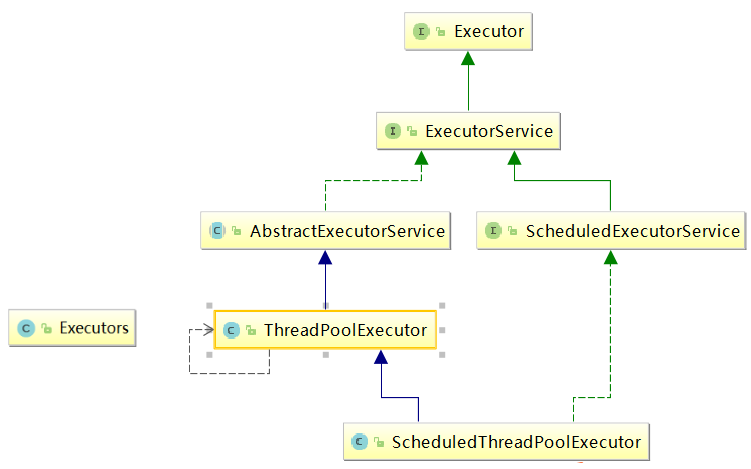

# 线程创建


## 线程创建方式

##### **继承Thread类**：

这种方式需要创建一个类，继承自Thread类，并重写其run()方法来定义线程的执行逻辑。然后可以创建该类的实例并调用start()方法启动线程。

```
class MyThread extends Thread {
    public void run() {
        // 线程执行的逻辑
    }
}

MyThread thread = new MyThread();
thread.start();
```

##### **实现Runnable接口**：

这种方式需要创建一个类，实现Runnable接口，并实现其run()方法来定义线程的执行逻辑。然后可以创建该类的实例并将其作为参数传递给Thread类的构造函数，最后调用start()方法启动线程。

```
class MyRunnable implements Runnable {
    public void run() {
        // 线程执行的逻辑
    }
}

Thread thread = new Thread(new MyRunnable());
thread.start();
```

##### **实现Callable接口**：

与Runnable接口类似，但Callable接口的call()方法可以返回结果或抛出异常。可以通过FutureTask类包装Callable对象，然后传递给Thread类进行启动。

```
class MyCallable implements Callable<Integer> {
    public Integer call() {
        // 线程执行的逻辑
        return result;
    }
}

FutureTask<Integer> futureTask = new FutureTask<>(new MyCallable());
Thread thread = new Thread(futureTask);
thread.start();
```

##### **线程池创建**：

使用线程池可以管理和复用线程，避免频繁创建和销毁线程带来的性能开销。可以通过Executors工厂类来创建不同类型的线程池，如FixedThreadPool、CachedThreadPool、ScheduledThreadPool等。

```
ExecutorService executor = Executors.newFixedThreadPool(5);
executor.execute(new MyRunnable());
executor.shutdown();
```


## Object类

**wait()方法**：使当前线程进入等待状态，直到其他线程调用notify()或notifyAll()方法唤醒它。wait()方法通常与synchronized关键字一起使用，在同步块中调用。

```
synchronized(obj) {
    obj.wait(); // 当前线程等待
}
```

**wait(long timeout)**和**wait(long timeout, int nanos)**方法：与wait()方法类似，但是可以指定等待的时间，超过指定时间后会自动唤醒线程。

```
synchronized(obj) {
    obj.wait(1000); // 等待1秒钟，超时后自动唤醒
}
```


**notify()方法**：唤醒在该对象上等待的单个线程。如果多个线程在对象上等待，那么只会唤醒其中一个线程，具体唤醒哪个线程是不确定的。

```
synchronized(obj) {
    obj.notify(); // 唤醒等待的线程
}
```

**notifyAll()方法**：唤醒在该对象上等待的所有线程。这样所有等待的线程都有机会继续执行，但是只有一个线程能够获取对象的锁。

```
synchronized(obj) {
    obj.notifyAll(); // 唤醒所有等待的线程
}
```


**stop()**：终止线程（已过时）、这种方式存在很大的缺点：容易丢失数据、因为这种方式是直接将线程杀死了，线程没有保存的数据将会丢失。不建议使用


## Thread类


### Thread类属性

- ApartmentState：	获取或设置该线程的单元状态

- CurrentContext：	获取线程正在其中执行的当前上下文

- CurrentThread：	获取当前正在运行的线程

- IsAlive：	获取一个值，该值指示当前线程的执行状态

- ManagedThreadId：	获取当前托管线程的唯一标识符

- Name：	获取或设置线程的名称

- Priority：	获取或设置一个值，该值指示x线程的调度优先级

  - 最低优先级1

  - 默认优先级是5

  - 最高优先级10

- ThreadState：	获取一个值，该值包含当前线程的状态


### Thread类方法

**start()**：启动线程，使其进入可执行状态，当CPU调度到该线程时，会执行其run()方法。

```
Thread thread = new Thread(new MyRunnable());
thread.start();
```

**run()**：定义线程的执行逻辑，需要在自定义的Thread类中重写该方法。

```
class MyThread extends Thread {
    public void run() {
        // 线程执行的逻辑
    }
}
```

**join()**：等待该线程终止。在当前线程中调用另一个线程的join()方法，会使当前线程阻塞，直到另一个线程执行完毕。

```
Thread thread = new Thread(new MyRunnable());
thread.start();
thread.join(); // 等待thread线程执行完毕
```

**sleep(long millis)和sleep(long millis, int nanos)**：使当前线程暂停执行指定的时间。注意，sleep()方法不会释放对象锁。

```
Thread.sleep(1000); // 暂停1秒钟
```

**interrupt()**：中断该线程。通常与线程的中断机制一起使用，通过设置线程的中断状态来请求线程停止执行。

```
thread.interrupt(); // 中断线程
```

**isInterrupted()和interrupted()**：用于检查线程的中断状态。isInterrupted()检查指定线程的中断状态，而interrupted()检查当前线程的中断状态，并清除中断状态。

```
if (Thread.currentThread().isInterrupted()) {
    // 线程已被中断
}
```

**yield()**：暂停当前正在执行的线程，并允许其他线程执行。该方法会提示线程调度器当前线程愿意让出CPU资源，但不保证线程调度器一定会满足这一愿望。

```
Thread.yield(); // 暂停当前线程，让出CPU资源
```


## Callable

### 理论

#### （1）callable原理分析

##### Future 接口

当 call（）方法完成时，结果必须存储在主线程已知的对象中，以便主线程可以知道该线程返回的结果。为此，可以使用 Future 对象。
将 Future 视为保存结果的对象–它可能暂时不保存结果，但将来会保存（一旦Callable 返回）。Future 基本上是主线程可以跟踪进度以及其他线程的结果的一种方式。要实现此接口，必须重写 5 种方法，这里列出了重要的方法,如下:
• public boolean cancel（boolean mayInterrupt）：用于停止任务。如果尚未启动，它将停止任务。如果已启动，则仅在mayInterrupt 为 true时才会中断任务。
• public Object get（）抛出 InterruptedException，ExecutionException：用于获取任务的结果。如果任务完成，它将立即返回结果，否则将等待任务完成，然后返回结果。

• public boolean isDone（）：如果任务完成，则返回 true，否则返回 false可以看到 Callable 和 Future 做两件事-Callable 与 Runnable 类似，因为它封装了要在另一个线程上运行的任务，而 Future 用于存储从另一个线程获得的结果。实际上，future 也可以与 Runnable 一起使用。要创建线程，需要 Runnable。为了获得结果，需要 future。

##### FutureTask

Java 库具有具体的 FutureTask 类型，该类型实现 Runnable 和 Future，并方便地将两种功能组合在一起。 可以通过为其构造函数提供 Callable 来创建FutureTask。然后，将 FutureTask 对象提供给 Thread 的构造函数以创建Thread 对象。因此，间接地使用 Callable 创建线程。

#### （2）callable应用场景

• 在主线程中需要执行比较耗时的操作时，但又不想阻塞主线程时，可以把这些作业交给 Future 对象在后台完成, 当主线程将来需要时，就可以通过 Future对象获得后台作业的计算结果或者执行状态
• 一般 FutureTask 多用于耗时的计算，主线程可以在完成自己的任务后，再去获取结果
• 仅在计算完成时才能检索结果；如果计算尚未完成，则阻塞 get 方法。一旦计算完成，就不能再重新开始或取消计算。get 方法而获取结果只有在计算完成时获取，否则会一直阻塞直到任务转入完成状态，然后会返回结果或者抛出异常。
• 只计算一次

#### （3）核心原理:

在主线程中需要执行比较耗时的操作时，但又不想阻塞主线程时，可以把这些作业交给 Future 对象在后台完成
• 当主线程将来需要时，就可以通过 Future 对象获得后台作业的计算结果或者执行状态
• 一般 FutureTask 多用于耗时的计算，主线程可以在完成自己的任务后，再去获取结果。
• 仅在计算完成时才能检索结果；如果计算尚未完成，则阻塞 get 方法
• 一旦计算完成，就不能再重新开始或取消计算
• get 方法而获取结果只有在计算完成时获取，否则会一直阻塞直到任务转入完成状态，然后会返回结果或者抛出异常
• get 只计算一次,因此 get 方法放到最后

### 语法

与Runnable接口类似，但Callable接口的call()方法可以返回结果或抛出异常。可以通过FutureTask类包装Callable对象，然后传递给Thread类进行启动。

```
class MyCallable implements Callable<Integer> {
    public Integer call() {
        // 线程执行的逻辑
        return result;
    }
}

FutureTask<Integer> futureTask = new FutureTask<>(new MyCallable());
Thread thread = new Thread(futureTask);
thread.start();
```


## 线程池

### 理论

#### （1）线程池

一种线程使用模式。线程过多会带来调度开销，进而影响缓存局部性和整体性能。而线程池维护着多个线程，等待着监督管理者分配可并发执行的任务。这避免了在处理短时间任务时创建与销毁线程的代价。线程池不仅能够保证内核的充分利用，还能防止过分调度。

#### （2）线程池的优势

 线程池做的工作只要是控制运行的线程数量，处理过程中将任务放入队列，然后在线程创建后启动这些任务，如果线程数量超过了最大数量，超出数量的线程排队等候，等其他线程执行完毕，再从队列中取出任务来执行。

#### （3）线程池的特点

• 降低资源消耗: 通过重复利用已创建的线程降低线程创建和销毁造成的销耗。
• 提高响应速度: 当任务到达时，任务可以不需要等待线程创建就能立即执行。
• 提高线程的可管理性: 线程是稀缺资源，如果无限制的创建，不仅会销耗系统资源，还会降低系统的稳定性，使用线程池可以进行统一的分配，调优和监控。

#### （4）线程池底层工作原理(重要)


1. 在创建了线程池后，线程池中的线程数为零

2. 当调用 execute()方法添加一个请求任务时，线程池会做出如下判断： 

  2.1 如果正在运行的线程数量小于 corePoolSize，那么马上创建线程运行这个任务；
  2.2 如果正在运行的线程数量大于或等于 corePoolSize，那么将这个任务放入
  队列； 

  2.3 如果这个时候队列满了且正在运行的线程数量还小于maximumPoolSize，那么还是要创建非核心线程立刻运行这个任务； 

  2.4 如果队列满了且正在运行的线程数量大于或等于 maximumPoolSize，那么线程池会启动饱和拒绝策略来执行。

3. 当一个线程完成任务时，它会从队列中取下一个任务来执行

4. 当一个线程无事可做超过一定的时间（keepAliveTime）时，线程会判断：
   4.1 如果当前运行的线程数大于 corePoolSize，那么这个线程就被停掉。 

  4.2所以线程池的所有任务完成后，它最终会收缩到 corePoolSize 的大小。

#### （5）创建线程池推荐 ThreadPoolExecutor而不是 Executors

项目中创建多线程时，使用常见的三种线程池创建方式，单一、可变、定长都有一定问题，原因是 FixedThreadPool 和 SingleThreadExecutor 底层都是用LinkedBlockingQueue 实现的，这个队列最大长度为 Integer.MAX_VALUE，容易导致 OOM。所以实际生产一般自己通过 ThreadPoolExecutor 的 7 个参数，自定义线程池

### 线程池相关类

Java 中的线程池是通过 Executor 框架实现的，该框架中用到了 Executor，Executors，ExecutorService，ThreadPoolExecutor 这几个类



#### Executor

一个执行提交的任务的对象的简单接口。它提供了一种将任务提交与执行策略分离的方式，使得可以方便地实现不同的任务调度和执行策略。

**void execute(Runnable command)**：用于执行传入的任务。具体任务的执行方式可以由 `Executor` 的实现类来决定，例如同步执行、异步执行、并行执行等。

#### Executors

用于创建各种类型的线程池。它提供了一系列静态工厂方法，用于创建不同配置的线程池，从而简化了线程池的创建和管理过程。

1. **`newCachedThreadPool()`：** 创建一个可缓存的线程池，线程数量根据需求动态调整。如果线程池的线程数量超过了任务需求，多余的线程将会被回收，如果需要，线程池将会创建新的线程。
2. **`newFixedThreadPool(int nThreads)`：** 创建一个固定大小的线程池，线程数量固定，不会随着任务的增加而增加。当所有线程都处于活动状态时，新任务将会在队列中等待。
3. **`newSingleThreadExecutor()`：** 创建一个单线程的线程池，该线程池只有一个工作线程，保证所有任务按顺序执行。
4. **`newScheduledThreadPool(int corePoolSize)`：** 创建一个固定大小的线程池，可以执行定时任务或者周期性任务。

#### ExecutorService

扩展了 `Executor` 接口，提供了更丰富的任务提交、执行和管理功能。相比于 `Executor` 接口，`ExecutorService` 接口更适合于需要管理任务执行状态、获取任务执行结果等场景。

1. **`submit(Runnable task)`：** 提交一个 Runnable 任务给线程池执行，并返回一个表示该任务执行情况的 Future 对象。
2. **`submit(Callable<T> task)`：** 提交一个 Callable 任务给线程池执行，并返回一个表示该任务执行情况的 Future 对象，可以通过该对象获取任务执行的结果。
3. **`invokeAll(Collection<? extends Callable<T>> tasks)`：** 执行给定的任务集合，并返回一个包含 Future 对象的列表，每个 Future 对象表示相应任务的执行情况。
4. **`invokeAny(Collection<? extends Callable<T>> tasks)`：** 执行给定的任务集合，返回其中某一个任务的执行结果，无法保证返回的是哪个任务的结果。
5. **`shutdown()`：** 立即关闭线程池，并拒绝接受新任务，但会等待已提交的任务执行完毕。
6. **`shutdownNow()`：** 尝试立即关闭线程池，取消所有正在执行的任务，并且不再处理等待中的任务。
7. **`isShutdown()`：** 判断线程池是否已经关闭。
8. **`isTerminated()`：** 判断所有任务是否已经执行完毕，或者线程池是否已经被关闭。

#### ThreadPoolExecutor

提供了一个灵活而强大的线程池管理机制，可以用来管理和复用线程，从而有效地处理并发任务。

通过合理地配置这些参数，可以根据实际情况创建出满足需求的线程池。`ThreadPoolExecutor` 提供了非常灵活和强大的线程池管理机制，适用于各种多线程场景下的任务调度和执行。

##### 参数：

1. **corePoolSize（核心线程数）：** 线程池中始终保持的活动线程数，即使它们处于空闲状态。如果提交的任务数多于核心线程数，线程池会根据情况创建新的线程来处理任务，直到达到最大线程数。
2. **maximumPoolSize（最大线程数）：** 线程池允许的最大线程数，包括核心线程数和额外创建的线程数。当队列满了且当前线程数小于最大线程数时，线程池会创建新的线程来处理任务，直到达到最大线程数。
3. **keepAliveTime（线程空闲时间）：** 当线程池中的线程数量超过核心线程数时，多余的空闲线程在被终止之前等待新任务的最长时间。超过这个时间后，空闲线程将被终止直到线程池中的线程数等于核心线程数。
4. **unit（时间单位）：** 空闲时间的时间单位。
5. **workQueue（工作队列）：** 用于保存等待执行的任务的阻塞队列。当线程池中的线程数达到核心线程数时，新提交的任务会被放入工作队列中等待执行。
6. **threadFactory（线程工厂）：** 用于创建新线程的工厂。
7. **handler（拒绝策略）：** 当线程池和工作队列都满了，无法继续处理新任务时，如何处理新任务的策略。

### 创建线程池方式（ThreadPoolExecutor对象）

##### 参数

• corePoolSize 线程池的核心线程数
• maximumPoolSize 能容纳的最大线程数
• keepAliveTime 空闲线程存活时间
• unit 存活的时间单位
• workQueue 存放提交但未执行任务的队列
• threadFactory 创建线程的工厂类
• handler 等待队列满后的拒绝策略

##### **原理**

线程池中，有三个重要的参数，决定影响了拒绝策略：corePoolSize - 核心线程数，也即最小的线程数、workQueue - 阻塞队列 、maximumPoolSize -最大线程数。
当提交任务数大于 corePoolSize 的时候，会优先将任务放到 workQueue 阻塞队列中。当阻塞队列饱和后，会扩充线程池中线程数，直到达到maximumPoolSize 最大线程数配置。此时，再多余的任务，则会触发线程池的拒绝策略了。
总结起来，也就是一句话，当提交的任务数大于（workQueue.size() +maximumPoolSize ），就会触发线程池的拒绝策略。

##### **拒绝策略**(重点)

**CallerRunsPolicy**: 当触发拒绝策略，只要线程池没有关闭的话，则使用调用线程直接运行任务。一般并发比较小，性能要求不高，不允许失败。但是，由于调用者自己运行任务，如果任务提交速度过快，可能导致程序阻塞，性能效率上必然的损失较大
**AbortPolicy**: 丢弃任务，并抛出拒绝执行 RejectedExecutionException 异常信息。线程池默认的拒绝策略。必须处理好抛出的异常，否则会打断当前的执行流程，影响后续的任务执行。
**DiscardPolicy**: 直接丢弃，其他啥都没有
**DiscardOldestPolicy**: 当触发拒绝策略，只要线程池没有关闭的话，丢弃阻塞队列 workQueue 中最老的一个任务，并将新任务加入

##### 使用

```
//自定义线程池创建
public class ThreadPoolDemo2 {
    public static void main(String[] args) {
        ExecutorService threadPool = new ThreadPoolExecutor(
                2,
                5,
                2L,
                TimeUnit.SECONDS,
                new ArrayBlockingQueue<>(3),
                Executors.defaultThreadFactory(),
                new ThreadPoolExecutor.AbortPolicy()
        );
        //10个顾客请求
        try {
            for (int i = 1; i <=10; i++) {
                //执行
                threadPool.execute(()->{
                    System.out.println(Thread.currentThread().getName()+" 办理业务");
                });
            }
        }catch (Exception e) {
            e.printStackTrace();
        }finally {
            //关闭
            threadPool.shutdown();
        }
    }
}
```

### 创建线程池方式（Executors静态方法）

#### newCachedThreadPool(常用)

**作用**：创建一个可缓存线程池，如果线程池长度超过处理需要，可灵活回收空闲线程，若无可回收，则新建线程.
**特点**:
• 线程池中数量没有固定，可达到最大值（Interger. MAX_VALUE）
• 线程池中的线程可进行缓存重复利用和回收（回收默认时间为 1 分钟）
• 当线程池中，没有可用线程，会重新创建一个线程

##### 场景: 

适用于创建一个可无限扩大的线程池，服务器负载压力较轻，执行时间较短，任务多的场景

##### 使用：

```
ExecutorService threadPool1 = Executors.newCachedThreadPool(5); 

public static ExecutorService newCachedThreadPool(){
/**
* corePoolSize 线程池的核心线程数
* maximumPoolSize 能容纳的最大线程数
* keepAliveTime 空闲线程存活时间
* unit 存活的时间单位
* workQueue 存放提交但未执行任务的队列
* threadFactory 创建线程的工厂类:可以省略
* handler 等待队列满后的拒绝策略:可以省略
*/
return new ThreadPoolExecutor(0,
Integer.MAX_VALUE,
60L,
TimeUnit.SECONDS,
new SynchronousQueue<>(),
Executors.defaultThreadFactory(),
new ThreadPoolExecutor.AbortPolicy());
}
```


#### newFixedThreadPool(常用)

##### 作用：

创建一个可重用固定线程数的线程池，以共享的无界队列方式来运行这些线程。在任意点，在大多数线程会处于处理任务的活动状态。如果在所有线程处于活动状态时提交附加任务，则在有可用线程之前，附加任务将在队列中等待。如果在关闭前的执行期间由于失败而导致任何线程终止，那么一个新线程将代替它执行后续的任务（如果需要）。在某个线程被显式地关闭之前，池中的线程将一直存在。

##### 特征：

• 线程池中的线程处于一定的量，可以很好的控制线程的并发量
• 线程可以重复被使用，在显示关闭之前，都将一直存在
• 超出一定量的线程被提交时候需在队列中等待

##### 场景: 

适用于可以预测线程数量的业务中，或者服务器负载较重，对线程数有严格限制的场景

##### 使用：

```
ExecutorService threadPool1 = Executors.newFixedThreadPool(5); //5个窗口

public static ExecutorService newFixedThreadPool(){
/**
* corePoolSize 线程池的核心线程数
* maximumPoolSize 能容纳的最大线程数
* keepAliveTime 空闲线程存活时间
* unit 存活的时间单位
* workQueue 存放提交但未执行任务的队列
* threadFactory 创建线程的工厂类:可以省略
* handler 等待队列满后的拒绝策略:可以省略
*/
return new ThreadPoolExecutor(10,
10,
0L,
TimeUnit.SECONDS,
new LinkedBlockingQueue<>(),
Executors.defaultThreadFactory(),
new ThreadPoolExecutor.AbortPolicy());
}
```

#### newSingleThreadExecutor(常用)

##### 作用：

创建一个使用单个 worker 线程的 Executor，以无界队列方式来运行该线程。（注意，如果因为在关闭前的执行期间出现失败而终止了此单个线程，那么如果需要，一个新线程将代替它执行后续的任务）。可保证顺序地执行各个任务，并且在任意给定的时间不会有多个线程是活动的。与其他等效的newFixedThreadPool 不同，可保证无需重新配置此方法所返回的执行程序即可使用其他的线程。
特征： 线程池中最多执行 1 个线程，之后提交的线程活动将会排在队列中以此执行

##### 场景: 

适用于需要保证顺序执行各个任务，并且在任意时间点，不会同时有多个线程的场景

##### 使用：

```
public static ExecutorService newSingleThreadExecutor(){
/**
* corePoolSize 线程池的核心线程数
* maximumPoolSize 能容纳的最大线程数
* keepAliveTime 空闲线程存活时间
* unit 存活的时间单位
* workQueue 存放提交但未执行任务的队列
* threadFactory 创建线程的工厂类:可以省略
* handler 等待队列满后的拒绝策略:可以省略
*/
return new ThreadPoolExecutor(1,
1,
0L,
TimeUnit.SECONDS,
new LinkedBlockingQueue<>(),
Executors.defaultThreadFactory(),
new ThreadPoolExecutor.AbortPolicy());
}
```

#### newScheduleThreadPool(了解)

作用: 线程池支持定时以及周期性执行任务，创建一个 corePoolSize 为传入参数，最大线程数为整形的最大数的线程池
特征:
（1）线程池中具有指定数量的线程，即便是空线程也将保留 

（2）可定时或者延迟执行线程活动

场景: 适用于需要多个后台线程执行周期任务的场景

##### 创建方式:

```
public static ScheduledExecutorService newScheduledThreadPool(int
corePoolSize,
ThreadFactory threadFactory) {
return new ScheduledThreadPoolExecutor(corePoolSize,
threadFactory);
}
```

#### newWorkStealingPool（了解）

jdk1.8 提供的线程池，底层使用的是 ForkJoinPool 实现，创建一个拥有多个任务队列的线程池，可以减少连接数，创建当前可用 cpu 核数的线程来并行执行任务

场景: 适用于大耗时，可并行执行的场景

创建方式:

```
public static ExecutorService newWorkStealingPool(int parallelism) {
/**

* parallelism：并行级别，通常默认为 JVM 可用的处理器个数
* factory：用于创建 ForkJoinPool 中使用的线程。
* handler：用于处理工作线程未处理的异常，默认为 null
* asyncMode：用于控制 WorkQueue 的工作模式:队列---反队列
  */
  return new ForkJoinPool(parallelism,
  ForkJoinPool.defaultForkJoinWorkerThreadFactory,
  null,
  true);
  }
```


# 线程状态

## （1）线程状态

- 初始(NEW)：新创建了一个线程对象，但还没有调用start()方法

- 运行(RUNNABLE)：Java线程中将就绪（ready）和运行中（running）两种状态笼统的称为“运行”

  - 线程对象创建后，其他线程(比如main线程）调用了该对象的start()方法。该状态的线程位于可运行线程池中，等待被线程调度选中，获取CPU的使用权，此时处于就绪状态（ready）

  - 就绪状态的线程在获得CPU时间片后变为运行中状态（running）

- 阻塞(BLOCKED)：表示线程阻塞于锁

- 等待(WAITING)：进入该状态的线程需要等待其他线程做出一些特定动作（通知或中断）

- 超时等待(TIMED_WAITING)：该状态不同于WAITING，它可以在指定的时间后自行返回

- 终止(TERMINATED)：表示该线程已经执行完毕

## （2）runnable 和 callable 区别

Runnable 接口run方法没有返回值

Callable接口call方法有返回值，是个泛型，和Future、FutureTask配合可以用来获取异步执行的结果

Callable接口的call()方法允许抛出异常；而Runnable接口的run()方法的异常只能在内部消化，不能继续上抛


# 线程中断机制

### 什么是中断机制

首先，一个线程不应该由其他线程来强制中断或停止，而是应该由**线程自己自行停止**，自己来决定自己的命运，所以，Thread.stop,Thread.suspend,Thread.resume都已经被废弃了

其次，在Java中没   有办法立即停止一条线程，然而停止线程却显得尤为重要，如取消一个耗时操作。因此，Java提供了一种用于停止线程的协商机制----中断，也即中断标识协商机制

- 中断只是一种协作协商机制，Java没有给中断增加任何语法，中断的过程完全需要程序员自行实现。若要中断一个线程，你需要手动调用该线程interrupt方法，该方法也仅仅是将该线程对象的中断标识设置为true，接着你需要自己写代码不断检测当前线程的标识位，如果为true，表示别的线程请求这条线程中断，此时究竟应该做什么需要你自己写代码实现。
- 每个线程对象都有一个中断标识位，用于表示线程是否被中断；该标识位为true表示中断，为false表示未中断；通过调用线程对象的interrupt方法将该线程的标识位设置为true；可以在别的线程中调用，也可以在自己的线程中调用。

### 中断的相关API方法之三大方法说明

##### `interrupt()` 方法：

- 这是`Thread`类的一个方法，用于请求中断线程。
- 调用一个线程的`interrupt()`方法只是设置该线程的中断状态为`true`，并不会立即停止线程的执行。
- 如果线程在调用`interrupt()`方法时正在等待、睡眠或执行某些阻塞操作（如`Object.wait()`, `Thread.sleep()`, `Thread.join()`, `BlockingQueue.take()`, `Selector.select()`, `LockSupport.park()`等），那么它将收到一个`InterruptedException`。

##### `isInterrupted()` 方法：

- 这也是`Thread`类的一个方法，用于检查线程的中断状态。
- 如果线程的中断状态为`true`，则返回`true`。
- 需要注意的是，如果线程在调用`isInterrupted()`后收到中断请求（即`interrupt()`被调用），`isInterrupted()`将返回`true`，但中断状态不会被清除。这意味着你需要连续检查中断状态或捕获`InterruptedException`。

##### `interrupted()` 方法：

- 这是`Thread`类的一个静态方法，用于检查当前线程的中断状态，并清除中断状态。
- 如果当前线程的中断状态为`true`，则返回`true`，并清除中断状态。
- 如果线程在调用`interrupted()`后收到中断请求，再次调用`interrupted()`将返回`false`，因为中断状态已经被清除。


对于静态方法Thread.interrupted()和实例方法isInterrupted()区别在于：

- 静态方法interrupted将会清除中断状态（传入的参数ClearInterrupted为true）
- 实例方法isInterrupted则不会（传入的参数ClearInterrupted为false）


##### 处理`InterruptedException`：

- 当线程在等待、睡眠或执行某些阻塞操作时收到中断请求，它将抛出`InterruptedException`。
- 你应该总是捕获这个异常，并适当地处理它。通常的做法是清除中断状态（通过调用`Thread.currentThread().interrupt()`），然后要么重新抛出异常（如果当前方法也是声明抛出`InterruptedException`的），要么设置一个中断标志并返回。

##### 响应中断：

- 线程应该定期检查中断状态（通过调用`isInterrupted()`或捕获`InterruptedException`），并在收到中断请求时采取适当的行动。
- 响应中断的具体方式取决于线程的任务和上下文。例如，一个正在执行长时间计算的线程可能在收到中断请求时停止计算并返回结果，而一个正在等待I/O操作的线程可能在收到中断请求时取消I/O操作并抛出异常。


### 如何停止中断运行中的线程

#### 通过一个volatile变量实现

```
/**
 * 
 * 使用volatile修饰一个标识符来决定是否结束线程
 */
public class InterruptDemo {
    static volatile boolean isStop = false; //volatile表示的变量具有可见性

    public static void main(String[] args) {
        new Thread(() -> {
            while (true) {
                if (isStop) {
                    System.out.println(Thread.currentThread().getName() + " isStop的值被改为true，t1程序停止");
                    break;
                }
                System.out.println("-----------hello volatile");
            }
        }, "t1").start();
        try {
            TimeUnit.MILLISECONDS.sleep(10);
        } catch (InterruptedException e) {
            e.printStackTrace();
        }

        new Thread(() -> {
            isStop = true;
        }, "t2").start();

    }
}
/**
 * -----------hello volatile
 * -----------hello volatile
 * -----------hello volatile
 * -----------hello volatile
 * -----------hello volatile
 * -----------hello volatile
 * t1 isStop的值被改为true，t1程序停止
 */

```

#### 通过AutomicBoolean

```
/**
 * 
 * 使用AtomicBoolean
 */
public class InterruptDemo {
    static AtomicBoolean atomicBoolean = new AtomicBoolean(false);


    public static void main(String[] args) {
        new Thread(() -> {
            while (true) {
                if (atomicBoolean.get()) {
                    System.out.println(Thread.currentThread().getName() + " atomicBoolean的值被改为true，t1程序停止");
                    break;
                }
                System.out.println("-----------hello atomicBoolean");
            }
        }, "t1").start();
        try {
            TimeUnit.MILLISECONDS.sleep(10);
        } catch (InterruptedException e) {
            e.printStackTrace();
        }

        new Thread(() -> {
            atomicBoolean.set(true);
        }, "t2").start();

    }
}

/**
 * -----------hello atomicBoolean
 * -----------hello atomicBoolean
 * -----------hello atomicBoolean
 * -----------hello atomicBoolean
 * -----------hello atomicBoolean
 * t1 atomicBoolean的值被改为true，t1程序停止
 */

```

#### 通过Thread类自带的中断API实例方法实现

在需要中断的线程中不断监听中断状态，一旦发生中断，就执行相应的中断处理业务逻辑stop线程。

```
/**
 * 
 * 使用interrupt() 和isInterrupted()组合使用来中断某个线程
 */
public class InterruptDemo {
    static AtomicBoolean atomicBoolean = new AtomicBoolean(false);


    public static void main(String[] args) {
        Thread t1 = new Thread(() -> {
            while (true) {
                if (Thread.currentThread().isInterrupted()) {
                    System.out.println(Thread.currentThread().getName() + " isInterrupted()的值被改为true，t1程序停止");
                    break;
                }
                System.out.println("-----------hello isInterrupted()");
            }
        }, "t1");
        t1.start();

        try {
            TimeUnit.MILLISECONDS.sleep(10);
        } catch (InterruptedException e) {
            e.printStackTrace();
        }

        //t2向t1放出协商，将t1中的中断标识位设为true，希望t1停下来
        new Thread(() -> t1.interrupt(), "t2").start();

        //当然，也可以t1自行设置
        t1.interrupt();

    }
}
/**
 * -----------hello isInterrupted()
 * -----------hello isInterrupted()
 * -----------hello isInterrupted()
 * -----------hello isInterrupted()
 * t1 isInterrupted()的值被改为true，t1程序停止
 */
```

#### Thread线程中断原理

- 当前线程的中断标识为true，是不是线程就立刻停止？

答案是不立刻停止，具体来说，当对一个线程，调用interrupt时：

- 如果线程处于正常活动状态，那么会将该线程的中断标志设置为true，仅此而已，被设置中断标志的线程将继续正常运行，不受影响，所以interrupt()并不能真正的中断线程，需要被调用的线程自己进行配合才行，对于不活动的线程没有任何影响。
- 如果线程处于阻塞状态（例如sleep,wait,join状态等），在别的线程中调用当前线程对象的interrupt方法，那么线程将立即退出被阻塞状态（interrupt状态也将被清除），并抛出一个InterruptedException异常。

```
/**
 * 
 * 执行interrupt方法将t1标志位设置为true后，t1没有中断，仍然完成了任务后再结束
 * 在2000毫秒后，t1已经结束称为不活动线程，设置状态为没有任何影响
 */
public class InterruptDemo2 {
    public static void main(String[] args) {
        //实例方法interrupt()仅仅是设置线程的中断状态位为true，不会停止线程
        Thread t1 = new Thread(() -> {
            for (int i = 1; i <= 300; i++) {
                System.out.println("------: " + i);
            }
            /**
             * ------: 298
             * ------: 299
             * ------: 300
             * t1线程调用interrupt()后的中断标志位02：true
             */
            System.out.println("t1线程调用interrupt()后的中断标志位02：" + Thread.currentThread().isInterrupted());
        }, "t1");
        t1.start();

        System.out.println("t1线程默认的中断标志位：" + t1.isInterrupted());//false

        try {
            TimeUnit.MILLISECONDS.sleep(2);
        } catch (InterruptedException e) {
            e.printStackTrace();
        }

        t1.interrupt();//true
        /**
         * ------: 251
         * ------: 252
         * ------: 253
         * t1线程调用interrupt()后的中断标志位01：true
         */
        System.out.println("t1线程调用interrupt()后的中断标志位01：" + t1.isInterrupted());//true

        try {
            TimeUnit.MILLISECONDS.sleep(2000);
        } catch (InterruptedException e) {
            e.printStackTrace();
        }
        //2000毫秒后，t1线程已经不活动了，不会产生任何影响
        System.out.println("t1线程调用interrupt()后的中断标志位03：" + t1.isInterrupted());//false

    }
}
```

```
/**
 * 
 *1. 中断标志位默认为false
 * 2.t2对t1发出中断协商  t1.interrupt();
 * 3. 中断标志位为true： 正常情况 程序停止
 *     中断标志位为true  异常情况，.InterruptedException ，将会把中断状态清楚，中断标志位为false
 * 4。需要在catch块中，再次调用interrupt()方法将中断标志位设置为false;
 */
public class InterruptDemo3 {
    public static void main(String[] args) {
        Thread t1 = new Thread(() -> {
            while (true) {
                if (Thread.currentThread().isInterrupted()) {
                    System.out.println(Thread.currentThread().getName() + " 中断标志位为：" + Thread.currentThread().isInterrupted() + " 程序停止");
                    break;
                }
                //sleep方法抛出InterruptedException后，中断标识也被清空置为false，如果没有在
                //catch方法中调用interrupt方法再次将中断标识置为true，这将导致无限循环了
                try {
                    Thread.sleep(200);
                } catch (InterruptedException e) {
                    //Thread.currentThread().interrupt(); 
                    e.printStackTrace();
                }
                System.out.println("-------------hello InterruptDemo3");

            }
        }, "t1");
        t1.start();

        try {
            TimeUnit.SECONDS.sleep(1);
        } catch (InterruptedException e) {
            e.printStackTrace();
        }

        new Thread(() -> {
            t1.interrupt();
        }, "t2").start();
    }
}
```


# 线程等待唤醒机制

## 三种让线程等待和唤醒的方法

方式一：使用Object中的wait()方法让线程等待，使用Object中的notify()方法唤醒线程

方式二：使用JUC包中的Condition的await()方法让线程等待，使用signal()方法唤醒线程

方式三：LockSupport类可以阻塞当前线程以及唤醒指定被阻塞的线程


## Object类中的wait和notify方法实现线程等待和唤醒

- wait和notify方法必须要在同步代码块或者方法里面，且成对出现使用
- 先wait再notify才ok

```
/**
 * @author Guanghao Wei
 * @create 2023-04-11 12:13
 */
public class LockSupportDemo {

    public static void main(String[] args) {
        Object objectLock = new Object();
        /**
         * t1	 -----------come in
         * t2	 -----------发出通知
         * t1	 -------被唤醒
         */
        new Thread(() -> {
            synchronized (objectLock) {
                System.out.println(Thread.currentThread().getName() + "\t -----------come in");
                try {
                    objectLock.wait();
                } catch (InterruptedException e) {
                    e.printStackTrace();
                }
                System.out.println(Thread.currentThread().getName() + "\t -------被唤醒");
            }
        }, "t1").start();

        try {
            TimeUnit.SECONDS.sleep(1);
        } catch (InterruptedException e) {
            e.printStackTrace();
        }

        new Thread(() -> {
            synchronized (objectLock) {
                objectLock.notify();
                System.out.println(Thread.currentThread().getName() + "\t -----------发出通知");
            }

        }, "t2").start();
    }
}
```

## Condition接口中的await和signal方法实现线程的等待和唤醒

- Condition中的线程等待和唤醒方法，需要先获取锁
- 一定要先await后signal，不要反了

```
/**
 * @author Guanghao Wei
 * @create 2023-04-11 12:13
 */
public class LockSupportDemo {

    public static void main(String[] args) {
        Lock lock = new ReentrantLock();
        Condition condition = lock.newCondition();
        /**
         * t1	 -----------come in
         * t2	 -----------发出通知
         * t1	 -----------被唤醒
         */
        new Thread(() -> {
            lock.lock();
            try {
                System.out.println(Thread.currentThread().getName() + "\t -----------come in");
                condition.await();
                System.out.println(Thread.currentThread().getName() + "\t -----------被唤醒");
            } catch (InterruptedException e) {
                e.printStackTrace();
            } finally {
                lock.unlock();
            }
        }, "t1").start();

        try {
            TimeUnit.SECONDS.sleep(1);
        } catch (InterruptedException e) {
            e.printStackTrace();
        }

        new Thread(() -> {
            lock.lock();
            try {
                condition.signal();
                System.out.println(Thread.currentThread().getName() + "\t -----------发出通知");
            } finally {
                lock.unlock();
            }
        }, "t2").start();

    }
}
```


**上述两个对象Object和Condition使用的限制条件**

- 线程需要先获得并持有锁，必须在锁块（synchronized或lock）中
- 必须要先等待后唤醒，线程才能够被唤醒


## LockSupport

LockSupport是用来创建锁和其他同步类的基本线程阻塞原语，其中park()和unpack()而作用分别是阻塞线程和解除阻塞线程

**用于阻塞和唤醒线程的功能**

### 一、定义和用途

**定义**：LockSupport是Java并发包（java.util.concurrent.locks）中的一个工具类，专门用于实现线程的阻塞和唤醒操作。

**用途**：LockSupport是创建锁和其他同步组件的基础工具，常用于构建复杂的线程同步和协作模式。

### 二、主要方法和原理

主要方法：

- `public static void park();`：阻塞当前线程，直到它被其他线程通过`unpark`方法唤醒、线程被中断，或者已经过了一个不可预知的时间。
- `public static void park(Object blocker);`：带有阻塞对象的版本，主要用于线程监控和诊断。
- `public static void parkNanos(long nanos);` 和 `public static void parkNanos(Object blocker, long nanos);`：阻塞当前线程，但最多只阻塞指定的纳秒数。
- `public static void parkUntil(long deadline);` 和 `public static void parkUntil(Object blocker, long deadline);`：阻塞当前线程，直到指定的绝对时间。
- `public static void unpark(Thread thread);`：唤醒处于阻塞状态的指定线程。

原理：

- LockSupport使用类似信号量的机制，为每个线程准备一个许可（permit）。当线程调用`park`方法时，如果许可可用则`park`方法立即返回，否则线程将被阻塞直到许可可用。
- `unpark`方法用于使一个许可变为可用，但许可不能累加，永远只有一个。这意味着即使`unpark`发生在`park`之前，它也可以使下一个`park`操作立即返回。

### 三、特点

**灵活性**：与传统的使用`synchronized`关键字或`Object`类的`wait()`和`notify()`方法不同，LockSupport提供了更灵活的线程阻塞和唤醒控制。

**精确性**：LockSupport提供了更精确的线程阻塞和唤醒控制，使得开发者能够更精确地控制线程的行为。

**可移植性和可维护性**：LockSupport具有更好的可移植性和可维护性，可以在不同的Java平台上保持一致的行为。

### 四、使用注意事项

- 在调用`park`之前，应确保当前线程没有持有任何可能导致死锁的锁。
- 与`Object.wait()`和`Object.notify()`或`Object.notifyAll()`相比，LockSupport提供了一种更灵活的线程挂起和恢复方法，但它不会释放任何锁资源。
- 某个线程可以先被`unpark`（这时，该线程就获得了一个许可），然后这个线程调用`LockSupport.park()`时，如果发现有许可可用，则使用此许可而不会阻塞。

LockSupport在Java并发编程中是一个非常重要的工具，它提供了灵活且精确的线程阻塞和唤醒控制，使得开发者能够更好地管理线程的行为和状态。


### LockSupport类中的park等待和unpark唤醒

是什么

- LockSupport 是用于创建锁和其他同步类的基本线程阻塞原语
- LockSupport类使用了一种名为Permit（许可）的概念来做到阻塞和唤醒线程的功能，每个线程都有一个许可（Permit），许可证只能有一个，累加上限是1。


主要方法

- 阻塞: Peimit许可证默认没有不能放行，所以一开始调用park()方法当前线程会阻塞，直到别的线程给当前线程发放peimit，park方法才会被唤醒。

- park/park(Object blocker)-------阻塞当前线程/阻塞传入的具体线程

- 唤醒: 调用unpack(thread)方法后 就会将thread线程的许可证peimit发放，会自动唤醒park线程，即之前阻塞中的LockSupport.park()方法会立即返回。

- unpark(Thread thread)------唤醒处于阻塞状态的指定线程

```
/**
 * 
 */
public class LockSupportDemo {

    public static void main(String[] args) {
        /**
         * t1	 -----------come in
         * t2	 ----------发出通知
         * t1	 ----------被唤醒
         */
        Thread t1 = new Thread(() -> {
            System.out.println(Thread.currentThread().getName() + "\t -----------come in");
            LockSupport.park();
            System.out.println(Thread.currentThread().getName() + "\t ----------被唤醒");
        }, "t1");
        t1.start();

        try {
            TimeUnit.SECONDS.sleep(1);
        } catch (InterruptedException e) {
            e.printStackTrace();
        }

        new Thread(() -> {
            LockSupport.unpark(t1);
            System.out.println(Thread.currentThread().getName() + "\t ----------发出通知");
        }, "t2").start();

    }
}
```

重点说明（重要）

- LockSupport是用来创建锁和其他同步类的基本线程阻塞原语，所有的方法都是静态方法，可以让线程再任意位置阻塞，阻塞后也有对应的唤醒方法。归根结底，LockSupport时调用Unsafe中的native代码
- LockSupport提供park()和unpark()方法实现阻塞线程和解除线程阻塞的过程，LockSupport和每个使用它的线程都有一个许可（Peimit）关联，每个线程都有一个相关的permit，peimit最多只有一个，重复调用unpark也不会积累凭证。
- 形象理解：线程阻塞需要消耗凭证（Permit），这个凭证最多只有一个

- 当调用park时，如果有凭证，则会直接消耗掉这个凭证然后正常退出。如果没有凭证，则必须阻塞等待凭证可用；
- 当调用unpark时，它会增加一个凭证，但凭证最多只能有1各，累加无效。

面试题

- 为什么LockSupport可以突破wait/notify的原有调用顺序？

- 因为unpark获得了一个凭证，之后再调用park方法，就可以名正言顺的凭证消费，故不会阻塞，先发放了凭证后续可以畅通无阻。

- 为什么唤醒两次后阻塞两次，但最终结果还会阻塞线程？

- 因为凭证的数量最多为1，连续调用两次unpark和调用一次unpark效果一样，只会增加一个凭证，而调用两次park却需要消费两个凭证，证不够，不能放行。


