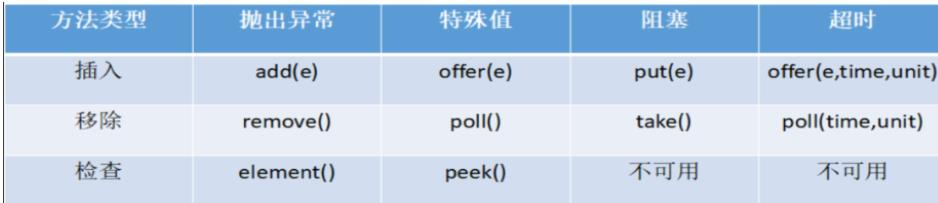

## JUC辅助类

### 理论

### 语法

#### CountDownLatch: 减少计数

CountDownLatch 类可以设置一个计数器，然后通过 countDown 方法来进行减 1 的操作，使用 await 方法等待计数器不大于 0，然后继续执行 await 方法之后的语句。
• 其它线程调用 countDown 方法会将计数器减 1(调用 countDown 方法的线程不会阻塞)
• 当计数器的值变为 0 时，因 await 方法阻塞的线程会被唤醒，继续执行

**构造方法：**

- `CountDownLatch(int count)`: 创建一个 CountDownLatch 实例，指定需要等待的线程数量，即需要调用 `countDown()` 方法的次数。

**等待方法：**

- `await() throws InterruptedException`: 让当前线程等待，直到计数器减为零，或者等待过程中被中断。如果计数器已经为零，则此方法立即返回。

**减少计数器方法：**

- `countDown()`: 使计数器减 1。当计数器减为零时，所有因调用 `await()` 方法而在等待的线程都会被释放，可以继续执行。

```
//场景: 6 个同学陆续离开教室后值班同学才可以关门。
//1：设置初始值
//2：消耗初始值
//3：主线程等待值为0

public class CountDownLatchDemo {
    //6个同学陆续离开教室之后，班长锁门
    public static void main(String[] args) throws InterruptedException {

        //创建CountDownLatch对象，设置初始值
        CountDownLatch countDownLatch = new CountDownLatch(6);

        //6个同学陆续离开教室之后
        for (int i = 1; i <=6; i++) {
            new Thread(()->{
                System.out.println(Thread.currentThread().getName()+" 号同学离开了教室");

                //计数  -1
                countDownLatch.countDown();

            },String.valueOf(i)).start();
        }

        //等待
        countDownLatch.await();

        System.out.println(Thread.currentThread().getName()+" 班长锁门走人了");
    }
}
```

#### CyclicBarrier: 循环栅栏

允许一组线程互相等待，直到到达某个公共屏障点，然后同时继续执行

CyclicBarrier 看英文单词可以看出大概就是循环阻塞的意思，在使用中CyclicBarrier 的构造方法第一个参数是目标障碍数，每次执行 CyclicBarrier 一次障碍数会加一，如果达到了目标障碍数，才会执行 cyclicBarrier.await()之后的语句。可以将 CyclicBarrier 理解为加 1 操作

**构造方法：**

- `CyclicBarrier(int parties)`: 创建一个 CyclicBarrier 实例，指定需要等待的线程数量。
- `CyclicBarrier(int parties, Runnable barrierAction)`: 创建一个 CyclicBarrier 实例，同时指定所有线程到达屏障点后执行的动作。

**等待方法：**

- `await() throws InterruptedException, BrokenBarrierException`: 让当前线程等待，直到所有线程都到达屏障点。如果当前线程不是最后一个到达的线程，则会被阻塞，直到所有线程到达；如果当前线程是最后一个到达的线程，则会唤醒所有等待的线程，并继续执行。

- `int await(long timeout, TimeUnit unit) throws InterruptedException, BrokenBarrierException, TimeoutException`: 让当前线程等待一段指定的时间，直到所有线程到达屏障点，或者超时。如果超时，会抛出 TimeoutException 异常。

```
//集齐7颗龙珠就可以召唤神龙
public class CyclicBarrierDemo {

    //创建固定值
    private static final int NUMBER = 7;

    public static void main(String[] args) {
        //创建CyclicBarrier
        CyclicBarrier cyclicBarrier =
                new CyclicBarrier(NUMBER,()->{
                    System.out.println("*****集齐7颗龙珠就可以召唤神龙");
                });

        //集齐七颗龙珠过程
        for (int i = 1; i <=7; i++) {
            new Thread(()->{
                try {
                    System.out.println(Thread.currentThread().getName()+" 星龙被收集到了");
                    //等待
                    cyclicBarrier.await();
                } catch (Exception e) {
                    e.printStackTrace();
                }
            },String.valueOf(i)).start();
        }
    }
}
```

#### Semaphore: 信号灯

Semaphore 的构造方法中传入的第一个参数是最大信号量（可以看成最大线程池），每个信号量初始化为一个最多只能分发一个许可证。使用 acquire 方法获得许可证，release 方法释放许可

用于控制同时访问特定资源的线程数量。Semaphore 维护了一组许可证（permits），线程在访问资源之前必须先获得许可证，每次许可证的获取都会将许可证数量减少，释放许可证则会增加数量。

**构造方法：**

- `Semaphore(int permits)`: 创建一个 Semaphore 实例，指定初始的许可证数量。

**获取许可证方法：**

- `acquire() throws InterruptedException`: 获取一个许可证，如果没有许可证可用，则当前线程会被阻塞，直到有许可证可用或者被中断。
- `acquire(int permits) throws InterruptedException`: 获取指定数量的许可证，如果当前可用的许可证数量小于请求的数量，则当前线程会被阻塞，直到有足够的许可证可用或者被中断。
- `tryAcquire()`: 尝试获取一个许可证，如果有可用的许可证，则立即返回 true；否则返回 false。
- `tryAcquire(int permits)`: 尝试获取指定数量的许可证，如果有足够的可用许可证，则立即返回 true；否则返回 false。

**释放许可证方法：**

- `release()`: 释放一个许可证，将许可证数量加一。如果有等待的线程在等待许可证，则其中一个会被唤醒并获取许可证。
- `release(int permits)`: 释放指定数量的许可证，将许可证数量加上指定数量。

**其他方法：**

- `int availablePermits()`: 获取当前可用的许可证数量。
- `boolean hasQueuedThreads()`: 判断是否有线程在等待获取许可证。

```
//6辆汽车，停3个车位
public class SemaphoreDemo {
    public static void main(String[] args) {
        //创建Semaphore，设置许可数量
        Semaphore semaphore = new Semaphore(3);

        //模拟6辆汽车
        for (int i = 1; i <=6; i++) {
            new Thread(()->{
                try {
                    //抢占
                    semaphore.acquire();

                    System.out.println(Thread.currentThread().getName()+" 抢到了车位");

                    //设置随机停车时间
                    TimeUnit.SECONDS.sleep(new Random().nextInt(5));

                    System.out.println(Thread.currentThread().getName()+" ------离开了车位");
                } catch (InterruptedException e) {
                    e.printStackTrace();
                } finally {
                    //释放
                    semaphore.release();
                }
            },String.valueOf(i)).start();
        }
    }
}
```


## 阻塞队列

### BlockingQueue

#### 特点

BlockingQueue 很好的解决了多线程中，如何高效安全“传输”数据的问题。通过这些高效并且线程安全的队列类，为我们快速搭建高质量的多线程程序带来极大的便利。本文详细介绍了 BlockingQueue 家庭中的所有成员，包括他们各自的功能以及常见使用场景。
阻塞队列，顾名思义，首先它是一个队列, 通过一个共享的队列，可以使得数据由队列的一端输入，从另外一端输出；

#### 原理


当队列是空的，从队列中获取元素的操作将会被阻塞
当队列是满的，从队列中添加元素的操作将会被阻塞
试图从空的队列中获取元素的线程将会被阻塞，直到其他线程往空的队列插入新的元素
试图向已满的队列中添加新元素的线程将会被阻塞，直到其他线程从队列中移除一个或多个元素或者完全清空，使队列变得空闲起来并后续新增

在多线程领域：所谓阻塞，在某些情况下会挂起线程（即阻塞），一旦条件满足，被挂起的线程又会自动被唤起

#### 为什么需要 BlockingQueue

好处是我们不需要关心什么时候需要阻塞线程，什么时候需要唤醒线程，因为这一切BlockingQueue 都给你一手包办了
在 concurrent 包发布以前，在多线程环境下，我们每个程序员都必须去自己控制这些细节，尤其还要兼顾效率和线程安全，而这会给我们的程序带来不小的复杂度。多线程环境中，通过队列可以很容易实现数据共享，比如经典的“生产者”和“消费者”模型中，通过队列可以很便利地实现两者之间的数据共享。假设我们有若干生产者线程，另外又有若干个消费者线程。如果生产者线程需要把准备好的数据共享给消费者线程，利用队列的方式来传递数据，就可以很方便地解决他们之间的数据共享问题。但如果生产者和消费者在某个时间段内，万一发生数据处理速度不匹配的情况呢？理想情况下，如果生产者产出数据的速度大于消费者消费的速度，并且当生产出来的数据累积到一定程度的时候，那么生产者必须暂停等待一下（阻塞生产者线程），以便等待消费者线程把累积的数据处理完毕，反之亦然。
• 当队列中没有数据的情况下，消费者端的所有线程都会被自动阻塞（挂起），直到有数据放入队列
• 当队列中填满数据的情况下，生产者端的所有线程都会被自动阻塞（挂起），直到队列中有空的位置，线程被自动唤醒

#### BlockingQueue 核心方法




##### 放入数据

• offer(anObject):表示如果可能的话,将 anObject 加到 BlockingQueue 里,即如果 BlockingQueue 可以容纳,则返回 true,否则返回 false.（本方法不阻塞当前执行方法的线程）
• offer(E o, long timeout, TimeUnit unit)：可以设定等待的时间，如果在指定的时间内，还不能往队列中加入 BlockingQueue，则返回失败
• put(anObject):把 anObject 加到 BlockingQueue 里,如果 BlockQueue 没有空间,则调用此方法的线程被阻断直到 BlockingQueue 里面有空间再继续.

##### 获取数据

• poll(time): 取走 BlockingQueue 里排在首位的对象,若不能立即取出,则可以等time 参数规定的时间,取不到时返回 null
• poll(long timeout, TimeUnit unit)：从 BlockingQueue 取出一个队首的对象，如果在指定时间内，队列一旦有数据可取，则立即返回队列中的数据。否则知道时间超时还没有数据可取，返回失败。
• take(): 取走 BlockingQueue 里排在首位的对象,若 BlockingQueue 为空,阻断进入等待状态直到 BlockingQueue 有新的数据被加入;
• drainTo(): 一次性从 BlockingQueue 获取所有可用的数据对象（还可以指定获取数据的个数），通过该方法，可以提升获取数据效率；不需要多次分批加锁或释放锁。

### ArrayBlockingQueue(常用)

**由数组结构组成的有界阻塞队列**

基于数组的阻塞队列实现，在 ArrayBlockingQueue 内部，维护了一个定长数组，以便缓存队列中的数据对象，这是一个常用的阻塞队列，除了一个定长数组外，ArrayBlockingQueue 内部还保存着两个整形变量，分别标识着队列的头部和尾部在数组中的位置。
ArrayBlockingQueue 在生产者放入数据和消费者获取数据，都是共用同一个锁对象，由此也意味着两者无法真正并行运行，这点尤其不同于LinkedBlockingQueue；按照实现原理来分析，ArrayBlockingQueue 完全可以采用分离锁，从而实现生产者和消费者操作的完全并行运行。Doug Lea 之所以没这样去做，也许是因为 ArrayBlockingQueue 的数据写入和获取操作已经足够轻巧，以至于引入独立的锁机制，除了给代码带来额外的复杂性外，其在性能上完全占不到任何便宜。 ArrayBlockingQueue 和LinkedBlockingQueue 间还有一个明显的不同之处在于，前者在插入或删除元素时不会产生或销毁任何额外的对象实例，而后者则会生成一个额外的Node 对象。这在长时间内需要高效并发地处理大批量数据的系统中，其对于GC 的影响还是存在一定的区别。而在创建 ArrayBlockingQueue 时，我们还可以控制对象的内部锁是否采用公平锁，默认采用非公平锁。

### LinkedBlockingQueue(常用)

**由链表结构组成的有界（但大小默认值为integer.MAX_VALUE）阻塞队列**

基于链表的阻塞队列，同 ArrayListBlockingQueue 类似，其内部也维持着一个数据缓冲队列（该队列由一个链表构成），当生产者往队列中放入一个数据时，队列会从生产者手中获取数据，并缓存在队列内部，而生产者立即返回；只有当队列缓冲区达到最大值缓存容量时（LinkedBlockingQueue 可以通过构造函数指定该值），才会阻塞生产者队列，直到消费者从队列中消费掉一份数据，生产者线程会被唤醒，反之对于消费者这端的处理也基于同样的原理。而 LinkedBlockingQueue 之所以能够高效的处理并发数据，还因为其对于生产者端和消费者端分别采用了独立的锁来控制数据同步，这也意味着在高并发的情况下生产者和消费者可以并行地操作队列中的数据，以此来提高整个队列的并发性能。
ArrayBlockingQueue 和 LinkedBlockingQueue 是两个最普通也是最常用的阻塞队列，一般情况下，在处理多线程间的生产者消费者问题，使用这两个类足以。

### DelayQueue

**使用优先级队列实现的延迟无界阻塞队列**

DelayQueue 中的元素只有当其指定的延迟时间到了，才能够从队列中获取到该元素。DelayQueue 是一个没有大小限制的队列，因此往队列中插入数据的操作（生产者）永远不会被阻塞，而只有获取数据的操作（消费者）才会被阻塞。

### PriorityBlockingQueue

**支持优先级排序的无界阻塞队列**

基于优先级的阻塞队列（优先级的判断通过构造函数传入的 Compator 对象来决定），但需要注意的是 PriorityBlockingQueue 并不会阻塞数据生产者，而只会在没有可消费的数据时，阻塞数据的消费者。因此使用的时候要特别注意，生产者生产数据的速度绝对不能快于消费者消费数据的速度，否则时间一长，会最终耗尽所有的可用堆内存空间。在实现 PriorityBlockingQueue 时，内部控制线程同步的锁采用的是公平锁。

### SynchronousQueue

**不存储元素的阻塞队列，也即单个元素的队列**

一种无缓冲的等待队列，类似于无中介的直接交易，有点像原始社会中的生产者和消费者，生产者拿着产品去集市销售给产品的最终消费者，而消费者必须亲自去集市找到所要商品的直接生产者，如果一方没有找到合适的目标，那么对不起，大家都在集市等待。相对于有缓冲的 BlockingQueue 来说，少了一个中间经销商的环节（缓冲区），如果有经销商，生产者直接把产品批发给经销商，而无需在意经销商最终会将这些产品卖给那些消费者，由于经销商可以库存一部分商品，因此相对于直接交易模式，总体来说采用中间经销商的模式会吞吐量高一些（可以批量买卖）；但另一方面，又因为经销商的引入，使得产品从生产者到消费者中间增加了额外的交易环节，单个产品的及时响应性能可能会降低。
声明一个 SynchronousQueue 有两种不同的方式，它们之间有着不太一样的行为。

##### 公平模式和非公平模式的区别:

• 公平模式：SynchronousQueue 会采用公平锁，并配合一个 FIFO 队列来阻塞多余的生产者和消费者，从而体系整体的公平策略；
• 非公平模式（SynchronousQueue 默认）：SynchronousQueue 采用非公平锁，同时配合一个 LIFO 队列来管理多余的生产者和消费者，而后一种模式，如果生产者和消费者的处理速度有差距，则很容易出现饥渴的情况，即可能有某些生产者或者是消费者的数据永远都得不到处理。

### LinkedTransferQueue

**由链表组成的无界阻塞队列**

LinkedTransferQueue 是一个由链表结构组成的无界阻塞 TransferQueue 队列。相对于其他阻塞队列，LinkedTransferQueue 多了 tryTransfer 和transfer 方法。
LinkedTransferQueue 采用一种预占模式。意思就是消费者线程取元素时，如果队列不为空，则直接取走数据，若队列为空，那就生成一个节点（节点元素为 null）入队，然后消费者线程被等待在这个节点上，后面生产者线程入队时发现有一个元素为 null 的节点，生产者线程就不入队了，直接就将元素填充到该节点，并唤醒该节点等待的线程，被唤醒的消费者线程取走元素，从调用的方法返回。

### LinkedBlockingDeque

 **由链表组成的双向阻塞队列**

LinkedBlockingDeque 是一个由链表结构组成的双向阻塞队列，即可以从队列的两端插入和移除元素。
对于一些指定的操作，在插入或者获取队列元素时如果队列状态不允许该操作可能会阻塞住该线程直到队列状态变更为允许操作，这里的阻塞一般有两种情况
• 插入元素时: 如果当前队列已满将会进入阻塞状态，一直等到队列有空的位置时再讲该元素插入，该操作可以通过设置超时参数，超时后返回 false 表示操作失败，也可以不设置超时参数一直阻塞，中断后抛出 InterruptedException 异常
• 读取元素时: 如果当前队列为空会阻塞住直到队列不为空然后返回元素，同样可以通过设置超时参数

### 归纳

1. 在多线程领域：所谓阻塞，在某些情况下会挂起线程（即阻塞），一旦条件满足，被挂起的线程又会自动被唤起
2. 为什么需要 BlockingQueue? 在 concurrent 包发布以前，在多线程环境下，我们每个程序员都必须去自己控制这些细节，尤其还要兼顾效率和线程安全，而这会给我们的程序带来不小的复杂度。使用后我们不需要关心什么时候需要阻塞线程，什么时候需要唤醒线程，因为这一切 BlockingQueue 都给你一手包办了

### 案例

## 拆分任务-Fork/Join

### 理论

#### （1）介绍

Fork/Join 它可以将一个大的任务拆分成多个子任务进行并行处理，最后将子任务结果合并成最后的计算结果，并进行输出。Fork/Join 框架要完成两件事情：
Fork：把一个复杂任务进行分拆，大事化小
Join：把分拆任务的结果进行合并

1. 任务分割：首先 Fork/Join 框架需要把大的任务分割成足够小的子任务，如果子任务比较大的话还要对子任务进行继续分割
2. 执行任务并合并结果：分割的子任务分别放到双端队列里，然后几个启动线程分别从双端队列里获取任务执行。子任务执行完的结果都放在另外一个队列里，启动一个线程从队列里取数据，然后合并这些数据。

**ForkJoinTask**:我们要使用 Fork/Join 框架，首先需要创建一个 ForkJoin 任务。该类提供了在任务中执行 fork 和 join 的机制。通常情况下我们不需要直接集成 ForkJoinTask 类，只需要继承它的子类，Fork/Join 框架提供了两个子类：
	a.RecursiveAction：用于没有返回结果的任务
	b.RecursiveTask:用于有返回结果的任务
**ForkJoinPool**:ForkJoinTask 需要通过 ForkJoinPool 来执行
**RecursiveTask**: 继承后可以实现递归(自己调自己)调用的任务

#### （2）Fork/Join 框架的实现原理

ForkJoinPool 由 ForkJoinTask 数组和 ForkJoinWorkerThread 数组组成，ForkJoinTask 数组负责将存放以及将程序提交给 ForkJoinPool，而ForkJoinWorkerThread 负责执行这些任务。

#### （3）fork()与join方法()

##### Fork 方法的实现原理：

 当我们调用 ForkJoinTask 的 fork 方法时，程序会把任务放在 ForkJoinWorkerThread 的 pushTask 的 workQueue 中，异步地执行这个任务，然后立即返回结果

```
public final ForkJoinTask<V> fork() {
Thread t;
if ((t = Thread.currentThread()) instanceof ForkJoinWorkerThread)
((ForkJoinWorkerThread)t).workQueue.push(this);
else
ForkJoinPool.common.externalPush(this);
return this;
}
```

pushTask 方法把当前任务存放在 ForkJoinTask 数组队列里。然后再调用ForkJoinPool 的 signalWork()方法唤醒或创建一个工作线程来执行任务。

```
final void push(ForkJoinTask<?> task) {
ForkJoinTask<?>[] a; ForkJoinPool p;
int b = base, s = top, n;
if ((a = array) != null) { // ignore if queue removed
int m = a.length - 1; // fenced write for task visibility
U.putOrderedObject(a, ((m & s) << ASHIFT) + ABASE, task);
U.putOrderedInt(this, QTOP, s + 1);
if ((n = s - b) <= 1) {
if ((p = pool) != null)
p.signalWork(p.workQueues, this);//执行
}
else if (n >= m)
growArray();
}
}
```

##### join 方法

Join 方法的主要作用是阻塞当前线程并等待获取结果。让我们一起看看ForkJoinTask 的 join 方法的实现

```
public final V join() {
int s;
if ((s = doJoin() & DONE_MASK) != NORMAL)
reportException(s);
return getRawResult();
}
```

它首先调用 doJoin 方法，通过 doJoin()方法得到当前任务的状态来判断返回什么结果，任务状态有 4 种：已完成（NORMAL）、被取消（CANCELLED）、信号（SIGNAL）和出现异常（EXCEPTIONAL）
• 如果任务状态是已完成，则直接返回任务结果。
• 如果任务状态是被取消，则直接抛出 CancellationException
• 如果任务状态是抛出异常，则直接抛出对应的异常
分析一下 doJoin 方法的实现

```
private int doJoin() {
int s; Thread t; ForkJoinWorkerThread wt; ForkJoinPool.WorkQueue
w;
return (s = status) < 0 ? s :
((t = Thread.currentThread()) instanceof ForkJoinWorkerThread) ?
(w = (wt = (ForkJoinWorkerThread)t).workQueue).
tryUnpush(this) && (s = doExec()) < 0 ? s :
wt.pool.awaitJoin(w, this, 0L) :
externalAwaitDone();
}
final int doExec() {
int s; boolean completed;
if ((s = status) >= 0) {
try {
completed = exec();
} catch (Throwable rex) {
return setExceptionalCompletion(rex);
}
if (completed)
s = setCompletion(NORMAL);
}
return s;
}
```

在 doJoin()方法流程如下:

1. 首先通过查看任务的状态，看任务是否已经执行完成，如果执行完成，则直接返回任务状态；
2. 如果没有执行完，则从任务数组里取出任务并执行。
3. 如果任务顺利执行完成，则设置任务状态为 NORMAL，如果出现异常，则记录异常，并将任务状态设置为 EXCEPTIONAL。

#### （4）Fork/Join 框架的异常处理

ForkJoinTask 在执行的时候可能会抛出异常，但是我们没办法在主线程里直接捕获异常，所以 ForkJoinTask 提供了isCompletedAbnormally()方法来检查任务是否已经抛出异常或已经被取消了，并且可以通过 ForkJoinTask 的getException 方法获取异常。

getException 方法返回 Throwable 对象，如果任务被取消了则返回CancellationException。如果任务没有完成或者没有抛出异常则返回 null。

### 应用

```
class MyTask extends RecursiveTask<Integer> {

    //拆分差值不能超过10，计算10以内运算
    private static final Integer VALUE = 10;
    private int begin ;//拆分开始值
    private int end;//拆分结束值
    private int result ; //返回结果

    //创建有参数构造
    public MyTask(int begin,int end) {
        this.begin = begin;
        this.end = end;
    }

    //拆分和合并过程
    @Override
    protected Integer compute() {
        //判断相加两个数值是否大于10
        if((end-begin)<=VALUE) {
            //相加操作
            for (int i = begin; i <=end; i++) {
                result = result+i;
            }
        } else {//进一步拆分
            //获取中间值
            int middle = (begin+end)/2;
            //拆分左边
            MyTask task01 = new MyTask(begin,middle);
            //拆分右边
            MyTask task02 = new MyTask(middle+1,end);
            //调用方法拆分
            task01.fork();
            task02.fork();
            //合并结果
            result = task01.join()+task02.join();
        }
        return result;
    }
}

public class ForkJoinDemo {
    public static void main(String[] args) throws ExecutionException, InterruptedException {
        //创建MyTask对象
        MyTask myTask = new MyTask(0,100);
        //创建分支合并池对象
        ForkJoinPool forkJoinPool = new ForkJoinPool();
        //创建合并池对象任务
        ForkJoinTask<Integer> forkJoinTask = forkJoinPool.submit(myTask);
        //获取最终合并之后结果
        Integer result = forkJoinTask.get();
        System.out.println(result);
        //关闭池对象
        forkJoinPool.shutdown();
    }
}
```

## Callable

### 理论

#### （1）callable原理分析

##### Future 接口

当 call（）方法完成时，结果必须存储在主线程已知的对象中，以便主线程可以知道该线程返回的结果。为此，可以使用 Future 对象。
将 Future 视为保存结果的对象–它可能暂时不保存结果，但将来会保存（一旦Callable 返回）。Future 基本上是主线程可以跟踪进度以及其他线程的结果的一种方式。要实现此接口，必须重写 5 种方法，这里列出了重要的方法,如下:
• public boolean cancel（boolean mayInterrupt）：用于停止任务。如果尚未启动，它将停止任务。如果已启动，则仅在mayInterrupt 为 true时才会中断任务。
• public Object get（）抛出 InterruptedException，ExecutionException：用于获取任务的结果。如果任务完成，它将立即返回结果，否则将等待任务完成，然后返回结果。

• public boolean isDone（）：如果任务完成，则返回 true，否则返回 false可以看到 Callable 和 Future 做两件事-Callable 与 Runnable 类似，因为它封装了要在另一个线程上运行的任务，而 Future 用于存储从另一个线程获得的结果。实际上，future 也可以与 Runnable 一起使用。要创建线程，需要 Runnable。为了获得结果，需要 future。

##### FutureTask

Java 库具有具体的 FutureTask 类型，该类型实现 Runnable 和 Future，并方便地将两种功能组合在一起。 可以通过为其构造函数提供 Callable 来创建FutureTask。然后，将 FutureTask 对象提供给 Thread 的构造函数以创建Thread 对象。因此，间接地使用 Callable 创建线程。

#### （2）callable应用场景

• 在主线程中需要执行比较耗时的操作时，但又不想阻塞主线程时，可以把这些作业交给 Future 对象在后台完成, 当主线程将来需要时，就可以通过 Future对象获得后台作业的计算结果或者执行状态
• 一般 FutureTask 多用于耗时的计算，主线程可以在完成自己的任务后，再去获取结果
• 仅在计算完成时才能检索结果；如果计算尚未完成，则阻塞 get 方法。一旦计算完成，就不能再重新开始或取消计算。get 方法而获取结果只有在计算完成时获取，否则会一直阻塞直到任务转入完成状态，然后会返回结果或者抛出异常。
• 只计算一次

#### （3）核心原理:

在主线程中需要执行比较耗时的操作时，但又不想阻塞主线程时，可以把这些作业交给 Future 对象在后台完成
• 当主线程将来需要时，就可以通过 Future 对象获得后台作业的计算结果或者执行状态
• 一般 FutureTask 多用于耗时的计算，主线程可以在完成自己的任务后，再去获取结果。
• 仅在计算完成时才能检索结果；如果计算尚未完成，则阻塞 get 方法
• 一旦计算完成，就不能再重新开始或取消计算
• get 方法而获取结果只有在计算完成时获取，否则会一直阻塞直到任务转入完成状态，然后会返回结果或者抛出异常
• get 只计算一次,因此 get 方法放到最后

### 语法

与Runnable接口类似，但Callable接口的call()方法可以返回结果或抛出异常。可以通过FutureTask类包装Callable对象，然后传递给Thread类进行启动。

```
class MyCallable implements Callable<Integer> {
    public Integer call() {
        // 线程执行的逻辑
        return result;
    }
}

FutureTask<Integer> futureTask = new FutureTask<>(new MyCallable());
Thread thread = new Thread(futureTask);
thread.start();
```


## FutureTask

### 1、理论


1. 定义与功能：
   - FutureTask是Java并发编程中的一个类，结合了Future和Runnable接口，用于表示一个异步计算的结果。
   - 它允许将耗时的计算任务提交给另一个线程去执行，而当前线程可以继续执行其他任务，从而实现并发执行的效果。
   - FutureTask主要解决异步执行、获取计算结果、异常处理以及任务取消等问题。
2. 状态管理：
   - FutureTask内部维护了一个状态变量（如state），用于表示任务的不同状态，如未启动、运行中、已完成等。
   - 状态变量的变化通过CAS（Compare-and-Swap）等原子操作来保证线程安全。
3. 任务执行：
   - FutureTask通常与Callable或Runnable接口一起使用。当使用Callable时，可以获取到任务执行的结果；当使用Runnable时，则无法获取结果。
   - FutureTask实现了Runnable接口，因此可以直接提交给线程池执行，或者由调用线程直接执行（FutureTask.run()）。
4. 结果获取：
   - 通过调用Future.get()方法可以获取异步计算的结果。如果计算还没有完成，get()方法会阻塞调用线程，直到计算完成为止。
   - 如果异步计算抛出了异常，那么调用get()方法时会抛出ExecutionException，从而可以方便地处理异常。
5. 任务取消：
   - 通过Future.cancel()方法可以取消还没有开始或者正在进行的异步计算。
   - 取消操作的结果取决于任务是否已经启动、是否支持取消以及是否已经执行完成。
6. 内部实现：
   - FutureTask的实现涉及到了并发编程中的多个关键概念，如原子操作、状态管理、阻塞队列等。
   - 它通过内部维护的状态变量和等待/通知机制来协调生产者和消费者线程之间的交互。
7. 使用场景：
   - 当需要异步执行某个计算任务，并且需要获取任务执行的结果时，可以使用FutureTask。
   - 它可以提高程序的响应性，使得在等待耗时任务完成的同时，可以继续执行其他任务。

### 2、使用

```
public class CompletableFutureDemo
{
    public static void main(String[] args) throws ExecutionException, InterruptedException
    {
        FutureTask<String> futureTask = new FutureTask<>(new MyThread());

        Thread t1 = new Thread(futureTask,"t1");
        t1.start();
        try { TimeUnit.MILLISECONDS.sleep(3000); } catch (InterruptedException e) { e.printStackTrace(); }
        System.out.println(futureTask.get());
    }
}

class MyThread implements Callable<String>
{
    @Override
    public String call() throws Exception
    {

        System.out.println("-----come in call() " );
        try { TimeUnit.MILLISECONDS.sleep(2000); } catch (InterruptedException e) { e.printStackTrace(); }
        return "hello Callable";
    }
}

```

### 3、优缺点

优点：Future+线程池异步多线程任务配合，能显著提高程序的运行效率。

缺点：

- get()阻塞---一旦调用get()方法求结果，一旦调用不见不散，非要等到结果才会离开，不管你是否计算完成，如果没有计算完成容易程序堵塞。
- isDone()轮询---轮询的方式会耗费无谓的cpu资源，而且也不见得能及时得到计算结果，如果想要异步获取结果，通常会以轮询的方式去获取结果，尽量不要阻塞。

结论：Future对于结果的获取不是很友好，只能通过**阻塞或轮询**的方式得到任务的结果。

对于简单的业务场景使用Future完全ok

回调通知：

- 应对Future的完成时间，完成了可以告诉我，也就是我们的回调通知
- 通过轮询的方式去判断任务是否完成这样非常占cpu并且代码也不优雅

创建异步任务：Future+线程池组合

- 多个任务前后依赖可以组合处理（水煮鱼--->买鱼--->调料--->下锅）：

  - 想将多个异步任务的结果组合起来，后一个异步任务的计算结果需要钱一个异步任务的值

  - 想将两个或多个异步计算合并成为一个异步计算，这几个异步计算互相独立，同时后面这个又依赖前一个处理的结果

对计算速度选最快的：

- 当Future集合中某个任务最快结束时，返回结果，返回第一名处理结果

**结论**：

- 使用Future之前提供的那点API就囊中羞涩，处理起来不够优雅，这时候还是让CompletableFuture以声明式的方式优雅的处理这些需求。
- 从i到i++
- Future能干的，CompletableFuture都能干

## CompletableFuture（异步回调）

### 理论


#### Future 

Future是Java5新加的一个接口，它提供一种异步并行计算的功能，如果主线程需要执行一个很耗时的计算任务，我们会就可以通过Future把这个任务放进异步线程中执行，主线程继续处理其他任务或者先行结束，再通过Future获取计算结果。

Futrue 在 Java 里面，通常用来表示一个异步任务的引用，比如我们将任务提交到线程池里面，然后我们会得到一个 Futrue，在 Future 里面有 isDone 方法来 判断任务是否处理结束，还有 get 方法可以一直阻塞直到任务结束然后获取结果，但整体来说这种方式，还是同步的，因为需要客户端不断阻塞等待或者不断轮询才能知道任务是否完成。

##### Future 缺点

（1）不支持手动完成
我提交了一个任务，但是执行太慢了，我通过其他路径已经获取到了任务结果，现在没法把这个任务结果通知到正在执行的线程，所以必须主动取消或者一直等待它执行完成
（2）不支持进一步的非阻塞调用
通过 Future 的 get 方法会一直阻塞到任务完成，但是想在获取任务之后执行额外的任务，因为 Future 不支持回调函数，所以无法实现这个功能
（3）不支持链式调用
对于 Future 的执行结果，我们想继续传到下一个 Future 处理使用，从而形成一个链式的 pipline 调用，这在 Future 中是没法实现的。
（4）不支持多个 Future 合并
比如我们有 10 个 Future 并行执行，我们想在所有的 Future 运行完毕之后，执行某些函数，是没法通过 Future 实现的。
（5）不支持异常处理
Future 的 API 没有任何的异常处理的 api，所以在异步运行时，如果出了问题是不好定位的。

#### CompletionStage

用于**异步执行中的阶段处理**。这个接口定义了一组方法，这些方法使得在一个阶段执行结束后，可以继续执行下一个阶段，或者对结果进行转换以产生新的结果。

具体来说，CompletionStage的接口方法可以分为几类：

基于结果的转换：

- `apply` 和 `combine` 方法允许将上一阶段的结果作为参数传递给指定的函数，并返回新的结果。这些方法在Function或BiFunction类型的接口参数下工作。

基于结果的消费：

- `accept` 方法允许将上一阶段的结果作为参数传递给指定的函数，但不返回结果。这种方法在Consumer或BiConsumer类型的接口参数下工作。

不依赖结果的执行：

- `run` 方法允许在上一阶段执行结束后，执行指定的操作，但不依赖于一阶段的结果。这个方法的接口参数为Runnable类型。

异步执行：

- `async` 方法允许异步执行阶段任务，可以选择指定线程池或不指定。

组合多个阶段：

- `both` 方法表示当前两个阶段都完成后才执行下一阶段。
- `either` 方法表示当前两个阶段中任一完成后就执行下一阶段。
- `compose` 方法基于上阶段的执行完状态，执行下一阶段。

异常处理：

- `handle` 和 `exceptionally` 方法允许基于上阶段的执行完状态和结果，消费其正常或异常结果。

CompletionStage的实现类，如CompletableFuture，扩展了这个接口，提供了更多的功能和灵活性。通过使用CompletionStage和它的实现类，你可以更轻松地创建复杂的异步执行流程和任务组合。

总之，CompletionStage是Java 8中用于处理异步执行阶段和结果的重要接口，它提供了一组强大的方法来定义和管理异步任务之间的关系和转换。

#### CompletableFuture 简介

CompletableFuture 在 Java 里面被用于异步编程，异步通常意味着非阻塞，可以使得我们的任务单独运行在与主线程分离的其他线程中，并且通过回调可以在主线程中得到异步任务的执行状态，是否完成，和是否异常等信息。CompletableFuture 实现了 Future, CompletionStage 接口，实现了 Future接口就可以兼容现在有线程池框架，而 CompletionStage 接口才是异步编程的接口抽象，里面定义多种异步方法，通过这两者集合，从而打造出了强大的CompletableFuture 类。

####  CompletableFuture对Future的改进

get()方法在Future计算完成之前会一直处在阻塞状态下，阻塞的方式和异步编程的设计理念相违背。

isDene()方法容易耗费cpu资源（cpu空转）

对于真正的异步处理我们希望是可以通过传入回调函数，在Future结束时自动调用该回调函数，这样，我们就不用等待结果

jdk8设计出CompletableFuture，CompletableFuture提供了一种观察者模式类似的机制，可以让任务执行完成后通知监听的一方。

#### CompletableFuture和CompletionStage

**接口CompletionStage**

- 代表异步计算过程中的某一个阶段，一个阶段完成以后可能会触发另外一个阶段。
- 一个阶段的执行可能是被单个阶段的完成触发，也可能是由多个阶段一起触发

**类CompletableFuture**

- 提供了非常强大的Future的扩展功能，可以帮助我们简化异步编程的复杂性，并且提供了函数式编程的能力，可以通过回调的方式处理计算结果，也提供了转换和组合CompletableFuture的方法
- 它可能代表一个明确完成的Future，也可能代表一个完成阶段（CompletionStage），它支持在计算完成以后触发一些函数或执行某些动作

### 语法

Java 8 引入的一个类，用于支持异步编程和构建异步操作的结果。它提供了一种简洁的方式来处理异步任务，并且能够方便地进行任务之间的组合、串行执行、并行执行以及异常处理。

**创建 CompletableFuture：**

- `static CompletableFuture<Void> runAsync(Runnable runnable)`：异步执行一个没有返回值的任务。
- `static <U> CompletableFuture<U> supplyAsync(Supplier<U> supplier)`：异步执行一个有返回值的任务。

**处理异步结果：**

- `CompletableFuture<T> thenApply(Function<? super T,? extends U> fn)`：当上一个任务完成时，对其结果执行给定的函数。
- `CompletableFuture<Void> thenAccept(Consumer<? super T> action)`：当上一个任务完成时，对其结果执行给定的操作，但不返回任何结果。
- `CompletableFuture<Void> thenRun(Runnable action)`：当上一个任务完成时，执行给定的操作，但不接收上一个任务的结果。
- `CompletableFuture<U> thenCompose(Function<? super T,? extends CompletionStage<U>> fn)`：当上一个任务完成时，对其结果执行给定的函数，返回一个新的 `CompletableFuture`。

**组合多个 CompletableFuture：**

- `CompletableFuture<U> thenCombine(CompletionStage<? extends V> other, BiFunction<? super T,? super U,? extends V> fn)`：当当前任务和另一个任务都完成时，对它们的结果执行给定的函数。
- `CompletableFuture<Void> thenAcceptBoth(CompletionStage<? extends U> other, BiConsumer<? super T,? super U> action)`：当当前任务和另一个任务都完成时，对它们的结果执行给定的操作，但不返回任何结果。
- `CompletableFuture<Void> runAfterBoth(CompletionStage<?> other, Runnable action)`：当当前任务和另一个任务都完成时，执行给定的操作，但不接收任何结果。
- `CompletableFuture<Void> acceptEither(CompletionStage<? extends T> other, Consumer<? super T> action)`：当任意一个任务完成时，对其结果执行给定的操作，但不返回任何结果。
- `CompletableFuture<Void> runAfterEither(CompletionStage<?> other, Runnable action)`：当任意一个任务完成时，执行给定的操作，但不接收任何结果。

**异常处理：**

- `CompletableFuture<T> exceptionally(Function<Throwable,? extends T> fn)`：当异常发生时，执行给定的函数。
- `CompletableFuture<T> handle(BiFunction<? super T,Throwable,? extends T> fn)`：当任务完成时，对其结果执行给定的函数，或者在出现异常时执行另一个函数。

**等待所有任务完成：**

- `static CompletableFuture<Void> allOf(CompletableFuture<?>... cfs)`：等待所有 `CompletableFuture` 都完成后返回一个新的 `CompletableFuture`。

**等待任意任务完成：**

- `static CompletableFuture<Object> anyOf(CompletableFuture<?>... cfs)`：等待任意一个 `CompletableFuture` 完成后返回一个新的 `CompletableFuture`。

**取消任务：**

- `boolean cancel(boolean mayInterruptIfRunning)`：尝试取消任务的执行。

### 创建方法

#### 基本使用

```
//同步调用
CompletableFuture<Void> completableFuture1 = CompletableFuture.runAsync(()->{
    System.out.println(Thread.currentThread().getName()+" : CompletableFuture1");
});
completableFuture1.get();

//mq消息队列
//异步调用
CompletableFuture<Integer> completableFuture2 = CompletableFuture.supplyAsync(()->{
    System.out.println(Thread.currentThread().getName()+" : CompletableFuture2");
    //模拟异常
    int i = 10/0;
    return 1024;
});
completableFuture2.whenComplete((t,u)->{
    System.out.println("------t="+t);
    System.out.println("------u="+u);
}).get();
```

#### runAsync

方法用于异步地执行一个不返回结果的`Runnable`任务。

```
runAsync(Runnable runnable)
```

- 接收一个`Runnable`对象作为参数。
- 使用`ForkJoinPool.commonPool()`作为默认的线程池来异步执行这个任务。
- 返回一个`CompletableFuture<Void>`，因为`Runnable`不返回任何值（即返回`void`）。

```
runAsync(Runnable runnable, Executor executor)
```

- 除了接收一个`Runnable`对象作为参数外，还接收一个`Executor`对象来指定执行任务的线程池。
- 使用指定的`Executor`来异步执行这个任务。
- 同样返回一个`CompletableFuture<Void>`。

#### supplyAsync

方法用于异步地执行一个返回结果的`Supplier`任务。

```
supplyAsync(Supplier<U> supplier)
```

- 接收一个`Supplier`对象作为参数，`Supplier`是一个函数式接口，它的`get()`方法返回一个结果。
- 使用`ForkJoinPool.commonPool()`作为默认的线程池来异步执行这个任务。
- 返回一个`CompletableFuture<U>`，其中`U`是`Supplier`的`get()`方法返回的类型。

```
supplyAsync(Supplier<U> supplier, Executor executor)
```

- 除了接收一个`Supplier`对象作为参数外，还接收一个`Executor`对象来指定执行任务的线程池。
- 使用指定的`Executor`来异步执行这个任务。
- 返回一个`CompletableFuture<U>`。

对于上述Executor参数说明：若没有指定，则使用默认的ForkJoinPoolcommonPool（）作为它的线程池执行异步代码，如果指定线程池，则使用我们自定义的或者特别指定的线程池执行异步代码

```
public class CompletableFutureBuildDemo {
    public static void main(String[] args) throws ExecutionException, InterruptedException {
        ExecutorService executorService = Executors.newFixedThreadPool(3);

        CompletableFuture<Void> completableFuture = CompletableFuture.runAsync(() -> {
            System.out.println(Thread.currentThread().getName());
            try {
                TimeUnit.SECONDS.sleep(1);
            } catch (InterruptedException e) {
                e.printStackTrace();
            }
        },executorService);

        System.out.println(completableFuture.get()); //null

        CompletableFuture<String> objectCompletableFuture = CompletableFuture.supplyAsync(()->{
            System.out.println(Thread.currentThread().getName());
            try {
                TimeUnit.SECONDS.sleep(1);
            } catch (InterruptedException e) {
                e.printStackTrace();
            }
            return "hello supplyAsync";
        },executorService);

        System.out.println(objectCompletableFuture.get());//hello supplyAsync

        executorService.shutdown();

    }
}
```

CompletableFuture减少阻塞和轮询，可以传入回调对象，当异步任务完成或者发生异常时，自动调用回调对象的回调方法。

```
public class CompletableFutureUseDemo {
    public static void main(String[] args) throws ExecutionException, InterruptedException {
        ExecutorService executorService = Executors.newFixedThreadPool(3);
        CompletableFuture<Integer> completableFuture = CompletableFuture.supplyAsync(() -> {
            System.out.println(Thread.currentThread().getName() + "---come in");
            int result = ThreadLocalRandom.current().nextInt(10);
            try {
                TimeUnit.SECONDS.sleep(1);
            } catch (InterruptedException e) {
                e.printStackTrace();
            }
            if (result > 5) { //模拟产生异常情况
                int i = 10 / 0;
            }
            System.out.println("----------1秒钟后出结果" + result);
            return result;
        }, executorService).whenComplete((v, e) -> {
            if (e == null) {
                System.out.println("计算完成 更新系统" + v);
            }
        }).exceptionally(e -> {
            e.printStackTrace();
            System.out.println("异常情况：" + e.getCause() + " " + e.getMessage());
            return null;
        });
        System.out.println(Thread.currentThread().getName() + "先去完成其他任务");
        executorService.shutdown();
    }
}

/**
 * 无异常情况
 * pool-1-thread-1---come in
 * main先去完成其他任务
 * ----------1秒钟后出结果9
 * 计算完成 更新系统9
 */

/**
 * 有异常情况
 *pool-1-thread-1---come in
 * main先去完成其他任务
 * java.util.concurrent.CompletionException: java.lang.ArithmeticException: / by zero
 * 异常情况：java.lang.ArithmeticException: / by zero java.lang.ArithmeticException: / by zero
 */
```

CompletableFuture优点：

- 异步任务**结束**时，会自动回调某个对象的方法
- 主线程设置好回调后，不用关心异步任务的执行，异步任务之间可以顺序执行
- 异步任务**出错**时，会自动回调某个对象的方法

#### 案例（电商网站比价）

电商网站比价需求分析：

1. 需求说明：

1. 同一款产品，同时搜索出同款产品在各大电商平台的售价
2. 同一款产品，同时搜索出本产品在同一个电商平台下，各个入驻卖家售价是多少

1. 输出返回：

1. 出来结果希望是同款产品的在不同地方的价格清单列表，返回一个List<String>

例如：《Mysql》 in jd price is 88.05  《Mysql》 in taobao price is 90.43

1. 解决方案，对比同一个产品在各个平台上的价格，要求获得一个清单列表

1. step by step，按部就班，查完淘宝查京东，查完京东查天猫....
2. all in，万箭齐发，一口气多线程异步任务同时查询

```
package com.bilibili.juc.cf;

import lombok.*;
import lombok.experimental.Accessors;

import java.awt.print.Book;
import java.math.BigDecimal;
import java.util.ArrayList;
import java.util.Arrays;
import java.util.List;
import java.util.concurrent.CompletableFuture;
import java.util.concurrent.ExecutionException;
import java.util.concurrent.ThreadLocalRandom;
import java.util.concurrent.TimeUnit;
import java.util.stream.Collectors;

/**
 *
 * 案例说明：电商比价需求，模拟如下情况：
 *
 * 1需求：
 *  1.1 同一款产品，同时搜索出同款产品在各大电商平台的售价;
 *  1.2 同一款产品，同时搜索出本产品在同一个电商平台下，各个入驻卖家售价是多少
 *
 * 2输出：出来结果希望是同款产品的在不同地方的价格清单列表，返回一个List<String>
 * 《mysql》 in jd price is 88.05
 * 《mysql》 in dangdang price is 86.11
 * 《mysql》 in taobao price is 90.43
 *
 * 3 技术要求
 *   3.1 函数式编程
 *   3.2 链式编程
 *   3.3 Stream流式计算
 */
public class CompletableFutureMallDemo
{
    static List<NetMall> list = Arrays.asList(
            new NetMall("jd"),
            new NetMall("dangdang"),
            new NetMall("taobao"),
            new NetMall("pdd"),
            new NetMall("tmall")
    );

    /**
     * step by step 一家家搜查
     * List<NetMall> ----->map------> List<String>
     * @param list
     * @param productName
     * @return
     */
    public static List<String> getPrice(List<NetMall> list,String productName)
    {
        //《mysql》 in taobao price is 90.43
        return list
                .stream()
                .map(netMall ->
                        String.format(productName + " in %s price is %.2f",
                                netMall.getNetMallName(),
                                netMall.calcPrice(productName)))
                .collect(Collectors.toList());
    }

    /**
     * List<NetMall> ----->List<CompletableFuture<String>>------> List<String>
     * @param list
     * @param productName
     * @return
     */
    public static List<String> getPriceByCompletableFuture(List<NetMall> list,String productName)
    {
        return list.stream().map(netMall ->
                CompletableFuture.supplyAsync(() -> String.format(productName + " in %s price is %.2f",
                netMall.getNetMallName(),
                netMall.calcPrice(productName))))
                .collect(Collectors.toList())
                .stream()
                .map(s -> s.join())
                .collect(Collectors.toList());
    }


    public static void main(String[] args)
    {
        long startTime = System.currentTimeMillis();
        List<String> list1 = getPrice(list, "mysql");
        for (String element : list1) {
            System.out.println(element);
        }
        long endTime = System.currentTimeMillis();
        System.out.println("----costTime: "+(endTime - startTime) +" 毫秒");

        System.out.println("--------------------");

        long startTime2 = System.currentTimeMillis();
        List<String> list2 = getPriceByCompletableFuture(list, "mysql");
        for (String element : list2) {
            System.out.println(element);
        }
        long endTime2 = System.currentTimeMillis();
        System.out.println("----costTime: "+(endTime2 - startTime2) +" 毫秒");
    }
}

class NetMall
{
    @Getter
    private String netMallName;

    public NetMall(String netMallName)
    {
        this.netMallName = netMallName;
    }

    public double calcPrice(String productName)
    {
        try { TimeUnit.SECONDS.sleep(1); } catch (InterruptedException e) { e.printStackTrace(); }

        return ThreadLocalRandom.current().nextDouble() * 2 + productName.charAt(0);
    }
}
```


### 常用方法

#### 获得结果和触发计算

- 获取结果

  - public T get()

  - public T get(long timeout,TimeUnit unit)

  - public T join() --->和get一样的作用，只是不需要抛出异常

  - public T getNow(T valuelfAbsent) --->计算完成就返回正常值，否则返回备胎值（传入的参数），立即获取结果不阻塞

- 主动触发计算
  - public boolean complete(T value) ---->是否打断get方法立即返回括号值

#### 对计算结果进行处理

- thenApply --->计算结果存在依赖关系，这两个线程串行化---->由于存在依赖关系（当前步错，不走下一步），当前步骤有异常的话就叫停
- handle --->计算结果存在依赖关系，这两个线程串行化---->有异常也可以往下走一步

#### 对计算结果进行消费

- 接受任务的处理结果，并消费处理，无返回结果

```
public class CompletableFutureApi2Demo {
    public static void main(String[] args) {
        ExecutorService threadPool = Executors.newFixedThreadPool(3);
        CompletableFuture.supplyAsync(() -> {
            return 1;
        }, threadPool).thenApply(f -> {
            return f + 2;
        }).thenApply(f -> {
            return f + 2;
        }).thenAccept(r -> {
            System.out.println(r);//5
        });
    }
}
```

- thenRun(Runnable runnable) :任务A执行完执行B，并且不需要A的结果
- thenAccept(Consumer action): 任务A执行完执行B，B需要A的结果，但是任务B没有返回值
- thenApply(Function fn): 任务A执行完执行B，B需要A的结果，同时任务B有返回值

```
public class CompletableFutureApi2Demo {
    public static void main(String[] args) {
        System.out.println(CompletableFuture.supplyAsync(() -> "result").thenRun(() -> {}).join());//null
        System.out.println(CompletableFuture.supplyAsync(() -> "result").thenAccept(r -> System.out.println(r)).join());//result null
        System.out.println(CompletableFuture.supplyAsync(() -> "result").thenApply(f -> f + 2).join());//result2
    }
}
```

CompletableFuture和线程池说明

- 如果没有传入自定义线程池，都用默认线程池ForkJoinPool

- 传入一个线程池，如果你执行第一个任务时，传入了一个自定义线程池

  - 调用thenRun方法执行第二个任务时，则第二个任务和第一个任务时共用同一个线程池

  - 调用thenRunAsync执行第二个任务时，则第一个任务使用的是你自定义的线程池，第二个任务使用的是ForkJoin线程池

- 备注：可能是线程处理太快，系统优化切换原则， 直接使用main线程处理，thenAccept和thenAcceptAsync，thenApply和thenApplyAsync等，之间的区别同理。

#### 对计算速度进行选用

- 谁快用谁
- applyToEither

```
public class CompletableFutureApiDemo {
    public static void main(String[] args) {
        ExecutorService threadPool = Executors.newFixedThreadPool(3);
        CompletableFuture<String> playA = CompletableFuture.supplyAsync(() -> {
            try {
                System.out.println("A come in");
                TimeUnit.SECONDS.sleep(2);
            } catch (InterruptedException e) {
                e.printStackTrace();
            }
            return "playA";
        }, threadPool);


        CompletableFuture<String> playB = CompletableFuture.supplyAsync(() -> {
            try {
                System.out.println("B come in");
                TimeUnit.SECONDS.sleep(3);
            } catch (InterruptedException e) {
                e.printStackTrace();
            }
            return "playB";
        }, threadPool);

        CompletableFuture<String> result = playA.applyToEither(playB, f -> {
            return f + " is winner";
        });

        /**
         * A come in
         * B come in
         * main-----------winner:playA is winner
         */
        System.out.println(Thread.currentThread().getName() + "-----------winner:" + result.join());
    }
}
```


#### 对计算结果进行合并

- 两个CompletableStage任务都完成后，最终能把两个任务的结果一起交给thenCombine来处理
- 先完成的先等着，等待其他分支任务

```
public class CompletableFutureApi3Demo {
    public static void main(String[] args) {
        CompletableFuture<Integer> completableFuture1 = CompletableFuture.supplyAsync(() -> {
            System.out.println(Thread.currentThread().getName() + " 启动");
            try {
                TimeUnit.SECONDS.sleep(1);
            } catch (InterruptedException e) {
                e.printStackTrace();
            }
            return 10;
        });

        CompletableFuture<Integer> completableFuture2 = CompletableFuture.supplyAsync(() -> {
            System.out.println(Thread.currentThread().getName() + " 启动");
            try {
                TimeUnit.SECONDS.sleep(2);
            } catch (InterruptedException e) {
                e.printStackTrace();
            }
            return 20;
        });

        CompletableFuture<Integer> finalResult = completableFuture1.thenCombine(completableFuture2, (x, y) -> {
            System.out.println("----------开始两个结果合并");
            return x + y;
        });
        System.out.println(finalResult.join());

    }
}
```

