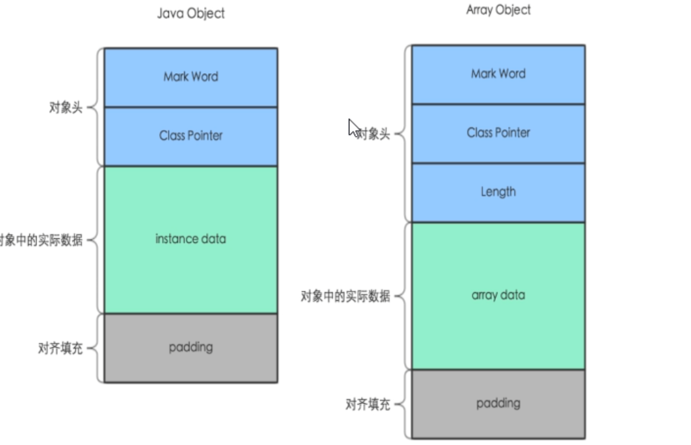
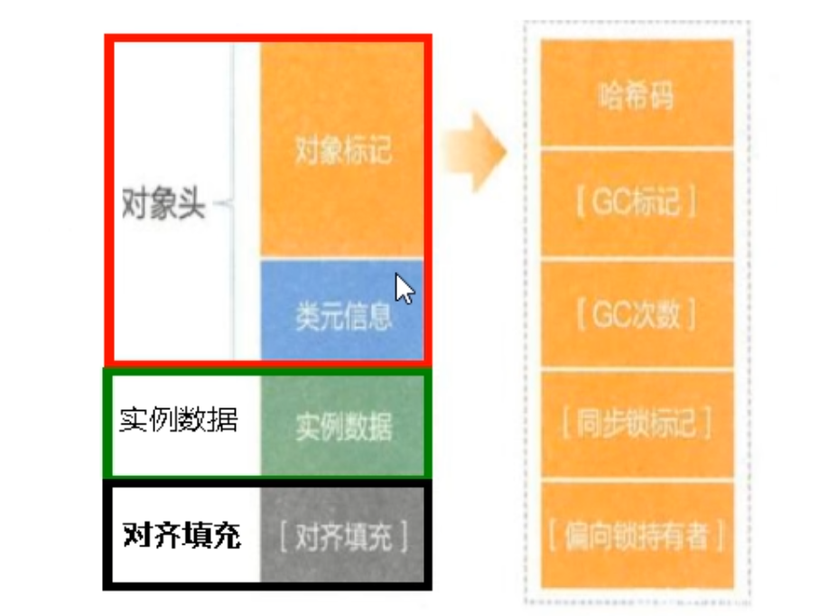
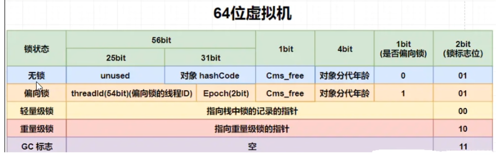
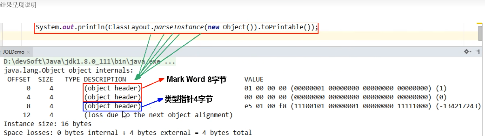
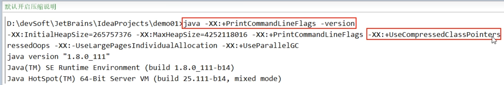
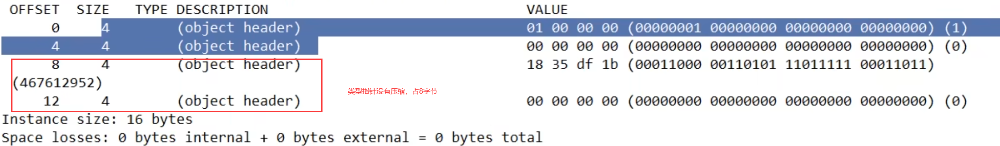
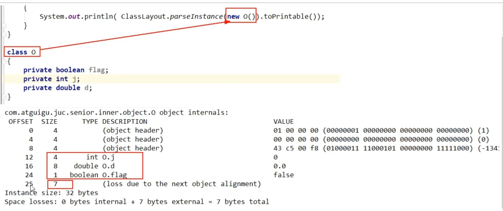

## Java对象内存布局和对象头

### Object object = new Object()的理解

- 位置所在-------->JVM堆->新生区->伊甸园区
- 构成布局-------->对象头+实例数据+对齐填充

### 对象在堆内存中布局

#### 权威定义

在HotSpot虚拟机里，对象在堆内存的存储布局可以划分为三个部分：对象头（Header）、实例数据（Instance Data） 和对齐填充（Padding）。

#### 对象在堆内存中的存储布局

**对象头**（在64位系统中，Mark Word占了8个字节，类型指针占了8个字节，一共是16个字节）

- 对象标记（Mark Word）

- 默认存储对象的HashCode、分代年龄和锁标志等信息。
- 这些信息都是与对象自身定义无关的数据，所以Mark Word被设计成一个非固定的数据结构以便在极小的空间内存存储尽量多的数据。
- 它会根据对象的状态复用自己的存储空间，也就是说在运行期间MarkWord里存储的数据会随着锁标志位的变化而变化。

- 类元信息（类型指针）

- 对象指向它的类元数据的指针，虚拟机通过这个指针来确定这个对象哪个类的实例

**实例数据**

- 存放类的属性（Field）数据信息，包括父类的属性信息

**对齐填充**（保证8个字节的倍数）

- 虚拟机要求对象起始地址必须是8字节的整数倍，填充数据不是必须存在的，仅仅是为了字节对齐，这部分内存按8字节补充对齐。

### 再说对象头的MarkWord

### Mark Word

Mark Word是Java对象头中的一个部分，它主要记录了对象的一些元信息，如哈希码（Hash Code）、GC分代年龄（GC Age）、锁状态标志（Lock Status）等。这些信息在JVM进行垃圾收集、对象哈希码计算、对象同步等操作时都会被用到。

Mark Word的具体内容会根据JVM的实现和对象的状态有所不同。但一般来说，它可以被大致划分为以下几个部分：

1. **锁状态标志（Lock Status Flag）**：这个标志位用于标识对象的锁状态。在Java中，对象可以被用来实现同步机制（如synchronized关键字），而这个标志位就是用来标识对象当前是否被某个线程持有锁。根据JVM的规范，这个标志位可以有多种状态，如轻量级锁（Lightweight Locking）、偏向锁（Biased Locking）、重量级锁（Heavyweight Locking）等。
2. **哈希码（Hash Code）**：当对象需要计算哈希码时（如插入到HashMap等基于哈希的集合中），这个哈希码会被存储在Mark Word中，以便后续快速获取。但需要注意的是，这个哈希码并不是在对象创建时就计算好的，而是在对象第一次调用hashCode()方法时计算并存储的。
3. **GC分代年龄（GC Age）**：在Java的垃圾收集器中，对象通常会被分配到不同的代（Generation）中，如新生代（Young Generation）和老年代（Old Generation）。而GC分代年龄就是用来标识对象在新生代中经历了多少次GC（Garbage Collection）而没有被回收。这个信息在JVM决定是否要将对象晋升到老年代时会被用到。
4. **其他信息**：除了上述信息外，Mark Word还可能包含一些其他的信息，如是否偏向锁可撤销（Biased Lock Revocable）等。这些信息的具体内容和格式会根据JVM的实现和版本有所不同。

### 聊聊Object obj = new Object()

#### 运行结果展示

#### 压缩指针

- Java -XX:+PrintCommandLineFlags -version 查看当前虚拟机信息
- 默认开启压缩指针，开启后将上述类型指针压缩为4字节，以节约空间

- 

- 手动关闭压缩指针： -XX: -UseCompressedClassPointers

- 

### 换成其他对象试试

