## synchronized 

### 理论

#### （1）继承

虽然可以使用 synchronized 来定义方法，但 synchronized 并不属于方法定义的一部分，因此，synchronized 关键字不能被继承。如果在父类中的某个方法使用了 synchronized 关键字，而在子类中覆盖了这个方法，在子类中的这个方法默认情况下并不是同步的，而必须显式地在子类的这个方法中加上synchronized 关键字才可以。当然，还可以在子类方法中调用父类中相应的方法，这样虽然子类中的方法不是同步的，但子类调用了父类的同步方法，因此，子类的方法也就相当于同步了。

#### （2）线程阻塞

如果一个代码块被 synchronized 修饰了，当一个线程获取了对应的锁，并执行该代码块时，其他线程便只能一直等待，等待获取锁的线程释放锁，而这里获取锁的线程释放锁只会有两种情况：
1）获取锁的线程执行完了该代码块，然后线程释放对锁的占有；
2）线程执行发生异常，此时 JVM 会让线程自动释放锁。
那么如果这个获取锁的线程由于要等待 IO 或者其他原因（比如调用 sleep方法）被阻塞了，但是又没有释放锁，其他线程便只能干巴巴地等待，试想一下，这多么影响程序执行效率。因此就需要有一种机制可以不让等待的线程一直无期限地等待下去（比如只等待一定的时间或者能够响应中断），通过 Lock 就可以办到。

#### （3）线程虚假唤醒

不使用while循环，而是使用if语句导致虚假唤醒

#### （4）锁的问题

一个对象里面如果有多个 synchronized 方法，某一个时刻内，只要一个线程去调用其中的一个 synchronized 方法了，其它的线程都只能等待，换句话说，某一个时刻内，只能有唯一一个线程去访问这些synchronized 方法锁的是当前对象 this，被锁定后，其它的线程都不能进入到当前对象的其它的synchronized 方法加个普通方法后发现和同步锁无关换成两个对象后，不是同一把锁了，情况立刻变化。
synchronized 实现同步的基础：Java 中的每一个对象都可以作为锁。
具体表现为以下 3 种形式：
	对于普通同步方法，锁是当前实例对象。
	对于静态同步方法，锁是当前类的 Class 对象。
	对于同步方法块，锁是 Synchonized 括号里配置的对象
当一个线程试图访问同步代码块时，它首先必须得到锁，退出或抛出异常时必须释放锁。也就是说如果一个实例对象的非静态同步方法获取锁后，该实例对象的其他非静态同步方法必须等待获取锁的方法释放锁后才能获取锁，可是别的实例对象的非静态同步方法因为跟该实例对象的非静态同步方法用的是不同的锁，所以毋须等待该实例对象已获取锁的非静态同步方法释放锁就可以获取他们自己的锁。所有的静态同步方法用的也是同一把锁——类对象本身，这两把锁是两个不同的对象，所以静态同步方法与非静态同步方法之间是不会有竞态条件的。但是一旦一个静态同步方法获取锁后，其他的静态同步方法都必须等待该方法释放锁后才能获取锁，而不管是同一个实例对象的静态同步方法之间，还是不同的实例对象的静态同步方法之间，只要它们同一个类的实例对象！


### 语法

#### 修饰方法

**实例方法**：当synchronized修饰一个实例方法时，它将锁定该方法所属对象的实例，确保同一时刻只有一个线程可以执行该方法。

```
public synchronized void method() {
    // 方法体
}
```

**静态方法**：当synchronized修饰一个静态方法时，它将锁定该方法所属的类的Class对象，确保同一时刻只有一个线程可以执行该静态方法。

```
public static synchronized void staticMethod() {
    // 方法体
}
```

#### 修饰代码块

**对象**：synchronized还可以用来修饰代码块，锁定指定的对象，确保同一时刻只有一个线程可以访问代码块中的代码（this、对象属性）

```
Object obj = new Object();
synchronized (obj) {
    // 代码块
}
```

**类字面常量**：在静态方法或静态代码块中，可以使用类字面常量来锁定整个类，即类的Class对象。

```
//类对象
public static void staticMethod() {
    synchronized (MyClass.class) {
        // 同步的代码块
    }
}

//静态属性
public class MyClass {
    private static Object lock = new Object();
    private static int count;
    public static void method() {
        synchronized (lock) {
            // 同步的代码块
        }
    }
}
```


## Lock

### 理论

#### 1、定义

Lock 锁实现提供了比使用同步方法和语句可以获得的更广泛的锁操作。它们允许更灵活的结构，可能具有非常不同的属性，并且可能支持多个关联的条件对象。Lock 提供了比 synchronized 更多的功能。

#### 2、Lock 与的 Synchronized 区别

• Lock 不是 Java 语言内置的，synchronized 是 Java 语言的关键字，因此是内置特性。Lock 是一个类，通过这个类可以实现同步访问；
• Lock 和 synchronized 有一点非常大的不同，采用 synchronized 不需要用户去手动释放锁，当 synchronized 方法或者 synchronized 代码块执行完之后，系统会自动让线程释放对锁的占用；而 Lock 则必须要用户去手动释放锁，如果没有主动释放锁，就有可能导致出现死锁现象。

#### 3、lock() 与 unlock()

lock()方法是平常使用得最多的一个方法，就是用来获取锁。如果锁已被其他线程获取，则进行等待。
采用 Lock，必须主动去释放锁，并且在发生异常时，不会自动释放锁。因此一般来说，使用 Lock 必须在 try{}catch{}块中进行，并且将释放锁的操作放在finally 块中进行，以保证锁一定被被释放，防止死锁的发生。通常使用 Lock来进行同步的话，是以下面这种形式去使用的：

```
Lock lock = ...;
lock.lock();
try{
//处理任务
}catch(Exception ex){
}finally{
lock.unlock(); //释放锁
}
```

#### 4、newCondition

关键字 synchronized 与 wait()/notify()这两个方法一起使用可以实现等待/通知模式， Lock 锁的 newContition()方法返回 Condition 对象，Condition 类也可以实现等待/通知模式。用 notify()通知时，JVM 会随机唤醒某个等待的线程， 使用 Condition 类可以进行选择性通知， Condition 比较常用的两个方法：
• await()会使当前线程等待,同时会释放锁,当其他线程调用 signal()时,线程会重新获得锁并继续执行。
• signal()用于唤醒一个等待的线程。
注意：在调用 Condition 的 await()/signal()方法前，也需要线程持有相关的 Lock 锁，调用 await()后线程会释放这个锁，在 singal()调用后会从当前Condition 对象的等待队列中，唤醒 一个线程，唤醒的线程尝试获得锁， 一旦获得锁成功就继续执行。

#### 5、Condition与Lock比较

虽然 `Lock` 接口提供了基本的互斥访问控制，但是它并没有提供线程间的等待和通知机制，这在某些情况下是不够的。`Condition` 接口的存在弥补了这一缺陷，它可以与 `Lock` 对象配合使用，提供了更灵活、更强大的线程间通信机制。

以下是使用 `Condition` 接口的一些优势和用途：

1. **精确的等待和通知机制**：`Condition` 接口提供了 `await()`、`signal()` 和 `signalAll()` 方法，可以实现精确的线程等待和通知。相比较于 `Object` 类的 `wait()`、`notify()` 和 `notifyAll()` 方法，`Condition` 接口更加灵活，可以更精确地控制线程的等待和唤醒。
2. **支持多个等待队列**：每个 `Condition` 对象都可以管理一个独立的等待队列，这意味着你可以在不同的条件下等待不同的线程。这种多个等待队列的支持使得线程间的通信更加灵活，可以更好地满足复杂的线程通信需求。
3. **避免虚假唤醒**：使用 `Condition` 接口可以避免虚假唤醒的问题。虚假唤醒指的是在没有调用 `signal()` 或 `signalAll()` 方法的情况下，等待中的线程被唤醒。`Condition` 接口提供的 `await()` 方法会在等待之前检查条件，如果条件不满足，则线程会真正地等待，而不会发生虚假唤醒。
4. **可组合性**：`Lock` 接口和 `Condition` 接口的组合使用提供了更高级的同步控制机制。你可以使用 `Lock` 接口来实现互斥访问控制，同时使用 `Condition` 接口来实现线程间的等待和通知，从而更灵活地控制多个线程的行为。

综上所述，虽然 `Lock` 接口提供了基本的互斥访问控制，但是 `Condition` 接口的存在使得线程间的通信更加灵活、精确，并且可以避免一些常见的并发编程问题，因此它们通常会一起使用。

#### 6、Lock 和 synchronized 有以下几点不同：

1. Lock 是一个接口，而 synchronized 是 Java 中的关键字，synchronized 是内置的语言实现；
2. synchronized 在发生异常时，会自动释放线程占有的锁，因此不会导致死锁现象发生；而 Lock 在发生异常时，如果没有主动通过 unLock()去释放锁，则很可能造成死锁现象，因此使用 Lock 时需要在 finally 块中释放锁；
3. Lock 可以让等待锁的线程响应中断，而 synchronized 却不行，使用synchronized 时，等待的线程会一直等待下去，不能够响应中断；
4. 通过 Lock 可以知道有没有成功获取锁，而 synchronized 却无法办到。
5. Lock 可以提高多个线程进行读操作的效率。在性能上来说，如果竞争资源不激烈，两者的性能是差不多的，而当竞争资源非常激烈时（即有大量线程同时竞争），此时 Lock 的性能要远远优于synchronized。

#### 7、公平锁与非公平锁

**公平锁（效率低、线程平等）：** 公平锁是指当多个线程请求锁时，按照请求的顺序来获取锁。即先来先得，线程按照请求锁的顺序排队等待。在公平锁中，所有的线程都有公平竞争获取锁的机会，不会出现饥饿现象。但是由于需要维护一个有序的等待队列，可能会导致性能下降。

**非公平锁（效率高、线程饿死）：** 非公平锁是指当多个线程请求锁时，不考虑线程请求的顺序，直接尝试获取锁。如果获取不到，才会进行排队等待。非公平锁可能会导致某些线程长时间无法获取到锁，产生饥饿现象，但是由于不需要维护有序的等待队列，可能会比公平锁有更高的吞吐量和更低的延迟。

```
private Lock fairLock = new ReentrantLock(true); // 使用公平锁 
private Lock nonfairLock = new ReentrantLock(false); // 使用非公平锁
```

#### 8、可重入锁/递归锁

同一个线程在持有锁的情况下，可以重复地对同一个锁进行加锁，而不会造成死锁。可重入锁是通过记录当前锁的持有者和持有次数来实现的。（只要某个线程拥有锁之后，再次调用该方法依然可以调用，即是无限递归锁方法）

显式：ReentrantLock

隐士：synchronized

1. **避免死锁：** 可重入锁允许同一个线程多次获取同一个锁，因此可以避免因为锁的持有者在等待自己释放锁而导致的死锁问题。
2. **更灵活的锁获取和释放操作：** 可重入锁提供了灵活的锁获取和释放方法，可以在不同的代码块中多次获取和释放锁，而不受限于同步方法或同步代码块的范围。
3. **高性能：** 与内置锁（synchronized）相比，可重入锁通常具有更好的性能，尤其是在高并发的情况下。

### 语法


#### Lock类

它提供了比传统的`synchronized`关键字更加灵活和强大的锁机制。与`synchronized`块或方法相比，`Lock`接口提供了更多的操作和功能，例如可中断锁、定时锁、尝试非阻塞地获取锁等。

`Lock`接口的常见实现类是`ReentrantLock`，它是一个可重入的锁，意味着同一个线程可以多次获取同一个锁而不会出现死锁。除了`ReentrantLock`，还有一些其他的实现类，例如`ReadWriteLock.ReadLock`和`ReadWriteLock.WriteLock`，用于实现读写锁。

使用`Lock`接口可以更加灵活地控制线程之间的同步，但也需要开发者手动管理锁的获取和释放，以及处理可能的异常情况。因此，在选择使用`Lock`接口时需要谨慎考虑，并根据具体情况进行权衡。

```
public interface Lock {
void lock();
void lockInterruptibly() throws InterruptedException;
boolean tryLock();
boolean tryLock(long time, TimeUnit unit) throws InterruptedException;
void unlock();
Condition newCondition();
}
```

**lock()**：获取锁。如果锁已经被其他线程获取，当前线程会被阻塞，直到获取到锁为止。如果线程在等待锁的过程中被中断，它会继续等待，直到获取到锁或者抛出`InterruptedException`。

**tryLock()**：尝试获取锁，如果锁是可用的，则立即返回`true`，否则立即返回`false`，不会等待。这个方法不会导致线程阻塞。

**tryLock(long time, TimeUnit unit)**：尝试在指定的时间内获取锁。如果在指定的时间内获取到了锁，则返回`true`，否则返回`false`。如果线程在等待锁的过程中被中断，它会继续等待，直到获取到锁或者抛出`InterruptedException`。

**lockInterruptibly()**：获取锁，但允许被中断。如果锁已经被其他线程获取，当前线程会被阻塞，直到获取到锁或者被其他线程中断。

**unlock()**：释放锁。必须在`lock()`之后、成功获取到锁之后调用，用于释放锁资源。

**newCondition()** 用于创建一个与该锁相关联的 `Condition` 对象，这个 `Condition` 对象可以用于线程间的等待和通知。


#### Condition类

Java并发编程中用于等待和通知的机制之一，它通常与锁（如`ReentrantLock`）一起使用。`Condition`接口提供了类似于`Object`的`wait()`和`notify()`方法的功能，但更加灵活和强大。

1. **await()**：使当前线程等待，并释放与之关联的锁。当另一个线程调用了相应锁的`signal()`或`signalAll()`方法时，该线程才会被唤醒并重新获取锁。通常在一个循环中使用`await()`方法，以防止虚假唤醒。
2. **awaitUninterruptibly()**：与`await()`类似，但不会响应中断。即使当前线程被中断，也会继续等待。
3. **signal()**：唤醒一个等待的线程。如果有多个线程在等待，那么只有一个会被唤醒。被唤醒的线程会尝试重新获取与之关联的锁，一旦成功获取锁，它就可以从`await()`方法中返回。
4. **signalAll()**：唤醒所有等待的线程。调用`signalAll()`后，所有等待的线程都会尝试重新获取与之关联的锁。

```
1、获取锁：首先，你需要使用 Lock 对象的 lock() 方法获取锁。
2、创建 Condition 对象：然后，通过调用 Lock 对象的 newCondition() 方法来创建一个与该锁相关联的 Condition 对象。
3、使用 Condition 对象进行线程间的等待和通知：
	等待（await）：调用 Condition 对象的 await() 方法来让当前线程等待某个条件的发生。调用该方法会释放锁，并将当前线程置于等待状态，直到其他线程调用了 Condition 对象的 signal() 或 signalAll() 方法。
	通知（signal）：当某个条件满足时，你可以调用 Condition 对象的 signal() 方法来唤醒一个等待的线程，或者调用 signalAll() 方法来唤醒所有等待的线程。
4、释放锁：在使用完 Condition 对象后，记得调用 Lock 对象的 unlock() 方法释放锁。

public class ConditionExample {
    private final Lock lock = new ReentrantLock();
    private final Condition condition = lock.newCondition();
    private boolean isConditionMet = false;

    public void waitForCondition() throws InterruptedException {
        lock.lock();
        try {
            // 如果条件未满足，则等待
            while (!isConditionMet) {
                condition.await(); // 线程等待，同时释放锁
            }
            // 条件满足后执行的代码
            System.out.println("Condition is met, continue...");
        } finally {
            lock.unlock();
        }
    }

    public void fulfillCondition() {
        lock.lock();
        try {
            // 设置条件为满足
            isConditionMet = true;
            // 唤醒等待的线程
            condition.signal();
        } finally {
            lock.unlock();
        }
    }

    public static void main(String[] args) {
        ConditionExample example = new ConditionExample();

        // 创建一个线程等待条件
        Thread waitingThread = new Thread(() -> {
            try {
                example.waitForCondition();
            } catch (InterruptedException e) {
                e.printStackTrace();
            }
        });

        // 创建一个线程来满足条件
        Thread fulfillingThread = new Thread(example::fulfillCondition);

        // 启动两个线程
        waitingThread.start();
        fulfillingThread.start();
    }
}
```


#### ReentrantLock

**构造方法：**

- `ReentrantLock()`: 创建一个新的 ReentrantLock 实例。

**获取锁方法：**

- `lock()`: 获取锁，如果锁已经被其他线程获取，则当前线程会被阻塞，直到获取到锁。
- `lockInterruptibly() throws InterruptedException`: 获取锁，如果锁已经被其他线程获取，则当前线程会被阻塞，直到获取到锁或者被中断。
- `tryLock()`: 尝试获取锁，如果锁是可用的，则立即返回 true，否则立即返回 false，不会被阻塞。
- `tryLock(long timeout, TimeUnit unit) throws InterruptedException`: 在指定的时间内尝试获取锁，如果锁是可用的，则立即返回 true，否则等待指定的时间，如果在等待的时间内获取到了锁，则返回 true，否则返回 false。

**释放锁方法：**

- `unlock()`: 释放锁。

**其他方法：**

- `boolean isLocked()`: 查询锁是否被任意线程持有。
- `boolean isHeldByCurrentThread()`: 查询锁是否被当前线程持有。
- `int getHoldCount()`: 查询当前线程持有该锁的次数。


### 应用

##### 线程间通信（按条件执行）

```
//第一步 创建资源类，定义属性和操作方法
class Share {
    //初始值
    private int number = 0;
    //+1的方法
    public synchronized void incr() throws InterruptedException {
        //第二步 判断 干活 通知
        while(number != 0) { //判断number值是否是0，如果不是0，等待
            this.wait(); //在哪里睡，就在哪里醒
        }
        //如果number值是0，就+1操作
        number++;
        System.out.println(Thread.currentThread().getName()+" :: "+number);
        //通知其他线程
        this.notifyAll();
    }

    //-1的方法
    public synchronized void decr() throws InterruptedException {
        //判断
        while(number != 1) {
            this.wait();
        }
        //干活
        number--;
        System.out.println(Thread.currentThread().getName()+" :: "+number);
        //通知其他线程
        this.notifyAll();
    }
}

public class ThreadDemo1 {
    //第三步 创建多个线程，调用资源类的操作方法
    public static void main(String[] args) {
        Share share = new Share();
        //创建线程
        new Thread(()->{
            for (int i = 1; i <=10; i++) {
                try {
                    share.incr(); //+1
                } catch (InterruptedException e) {
                    e.printStackTrace();
                }
            }
        },"AA").start();

        new Thread(()->{
            for (int i = 1; i <=10; i++) {
                try {
                    share.decr(); //-1
                } catch (InterruptedException e) {
                    e.printStackTrace();
                }
            }
        },"BB").start();

        new Thread(()->{
            for (int i = 1; i <=10; i++) {
                try {
                    share.incr(); //+1
                } catch (InterruptedException e) {
                    e.printStackTrace();
                }
            }
        },"CC").start();

        new Thread(()->{
            for (int i = 1; i <=10; i++) {
                try {
                    share.decr(); //-1
                } catch (InterruptedException e) {
                    e.printStackTrace();
                }
            }
        },"DD").start();
    }
}
```

##### 线程间定制通信（按一定顺序）

```
import java.util.ArrayList;
import java.util.List;
import java.util.UUID;
import java.util.concurrent.locks.Condition;
import java.util.concurrent.locks.Lock;
import java.util.concurrent.locks.ReentrantLock;

//第一步 创建资源类
class ShareResource {
    //定义标志位
    private int flag = 1;  // 1 AA     2 BB     3 CC

    //创建Lock锁
    private Lock lock = new ReentrantLock();

    //创建三个condition
    private Condition c1 = lock.newCondition();
    private Condition c2 = lock.newCondition();
    private Condition c3 = lock.newCondition();

    //打印5次，参数第几轮
    public void print5(int loop) throws InterruptedException {
        //上锁
        lock.lock();
        try {
            //判断
            while(flag != 1) {
                //等待
                c1.await();
            }
            //干活
            for (int i = 1; i <=5; i++) {
                System.out.println(Thread.currentThread().getName()+" :: "+i+" ：轮数："+loop);
            }
            //通知
            flag = 2; //修改标志位 2
            c2.signal(); //通知BB线程
        }finally {
            //释放锁
            lock.unlock();
        }
    }

    //打印10次，参数第几轮
    public void print10(int loop) throws InterruptedException {
        lock.lock();
        try {
            while(flag != 2) {
                c2.await();
            }
            for (int i = 1; i <=10; i++) {
                System.out.println(Thread.currentThread().getName()+" :: "+i+" ：轮数："+loop);
            }
            //修改标志位
            flag = 3;
            //通知CC线程
            c3.signal();
        }finally {
            lock.unlock();
        }
    }

    //打印15次，参数第几轮
    public void print15(int loop) throws InterruptedException {
        lock.lock();
        try {
            while(flag != 3) {
                c3.await();
            }
            for (int i = 1; i <=15; i++) {
                System.out.println(Thread.currentThread().getName()+" :: "+i+" ：轮数："+loop);
            }
            //修改标志位
            flag = 1;
            //通知AA线程
            c1.signal();
        }finally {
            lock.unlock();
        }
    }
}

public class ThreadDemo3 {
    public static void main(String[] args) {
        ShareResource shareResource = new ShareResource();
        new Thread(()->{
            for (int i = 1; i <=10; i++) {
                try {
                    shareResource.print5(i);
                } catch (InterruptedException e) {
                    e.printStackTrace();
                }
            }
        },"AA").start();

        new Thread(()->{
            for (int i = 1; i <=10; i++) {
                try {
                    shareResource.print10(i);
                } catch (InterruptedException e) {
                    e.printStackTrace();
                }
            }
        },"BB").start();

        new Thread(()->{
            for (int i = 1; i <=10; i++) {
                try {
                    shareResource.print15(i);
                } catch (InterruptedException e) {
                    e.printStackTrace();
                }
            }
        },"CC").start();
    }
}
```

## 读写锁

### 理论

#### （1）应用场景

对共享资源有读和写的操作，且写操作没有读操作那么频繁。在没有写操作的时候，多个线程同时读一个资源没有任何问题，所以
应该允许多个线程同时读取共享资源；但是如果一个线程想去写这些共享资源，就不应该允许其他线程对该资源进行读和写的操作了。

针对这种场景，JAVA 的并发包提供了读写锁 ReentrantReadWriteLock，它表示两个锁，一个是读操作相关的锁，称为共享锁；一个是写相关的锁，称为排他锁

##### 线程进入读锁的前提条件：

• 没有其他线程的写锁
• 没有写请求, 或者有写请求，但调用线程和持有锁的线程是同一个(可重入锁)。

##### 线程进入写锁的前提条件：

• 没有其他线程的读锁
• 没有其他线程的写锁

##### 读写锁三个重要的特性：

（1）公平选择性：支持非公平（默认）和公平的锁获取方式，吞吐量还是非公平优于公平。
（2）重进入：读锁和写锁都支持线程重进入。
（3）锁降级：遵循获取写锁、获取读锁再释放写锁的次序，写锁能够降级成为读锁。

#### （2）锁降级

在线程持有读锁的情况下，该线程不能取得写锁(因为获取写锁的时候，如果发现当前的读锁被占用，就马上获取失败，不管读锁是不是被当前线程持有)。
在线程持有写锁的情况下，该线程可以继续获取读锁（获取读锁时如果发现写锁被占用，只有写锁没有被当前线程占用的情况才会获取失败）。
原因: 当线程获取读锁的时候，可能有其他线程同时也在持有读锁，因此不能把获取读锁的线程“升级”为写锁；而对于获得写锁的线程，它一定独占了读写锁，因此可以继续让它获取读锁，当它同时获取了写锁和读锁后，还可以先释放写锁继续持有读锁，这样一个写锁就“降级”为了读锁。

```
//可重入读写锁对象
ReentrantReadWriteLock rwLock = new ReentrantReadWriteLock();
ReentrantReadWriteLock.ReadLock readLock = rwLock.readLock();//读锁
ReentrantReadWriteLock.WriteLock writeLock = rwLock.writeLock();//写锁

//1 获取写锁
writeLock.lock();
System.out.println("writing");

//锁降级
//2 获取读锁
readLock.lock();
System.out.println("read");

//3 释放写锁
writeLock.unlock();

//4 释放读锁
readLock.unlock();
```

### 语法

#### ReadWriteLock

**Read Lock（读锁）：** 用于支持多个线程同时读取共享资源，不互斥。

- `Lock readLock()`: 返回一个读锁实例。

**Write Lock（写锁）：** 用于独占地写入共享资源，当一个线程持有写锁时，其他线程无法获取读锁或写锁。

- `Lock writeLock()`: 返回一个写锁实例。

#### ReentrantReadWriteLock

##### 特点：

1. **可重入性：** 与 `ReentrantLock` 类似，读写锁也是可重入的，允许同一个线程在持有锁的情况下多次获取该锁。
2. **读写分离：** 读写锁在设计上允许多个线程同时获取读锁，而在写锁被持有时不允许其他线程获取读锁或写锁，从而实现了读写分离，提高了并发性能。
3. **公平性选择：** `ReentrantReadWriteLock` 支持公平和非公平的锁获取方式。公平锁会按照请求的顺序分配锁，而非公平锁则允许插队获取锁，可以提高整体吞吐量。

##### 方法：

- `readLock()`: 返回一个读锁实例，用于读取共享资源。
- `writeLock()`: 返回一个写锁实例，用于写入共享资源。
- `isFair()`: 判断锁是否是公平锁。
- `getQueueLength()`: 返回正在等待获取写锁的线程数。
- `getReadHoldCount()`: 返回当前线程持有读锁的个数。
- `getReadLockCount()`: 返回当前读锁的数量。
- `getWriteHoldCount()`: 返回当前线程持有写锁的个数。
- `isWriteLocked()`: 判断写锁是否被某个线程持有。

### 应用

```
//资源类
class MyCache {
    //创建map集合
    private volatile Map<String,Object> map = new HashMap<>();

    //创建读写锁对象
    private ReadWriteLock rwLock = new ReentrantReadWriteLock();

    //放数据
    public void put(String key,Object value) {
        //添加写锁
        rwLock.writeLock().lock();

        try {
            System.out.println(Thread.currentThread().getName()+" 正在写操作"+key);
            //暂停一会
            TimeUnit.MICROSECONDS.sleep(300);
            //放数据
            map.put(key,value);
            System.out.println(Thread.currentThread().getName()+" 写完了"+key);
        } catch (InterruptedException e) {
            e.printStackTrace();
        } finally {
            //释放写锁
            rwLock.writeLock().unlock();
        }
    }

    //取数据
    public Object get(String key) {
        //添加读锁
        rwLock.readLock().lock();
        Object result = null;
        try {
            System.out.println(Thread.currentThread().getName()+" 正在读取操作"+key);
            //暂停一会
            TimeUnit.MICROSECONDS.sleep(300);
            result = map.get(key);
            System.out.println(Thread.currentThread().getName()+" 取完了"+key);
        } catch (InterruptedException e) {
            e.printStackTrace();
        } finally {
            //释放读锁
            rwLock.readLock().unlock();
        }
        return result;
    }
}

public class ReadWriteLockDemo {
    public static void main(String[] args) throws InterruptedException {
        MyCache myCache = new MyCache();
        //创建线程放数据
        for (int i = 1; i <=5; i++) {
            final int num = i;
            new Thread(()->{
                myCache.put(num+"",num+"");
            },String.valueOf(i)).start();
        }

        TimeUnit.MICROSECONDS.sleep(300);

        //创建线程取数据
        for (int i = 1; i <=5; i++) {
            final int num = i;
            new Thread(()->{
                myCache.get(num+"");
            },String.valueOf(i)).start();
        }
    }
}

```

结果分析：读可以有多个线程，写只有一个线程

读写没有优先级，但是当进行读操作时，如果此时又有读操作与写操作同时进来，此时会优先进行读操作；当进行写操作时，如果此时又有读操作与写操作同时进来，此时会优先进行写操作

写完又写

读可以同时读，所以此时只有读完才能写


## 乐观锁和悲观锁

悲观锁： 认为自己在使用数据的时候一定有别的线程来修改数据，因此在获取数据的时候会先加锁，确保数据不会被别的线程修改，synchronized和Lock的实现类都是悲观锁，适合写操作多的场景，先加锁可以保证写操作时数据正确，显示的锁定之后再操作同步资源-----狼性锁

乐观锁： 认为自己在使用数据的时候不会有别的线程修改数据或资源，不会添加锁，Java中使用无锁编程来实现，只是在更新的时候去判断，之前有没有别的线程更新了这个数据，如果这个数据没有被更新，当前线程将自己修改的数据成功写入，如果已经被其他线程更新，则根据不同的实现方式执行不同的操作，比如：放弃修改、重试抢锁等等。判断规则有：版本号机制Version，最常采用的是CAS算法，Java原子类中的递增操作就通过CAS自旋实现的。-----适合读操作多的场景，不加锁的特性能够使其读操作的性能大幅提升，乐观锁则直接去操作同步资源，是一种无锁算法，得之我幸不得我命

## 从字节码角度分析synchronized实现

### 3.2.1字节码

#### 实现使用的是monitorenter和monitorexit指令

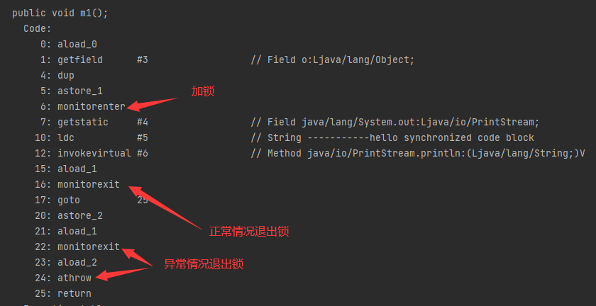

#### synchronized普通同步方法

调用指令将会检查方法的ACC_SYNCHRONIZED访问标志是否被设置，如果设置了，执行线程会将现持有monitor锁，然后再执行该方法，最后在方法完成（无论是否正常结束）时释放monitor

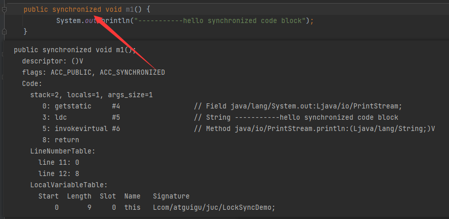

#### synchronized静态同步方法

ACC_STATIC、ACC_SYNCHRONIZED访问标志区分该方法是否是静态同步方法

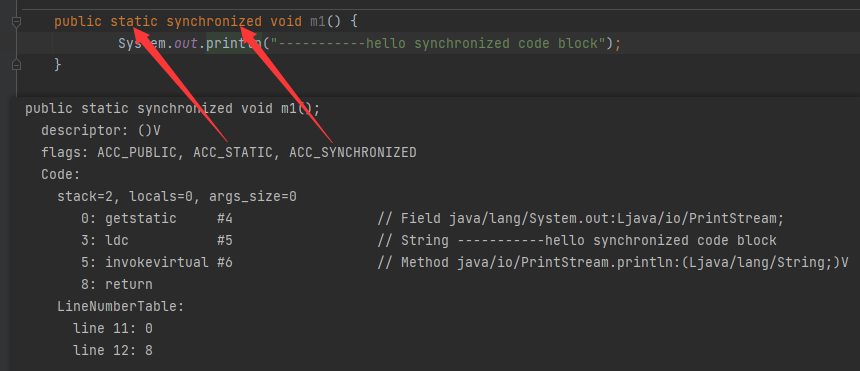

### 3.2.2 反编译synchronized锁的是什么

##### 任何一个对象都可以成为一个锁

C++源码：ObjectMonitor.java--->ObjectMonitor.cpp--->ObjectMonitor.hpp

每个对象天生都带着一个对象监视器，每一个被锁住的对象都会和Monitor关联起来

总结：指针指向Monitor对象（也称为管程或监视器）的真实地址。每个对象都存在着一个monitor与之关联，当一个monitor被某个线程持有后，它便处于锁定状态。在Java虚拟机（HotSpot）中，monitor是由OnjectMonitor实现的，其主要的数据结构如下（位于HotSpot虚拟机源码ObjectMonitor.hpp文件，C++实现）：

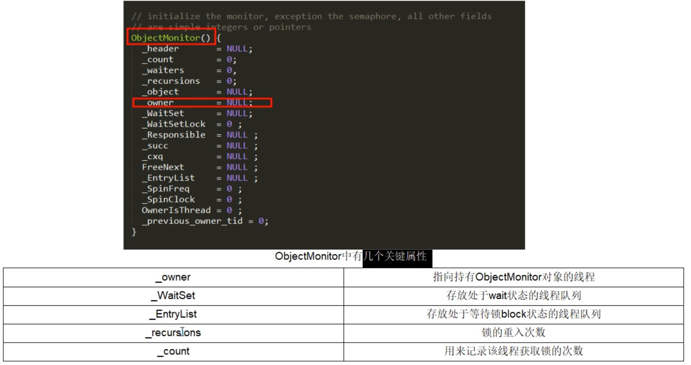

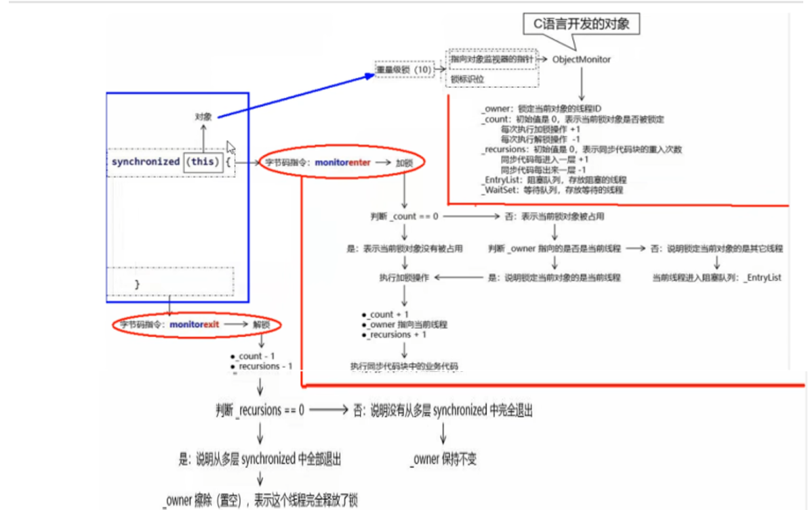

## 公平锁和非公平锁

##### 公平锁：

是指多个线程按照申请锁的顺序来获取锁，这里类似于排队买票，先来的人先买，后来的人再队尾排着，这是公平的----- Lock lock = new ReentrantLock(true)---表示公平锁，先来先得。

##### 非公平锁：

是指多个线程获取锁的顺序并不是按照申请的顺序，有可能后申请的线程比先申请的线程优先获取锁，在高并发环境下，有可能造成优先级反转或者饥饿的状态（某个线程一直得不到锁）---- Lock lock = new  ReentrantLock(false)---表示非公平锁，后来的也可能先获得锁，默认为非公平锁。

##### 为什么会有公平锁/非公平锁的设计？

性能考量：

- 非公平锁：非公平锁的设计允许新进入的线程在不需要等待已有等待队列中的线程的情况下直接尝试获取锁。这种方式能更充分地利用CPU的时间片，减少CPU的空闲时间。同时，当线程释放锁后，该线程再次尝试获取锁的概率增大，从而减少了线程切换的开销，提高了整体的吞吐效率。
- 公平锁：公平锁需要维护一个等待队列，并根据线程进入队列的顺序来决定哪个线程能够获取到锁。这种方式虽然保证了先来的线程优先获取锁，但也可能导致性能问题，因为需要频繁地进行线程上下文切换，以确保按照正确的顺序处理请求。

公平性考量：

- 公平锁：公平锁严格按照线程等待的顺序来获取锁，确保了先来先服务的原则，为每个线程提供了公平的访问机会。
- 非公平锁：非公平锁则不考虑线程等待的顺序，每个线程获取锁的概率都是相等的。这种方式可能会导致某些线程长时间处于饥饿状态，因为新加入的竞争者可能会优先获得锁。

适用场景：

- 当需要保证线程间的公平访问时，可以选择公平锁。
- 当更关注性能和吞吐量时，非公平锁可能是一个更好的选择。

总结来说，公平锁和非公平锁的设计是在多线程编程中对性能和公平性进行权衡的结果。非公平锁通过减少线程切换的开销和充分利用CPU的时间片来提高性能，但可能导致某些线程长时间处于饥饿状态；而公平锁则通过维护等待队列来确保线程间的公平访问，但可能牺牲了一定的性能。在实际应用中，应根据具体的需求和场景来选择使用哪种类型的锁。

##### 为什么默认非公平？

恢复挂起的线程到真正锁的获取还是有时间差的，从开发人员来看这个时间微乎其微，但是从CPU的角度来看，这个时间差存在的还是很明显的。所以非公平锁能更充分地利用CPU的时间片，尽量减少CPU空间状态时间。

使用多线程很重要的考量点是线程切换的开销，当采用非公平锁时，当一个线程请求锁获取同步状态，然后释放同步状态，所以刚释放锁的线程在此刻再次获取同步状态的概率就变得很大，所以就减少了线程的开销。

##### 什么时候用公平？什么时候用非公平？

如果为了更高的吞吐量，很显然非公平锁是比较合适的，因为节省了很多线程切换的时间，吞吐量自然就上去了；否则就用公平锁，大家公平使用。

## 可重入锁（递归锁）

在同一线程在外层方法获取到锁的时侯，在进入该线程的内层方法会自动获取锁（前提，锁对象的是同一个对象），不会因为之前已经获取过还没释放而阻塞---------优点之一就是可一定程度避免死锁。

**隐式锁**（即synchronized关键字使用的锁），默认是可重入锁

在一个synchronized修饰的方法或者代码块的内部调用本类的其他synchronized修饰的方法或者代码块时，是永远可以得到锁。

**显式锁**（即Lock）也有ReentrantLock这样的可重入锁

```
 public static void main(String[] args) {
        final Object o = new Object();
        /**
         * ---------------外层调用
         * ---------------中层调用
         * ---------------内层调用
         */
        new Thread(() -> {
            synchronized (o) {
                System.out.println("---------------外层调用");
                synchronized (o) {
                    System.out.println("---------------中层调用");
                    synchronized (o) {
                        System.out.println("---------------内层调用");
                    }
                }
            }
        }, "t1").start();

        /**
         * 注意：加锁几次就需要解锁几次
         * ---------------外层调用
         * ---------------中层调用
         * ---------------内层调用
         */
        Lock lock = new ReentrantLock();
        new Thread(() -> {
            lock.lock();
            try {
                System.out.println("---------------外层调用");
                lock.lock();
                try {
                    System.out.println("---------------中层调用");
                    lock.lock();
                    try {
                        System.out.println("---------------内层调用");
                    } finally {
                        lock.unlock();
                    }
                } finally {
                    lock.unlock();
                }
            } finally {
                lock.unlock();
            }
        }, "t2").start();
    }
```

## 死锁及排查

死锁是指两个或两个以上的线程在执行过程中，因抢夺资源而造成的一种互相等待的现象，若无外力干涉，则它们无法再继续推进下去。

### 3.5.1产生原因：

- 系统资源不足
- 进程运行推进顺序不合适
- 系统资源分配不当

### 3.5.2死锁案例：

```
public class DeadLockDemo {
    static  Object a=new Object();
    static  Object b=new Object();

    public static void main(String[] args) {
        new Thread(() -> {
            synchronized (a){
                System.out.println("t1线程持有a锁，试图获取b锁");
                try {
                    TimeUnit.SECONDS.sleep(1);
                } catch (InterruptedException e) {
                    e.printStackTrace();
                }
                synchronized (b){
                    System.out.println("t1线程获取到b锁");
                }
            }
         },"t1").start();

        new Thread(() -> {
            synchronized (b){
                System.out.println("t2线程持有a锁，试图获取a锁");
                try {
                    TimeUnit.SECONDS.sleep(1);
                } catch (InterruptedException e) {
                    e.printStackTrace();
                }
                synchronized (a){
                    System.out.println("t2线程获取到a锁");
                }
            }
        },"t2").start();
    }
}
```

### 3.5.3排查死锁

#### 纯命令：jps -l、jstack 进程编号

1、打开命令行终端。

2、输入 `jps -l` 命令并按下回车键。

```bash
jps -l
```

3、`jps` 命令会列出所有Java进程的PID（进程ID）和它们的主类名或JAR文件路径。

4、查找你想要分析的Java进程的PID。

5、找到了PID，使用 `jstack` 命令来生成该Java进程的线程堆栈跟踪，并查找死锁信息。

```
jstack <PID>
```

jstack 命令的输出将包含该Java进程的线程堆栈跟踪。如果存在死锁，jstack 的输出中会包含类似于以下内容的部分：

```
Found one Java-level deadlock:  
=============================  
  
"Thread-1":  
  waiting to lock monitor 0x00007f8d4c0022c8 (object 0x000000076b5e59d0),  
  which is held by "Thread-0"  
"Thread-0":  
  waiting to lock monitor 0x00007f8d4c002328 (object 0x000000076b5e59e0),  
  which is held by "Thread-1"  
  
Java stack information for the threads listed above:  
===================================================  
"Thread-1":  
... (省略了堆栈跟踪的其余部分)  
"Thread-0":  
... (省略了堆栈跟踪的其余部分)
```

请注意，jps 和 jstack 都是JDK自带的工具，它们位于JDK的 bin 目录下。因此，需要确保 jps 和 jstack 命令的路径已经包含在系统的环境变量 PATH 中，或者可以通过指定完整的路径来运行它们

#### 图形化：jconsole

1. **启动 jconsole**：
   打开命令行终端，输入 `jconsole` 并按回车键启动 `jconsole` 工具。
2. **连接到Java进程**：
   在 `jconsole` 的界面中，你会看到一个本地进程列表，显示了所有正在运行的Java进程。选择你想要连接的Java进程，然后点击“连接”按钮。如果你需要连接到远程Java进程，可以点击右上角的“远程”按钮，并输入远程主机的地址和端口号。
3. **查看线程信息**：
   连接成功后，在左侧的导航树中选择“**线程**”选项卡。这将显示Java进程的线程信息，包括线程名称、状态、堆栈跟踪等。
4. **查找死锁**：
   在“线程”选项卡中，查找状态为“BLOCKED”的线程。这些线程可能是死锁的一部分，因为它们正在等待获取某个锁，但无法获得。为了更清晰地看到死锁情况，你可以对线程列表进行排序或过滤。
5. **分析死锁**：
   点击一个状态为“BLOCKED”的线程，查看其堆栈跟踪信息。堆栈跟踪将显示线程正在等待哪个锁，以及哪个线程持有该锁。通过分析多个线程的堆栈跟踪，你可以确定是否存在死锁，并找出导致死锁的线程和锁。
6. **解决死锁**：
   一旦确定了死锁的原因，你可以采取适当的措施来解决它。这可能包括重新设计代码以避免死锁，或者调整线程的优先级和调度策略来减少死锁的可能性。

注意：`jconsole` 是一个强大的工具，但它可能无法直接显示“死锁”这个词。你需要通过分析线程的堆栈跟踪和状态来确定是否存在死锁。此外，`jconsole` 还提供了其他有用的监控功能，如内存使用、垃圾回收等，这些功能也可以帮助你更好地理解Java应用程序的性能和行为。


## Synchronized的性能变化

Java5以前，只有Synchronized，这个是操作系统级别的重量级操作

- 重量级锁，假如锁的竞争比较激烈的话，性能下降
- Java 5之前 用户态和内核态之间的转换

- 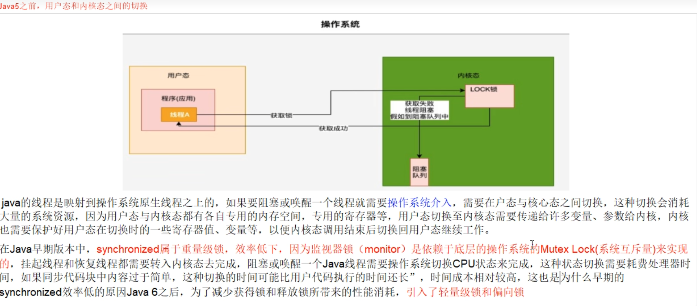

Java6 之后为了减少获得锁和释放锁所带来的性能消耗，引入了轻量级锁和偏向锁

## Synchronized锁种类及升级步骤

### 多线程访问情况

- 只有一个线程来访问，有且唯一Only One
- 有两个线程（2个线程交替访问）
- 竞争激烈，更多线程来访问

###  升级流程

- Synchronized用的锁是存在Java对象头里的MarkWord中，锁升级功能主要依赖MarkWord中锁标志位和释放偏向锁标志位
- 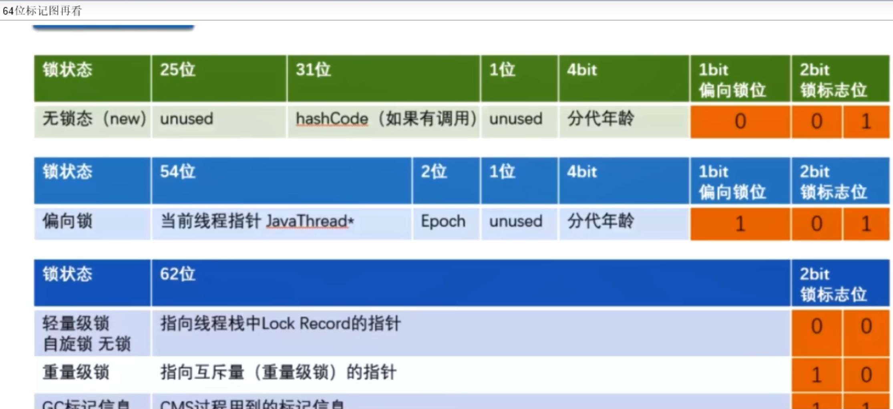
- 锁指向，请牢记

- 偏向锁：MarkWord存储的是偏向的线程ID
- 轻量锁：MarkWord存储的是指向线程栈中Lock Record的指针
- 重量锁：MarkWord存储的是指向堆中的monitor对象（系统互斥量指针）

### 无锁

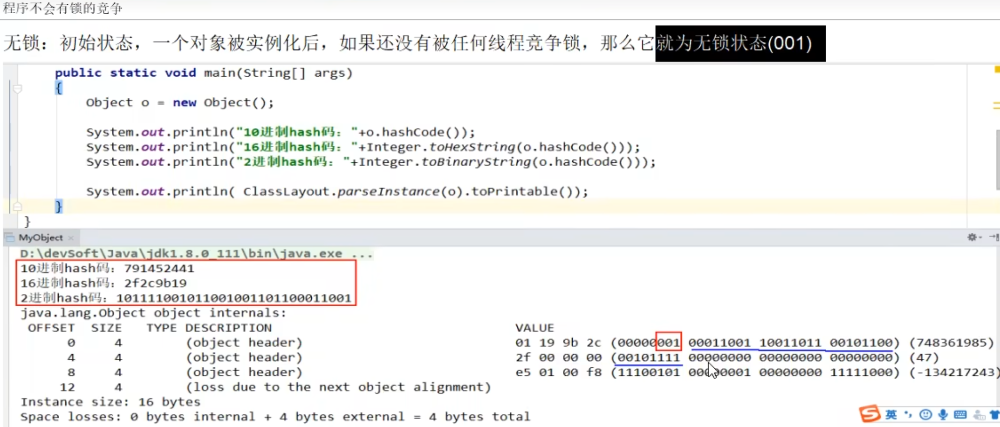


### 偏锁

偏向锁：单线程竞争，当线程A第一次竞争到锁时，通过修改MarkWord中的偏向线程ID、偏向模式。如果不存在其他线程竞争，那么持有偏向锁的线程将永远不需要进行同步。

主要作用：

- 当一段同步代码一直被同一个线程多次访问，由于只有一个线程那么该线程在后续访问时便会自动获得锁
- 同一个老顾客来访，直接老规矩行方便

结论：

- HotSpot的作者经过研究发现，大多数情况下：在多线程情况下，锁不仅不存在多线程竞争，还存在由同一个线程多次获得的情况，偏向锁就是在这种情况下出现的，它的出现是为了解决只有一个线程执行同步时提高性能。
- 偏向锁会偏向于第一个访问锁的线程，如果在接下来的运行过程中，该锁没有被其他线程访问，则持有偏向锁的线程将永远不需要出发同步。也即偏向锁在资源在没有竞争情况下消除了同步语句，懒得连CAS操作都不做了，直接提高程序性能。

理论落地：

- 

技术实现：


偏向锁JVM命令：

- 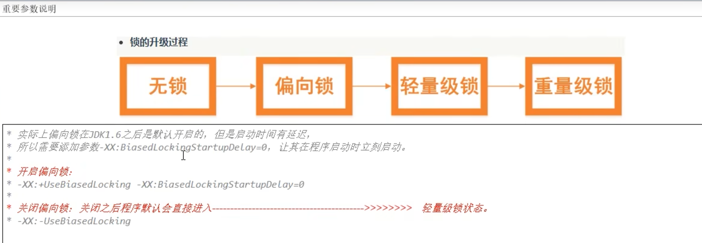

案例

```
/**

 */
public class SynchronizedUpDemo {

    public static void main(String[] args) {
        /**
         * 这里偏向锁在JDK6以上默认开启，开启后程序启动几秒后才会被激活，可以通过JVM参数来关闭延迟 -XX:BiasedLockingStartupDelay=0
         */
//        try { TimeUnit.SECONDS.sleep(5); } catch (InterruptedException e) { e.printStackTrace(); }
        Object o = new Object();
        synchronized (o) {
            System.out.println(ClassLayout.parseInstance(o).toPrintable());
        }
    }
}
```

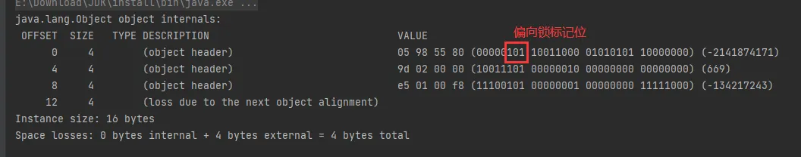

偏向锁的撤销：

- 当有另外一个线程逐步来竞争锁的时候，就不能再使用偏向锁了，要升级为轻量级锁，使用的是等到竞争出现才释放锁的机制
- 竞争线程尝试CAS更新对象头失败，会等到全局安全点（此时不会执行任何代码）撤销偏向锁，同时检查持有偏向锁的线程是否还在执行：

- 第一个线程正在执行Synchronized方法（处于同步块），它还没有执行完，其他线程来抢夺，该偏向锁会被取消掉并出现锁升级，此时轻量级锁由原来持有偏向锁的线程持有，继续执行同步代码块，而正在竞争的线程会自动进入自旋等待获得该轻量级锁
- 第一个线程执行完Synchronized（退出同步块），则将对象头设置为无所状态并撤销偏向锁，重新偏向。
- 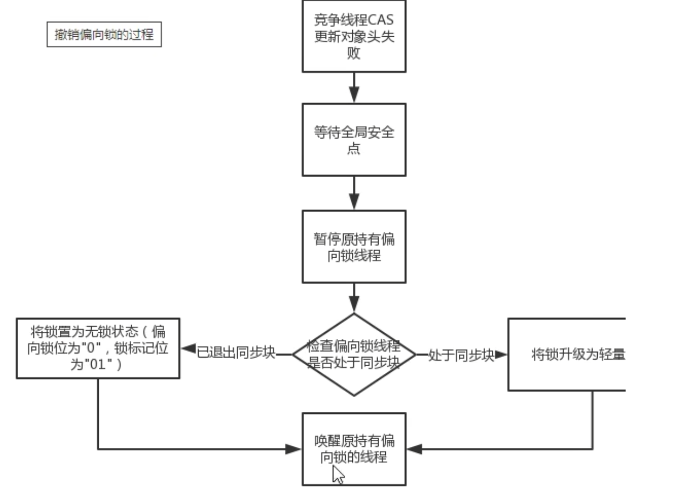

题外话：Java15以后逐步废弃偏向锁，需要手动开启------->维护成本高

### 轻锁

概念：多线程竞争，但是任意时候最多只有一个线程竞争，即不存在锁竞争太激烈的情况，也就没有线程阻塞。

主要作用：有线程来参与锁的竞争，但是获取锁的冲突时间极短---------->本质是自旋锁CAS


轻量锁的获取：


案例演示：

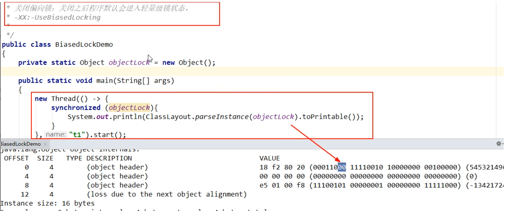

自旋一定程度和次数（Java8 之后是自适应自旋锁------意味着自旋的次数不是固定不变的）：

- 线程如果自旋成功了，那下次自旋的最大次数会增加，因为JVM认为既然上次成功了，那么这一次也大概率会成功
- 如果很少会自选成功，那么下次会减少自旋的次数甚至不自旋，避免CPU空转

轻量锁和偏向锁的区别：

- 争夺轻量锁失败时，自旋尝试抢占锁
- 轻量级锁每次退出同步块都需要释放锁，而偏向锁是在竞争发生时才释放锁

### 重锁

有大量线程参与锁的竞争，冲突性很高

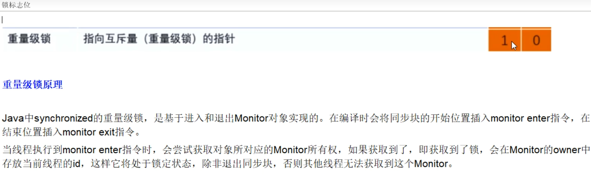

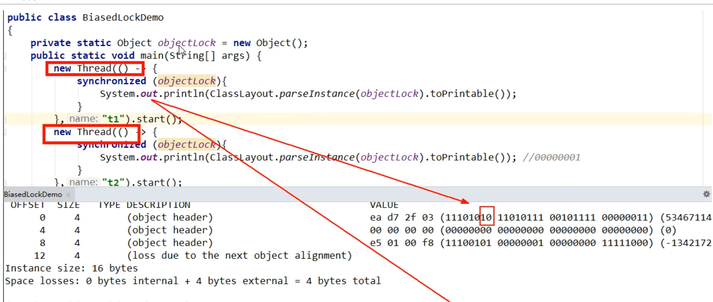

### 小总结

- 锁升级的过程

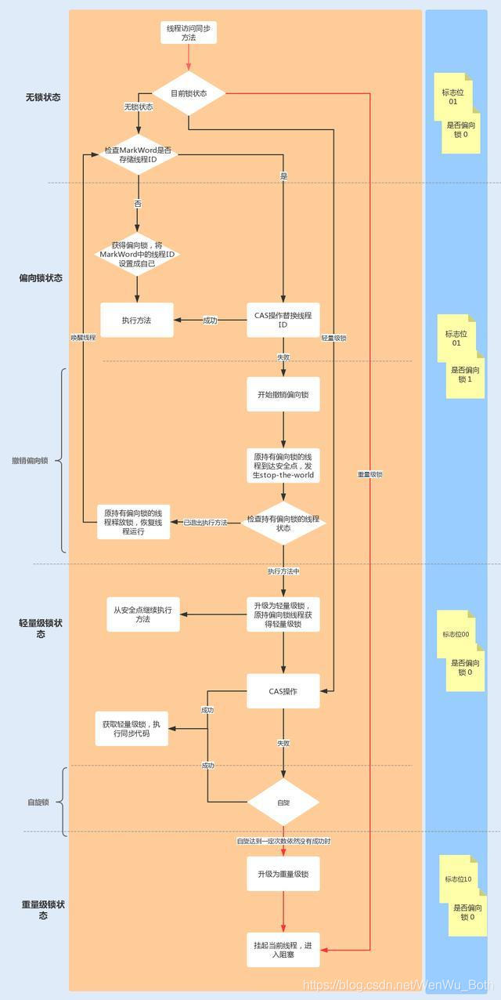

- 锁升级后，hashcode去哪儿了?

- 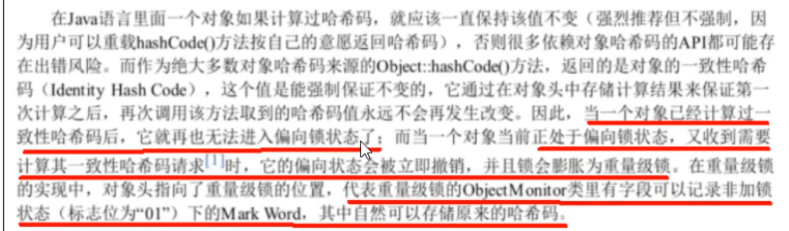
- 

- 各种锁优缺点、synchronized锁升级和实现原理

- 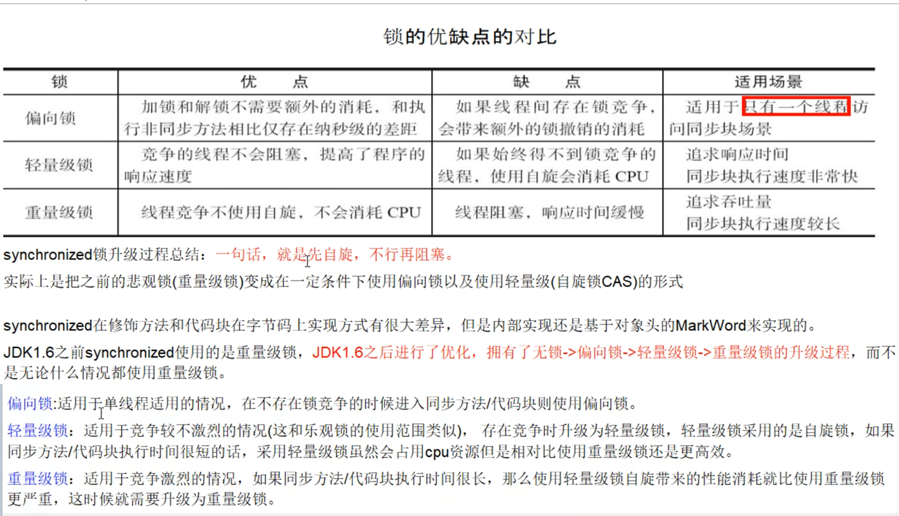

## 编译器对锁的优化

###  锁消除

```
/**
 * 
 * 锁消除
 * 从JIT角度看想相当于无视他，synchronized(o)不存在了
 * 这个锁对象并没有被共用扩散到其他线程使用
 * 极端的说就是根本没有加锁对象的底层机器码，消除了锁的使用
 */

public class LockClearUpDemo {
    static Object object = new Object();

    public void m1() {
        //锁消除问题，JIT会无视它，synchronized(o)每次new出来的，都不存在了，非正常的
        Object o = new Object();
        synchronized (o) {
            System.out.println("-----------hello LockClearUpDemo" + "\t" + o.hashCode() + "\t" + object.hashCode());
        }
    }

    public static void main(String[] args) {
        LockClearUpDemo lockClearUpDemo = new LockClearUpDemo();
        for (int i = 0; i < 10; i++) {
            new Thread(() -> {
                lockClearUpDemo.m1();
            }, String.valueOf(i)).start();
        }
    }
}
/**
 * -----------hello LockClearUpDemo	229465744	57319765
 * -----------hello LockClearUpDemo	219013680	57319765
 * -----------hello LockClearUpDemo	1109337020	57319765
 * -----------hello LockClearUpDemo	94808467	57319765
 * -----------hello LockClearUpDemo	973369600	57319765
 * -----------hello LockClearUpDemo	64667370	57319765
 * -----------hello LockClearUpDemo	1201983305	57319765
 * -----------hello LockClearUpDemo	573110659	57319765
 * -----------hello LockClearUpDemo	1863380256	57319765
 * -----------hello LockClearUpDemo	1119787251	57319765
 */
```

### 锁粗化

```
/**
 * 
 * 锁粗化
 * 假如方法中首尾相接，前后相邻的都是同一个锁对象，那JIT编译器会把这几个synchronized块合并为一个大块
 * 加粗加大范围，一次申请锁使用即可，避免次次的申请和释放锁，提高了性能
 */
public class LockBigDemo {
    static Object objectLock = new Object();

    public static void main(String[] args) {
        new Thread(() -> {
            synchronized (objectLock) {
                System.out.println("111111111111");
            }
            synchronized (objectLock) {
                System.out.println("222222222222");
            }
            synchronized (objectLock) {
                System.out.println("333333333333");
            }
            synchronized (objectLock) {
                System.out.println("444444444444");
            }
            //底层JIT的锁粗化优化
            synchronized (objectLock) {
                System.out.println("111111111111");
                System.out.println("222222222222");
                System.out.println("333333333333");
                System.out.println("444444444444");
            }
        }, "t1").start();
    }
}
```

## 小总结

- 没有锁：自由自在

- 偏向锁：唯我独尊

- 轻量锁：楚汉争霸

- 重量锁：群雄逐鹿

  

## ReentrantReadWriteLock

### 是什么

读写锁说明

一个资源能够被多个读线程访问，或者被一个写线程访问，但是不能同时存在读写线程

再说说演变

无锁无序->加锁->读写锁->邮戳锁

读写锁意义和特点

它只允许读读共存，而读写和写写依然是互斥的，大多实际场景是”读/读“线程间不存在互斥关系，只有”读/写“线程或者”写/写“线程间的操作是需要互斥的，因此引入了 ReentrantReadWriteLock

一个ReentrantReadWriteLock同时只能存在一个写锁但是可以存在多个读锁，但是不能同时存在写锁和读锁，也即资源可以被多个读操作访问，或一个写操作访问，但两者不能同时进行。

只有在读多写少情景之下，读写锁才具有较高的性能体现。

### 特点

可重入

读写兼顾

结论：一体两面，读写互斥，读读共享，读没有完成的时候其他线程写锁无法获得

锁降级：

- 将写锁降级为读锁------>遵循获取写锁、获取读锁再释放写锁的次序，写锁能够降级为读锁

- 如果一个线程持有了写锁，在没有释放写锁的情况下，它还可以继续获得读锁。这就是写锁的降级，降级成为了读锁。

- 如果释放了写锁，那么就完全转换为读锁

- 如果有线程在读，那么写线程是无法获取写锁的，是悲观锁的策略

  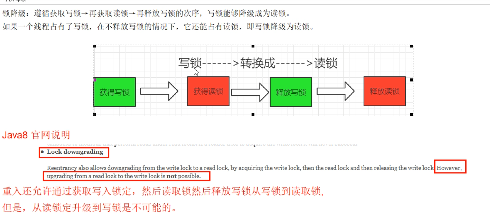


## StampedLock

###  是什么

StampedLock是JDK1.8中新增的一个读写锁，也是对JDK1.5中的读写锁ReentrantReadWriteLock的优化

stamp 代表了锁的状态。当stamp返回零时，表示线程获取锁失败，并且当释放锁或者转换锁的时候，都要传入最初获取的stamp值。

### 它是由饥饿问题引出

锁饥饿问题：

- ReentrantReadWriteLock实现了读写分离，但是一旦读操作比较多的时候，想要获取写锁就变得比较困难了，因此当前有可能会一直存在读锁，而无法获得写锁。

如何解决锁饥饿问题：

- 使用”公平“策略可以一定程度上缓解这个问题
- 使用”公平“策略是以牺牲系统吞吐量为代价的
- StampedLock类的乐观读锁方式--->采取乐观获取锁，其他线程尝试获取写锁时不会被阻塞，在获取乐观读锁后，还需要对结果进行校验

### StampedLock的特点

所有获取锁的方法，都返回一个邮戳，stamp为零表示失败，其余都表示成功

所有释放锁的方法，都需要一个邮戳，这个stamp必须是和成功获取锁时得到的stamp一致

StampedLock是不可重入的，危险（如果一个线程已经持有了写锁，在去获取写锁的话会造成死锁）

StampedLock有三种访问模式：

- Reading（读模式悲观）：功能和ReentrantReadWriteLock的读锁类似
- Writing（写模式）：功能和ReentrantReadWriteLock的写锁类似
- Optimistic reading（乐观读模式）：无锁机制，类似与数据库中的乐观锁，支持读写并发，很乐观认为读时没人修改，假如被修改在实现升级为悲观读模式

- 一句话：读的过程中也允许写锁介入

### 乐观读模式Code演示

传统的读写锁模式----读的时候写锁不能获取

```
/**
 * 
 */
public class StampedLockDemo {
    static int number = 37;
    static StampedLock stampedLock = new StampedLock();

    public void write() {
        long stamp = stampedLock.writeLock();
        System.out.println(Thread.currentThread().getName() + "\t" + "写线程准备修改");
        try {
            number = number + 13;
        } finally {
            stampedLock.unlockWrite(stamp);
        }
        System.out.println(Thread.currentThread().getName() + "\t" + "写线程结束修改");
    }

    public void read() {
        long stamp = stampedLock.readLock();
        System.out.println(Thread.currentThread().getName() + "\t" + " come in readLock codeBlock");
        for (int i = 0; i < 4; i++) {
            try {
                TimeUnit.SECONDS.sleep(1);
            } catch (InterruptedException e) {
                e.printStackTrace();
            }
            System.out.println(Thread.currentThread().getName() + "\t" + " 正在读取中");
        }
        try {
            int result = number;
            System.out.println(Thread.currentThread().getName() + "\t" + "获得成员变量值result: " + result);
            System.out.println("写线程没有修改成功，读锁时候写锁无法介入，传统的读写互斥");
        } finally {
            stampedLock.unlockRead(stamp);
        }

    }

    public static void main(String[] args) {
        StampedLockDemo resource = new StampedLockDemo();
        new Thread(() -> {
            resource.read();
        }, "readThread").start();

        try {
            TimeUnit.SECONDS.sleep(1);
        } catch (InterruptedException e) {
            e.printStackTrace();
        }

        new Thread(() -> {
            System.out.println(Thread.currentThread().getName()+"\t"+" come in");
            resource.write();
        }, "writeThread").start();
    }
}
/**
 * readThread	 come in readLock codeBlock
 * readThread	 正在读取中
 * writeThread	 come in
 * readThread	 正在读取中
 * readThread	 正在读取中
 * readThread	 正在读取中
 * readThread	获得成员变量值result: 37
 * 写线程没有修改成功，读锁时候写锁无法介入，传统的读写互斥
 * writeThread	写线程准备修改
 * writeThread	写线程结束修改
 */
```

- 乐观读模式----读的过程中也允许写锁介入

```
/**
 * 
 */
public class StampedLockDemo {
    static int number = 37;
    static StampedLock stampedLock = new StampedLock();

    public void write() {
        long stamp = stampedLock.writeLock();
        System.out.println(Thread.currentThread().getName() + "\t" + "写线程准备修改");
        try {
            number = number + 13;
        } finally {
            stampedLock.unlockWrite(stamp);
        }
        System.out.println(Thread.currentThread().getName() + "\t" + "写线程结束修改");
    }

    public void read() {
        long stamp = stampedLock.tryOptimisticRead();

        int result = number;

        System.out.println("4秒前 stampedLock.validate方法值（true 无修改 false有修改）" + "\t" + stampedLock.validate(stamp));
        for (int i = 0; i < 4; i++) {
            try {
                TimeUnit.SECONDS.sleep(1);
            } catch (InterruptedException e) {
                e.printStackTrace();
            }
            System.out.println(Thread.currentThread().getName() + "\t" + " 正在读取...." + i + "秒后" + "stampedLock.validate方法值（true 无修改 false有修改）" + "\t" + stampedLock.validate(stamp));
        }
        if (!stampedLock.validate(stamp)) {
            System.out.println("有人修改----------有写操作");
            stamp = stampedLock.readLock();
            try {
                System.out.println("从乐观读升级为悲观读");
                result = number;
                System.out.println("重新悲观读后result：" + result);
            } finally {
                stampedLock.unlockRead(stamp);
            }
        }
        System.out.println(Thread.currentThread().getName() + "\t" + "finally value: " + result);

    }


    public static void main(String[] args) {
        StampedLockDemo resource = new StampedLockDemo();
        new Thread(() -> {
            resource.read();
        }, "readThread").start();

        try {
            TimeUnit.SECONDS.sleep(2);
        } catch (InterruptedException e) {
            e.printStackTrace();
        }

        new Thread(() -> {
            System.out.println(Thread.currentThread().getName() + "\t" + " come in");
            resource.write();
        }, "writeThread").start();
    }
}
/**
 * 4秒前 stampedLock.validate方法值（true 无修改 false有修改）	true
 * readThread	 正在读取....0秒后stampedLock.validate方法值（true 无修改 false有修改）	true
 * readThread	 正在读取....1秒后stampedLock.validate方法值（true 无修改 false有修改）	true
 * writeThread	 come in
 * writeThread	写线程准备修改
 * writeThread	写线程结束修改
 * readThread	 正在读取....2秒后stampedLock.validate方法值（true 无修改 false有修改）	false
 * readThread	 正在读取....3秒后stampedLock.validate方法值（true 无修改 false有修改）	false
 * 有人修改----------有写操作
 * 从乐观读升级为悲观读
 * 重新悲观读后result：50
 * readThread	finally value: 50
 */
```

### StampedLock的缺点

●StampedLock不支持重入，没有Re开头
●StampedLock的悲观读锁和写锁都不支持条件变量，这个也需要主要
●使用StampedLock一定不要调用中断操作，即不要调用interrupt()方法
