# AbstractQueuedSynchronizer之AQS

## 前置知识

- 公平锁和非公平锁

- 公平锁：锁被释放以后，先申请的线程先得到锁。性能较差一些，因为公平锁为了保证时间上的绝对顺序，上下文切换更频繁
- 非公平锁：锁被释放以后，后申请的线程可能会先获取到锁，是随机或者按照其他优先级排序的。性能更好，但可能会导致某些线程永远无法获取到锁

- 可重入锁

- 也叫做递归锁，指的是线程可以再次获取自己的内部锁，比如一个线程获取到了对象锁，此时这个对象锁还没有释放，当其想再次获取这个对象锁的时候还是可以获取的，如果不可重入的话，会导致死锁。

- 自旋思想

- 当线程请求锁时，如果锁已经被其他线程持有，那么该线程会不断地重试获取锁，而不是被挂起等待，这种不断尝试获取锁的行为称为自旋

- LockSupport

- 一个工具类，用于线程的阻塞和唤醒操作，类似于wait()和notify()方法，但是更加灵活和可控
- 提供了park()和unpark()两个静态方法用于线程阻塞和唤醒操作。
- 优点在于可以在任意时刻阻塞和唤醒线程而不需要事先获取锁或监视器对象。

- 数据结构之双向链表

- 双向链表（Doubly Linked List）是一种常见的数据结构，它是由一系列结点（Node）组成的，每个结点包含三个部分：数据域、前驱指针和后继指针。其中，数据域存储结点的数据，前驱指针指向前一个结点，后继指针指向后一个结点。通过这种方式，双向链表可以实现双向遍历和插入、删除操作。

- 设计模式之模板设计模式

- 模板设计模式是一种行为型设计模式，定义了一种算法的框架，并将某些步骤延迟到子类中事先，这种设计模式的主要目的是允许子类在不改变算法结构的情况下重新定义算法中的某些步骤。
- 优点是能够提高代码复用性和可维护性。

## AQS入门理论

### AQS是什么？

抽象的队列同步器

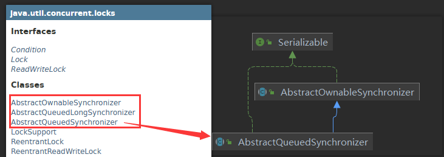

技术解释

- 是用来实现锁或者其他同步器组件的公共基础部分的抽象实现
- 是重量级基础框架及整个JUC体系的基石，只要用于解决锁分配给”谁“的问题。
- 整体就是一个抽象的FIFO队列来完成资源获取线程的排队工作，并通过一个int类变量表示持有锁的状态

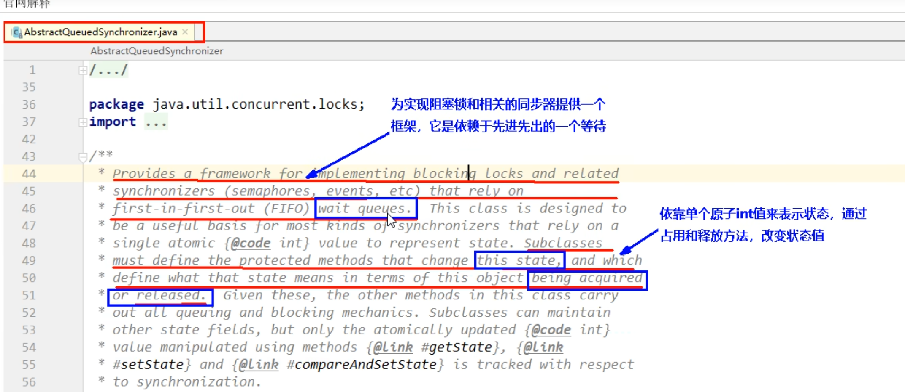

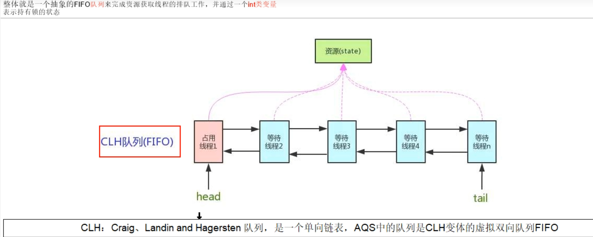

### AQS为什么是JUC内容中最重要的基石？

- 和AQS有关的

- 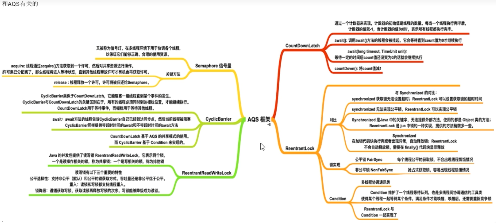
- ReentrantLock

- 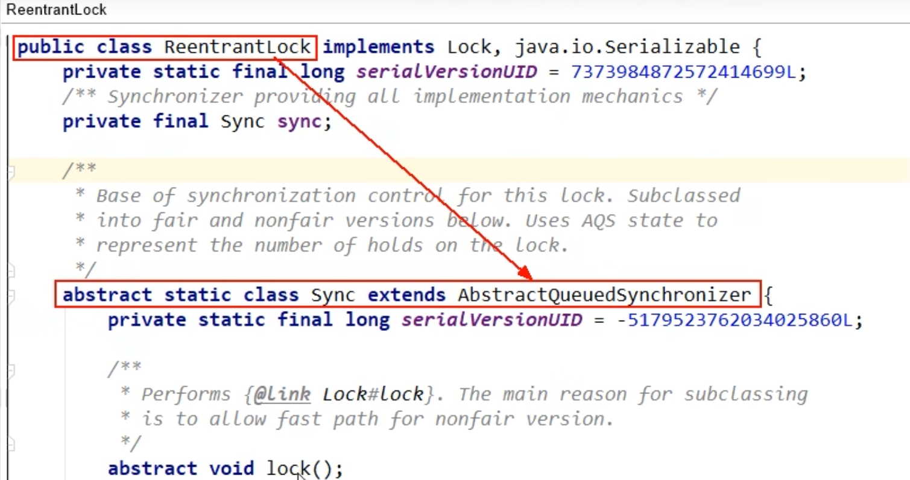

- CountDownLatch

- 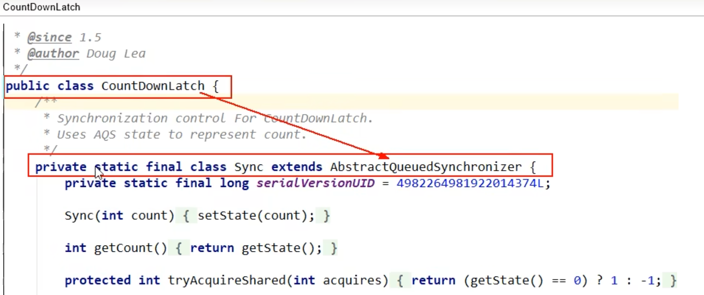

- ReentrantReadWriteLock

- 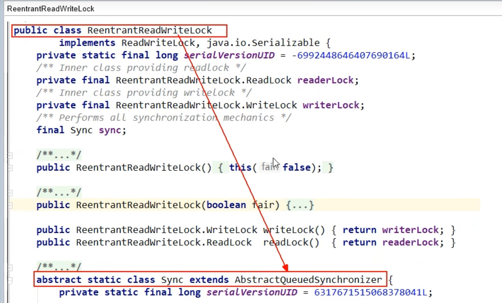

- Semaphore

- 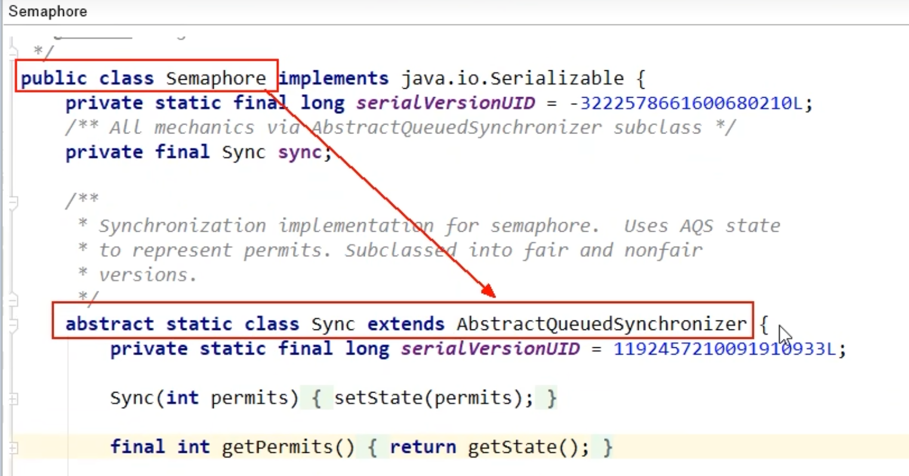

- 进一步理解锁和同步器的关系

- 锁，面向锁的使用者：定义了程序员和锁交互的使用层API，隐藏了实现细节，你调用即可
- 同步器，面向锁的实现者：Java并发大神DoungLee，提出了统一规范并简化了锁的实现，将其抽象出来，屏蔽了同步状态管理、同步队列的管理和维护、阻塞线程排队和通知、唤醒机制等，是一切锁和同步组件实现的----公共基础部分

### 能干嘛？

加锁会导致阻塞------有阻塞就需要排队，实现排队必然需要队列

- 抢到资源的线程直接使用处理业务，抢不到资源的必然涉及一种排队等候机制。抢占失败的线程继续去等待（类似于银行办理窗口都满了，暂时没有受理窗口的顾客只能去候客区排队等待），但等候线程仍然保留获取锁的可能且获取锁流程仍在继续（候客区的顾客也在等着叫号，轮到了再去受理窗口办理业务）
- 既然说到了排队等候机制，那么就一定会有某种队列形成，这样的队列是什么数据结构呢？

- 如果共享资源被占用，就需要一定的阻塞等待唤醒机制来保证锁分配。这个机制主要用的是CLH队列的变体实现的，将暂时获取不到锁的线程加入到队列中，这个队列就是AQS同步队列的抽象表现。它将要请求共享资源的线程及自身的等待状态封装成队列的节点对象（Node），通过CAS、自旋以及LockSupport.park()的方式，维护着state变量的状态，使其达到同步的状态。
- 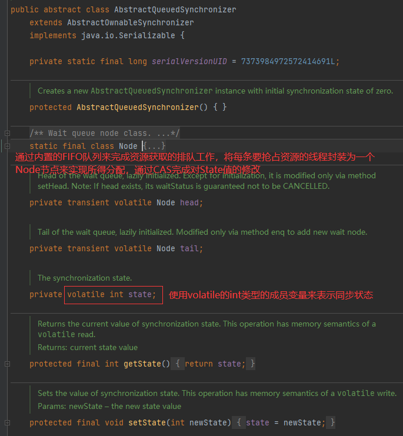

### 小总结

AQS同步队列的基本结构

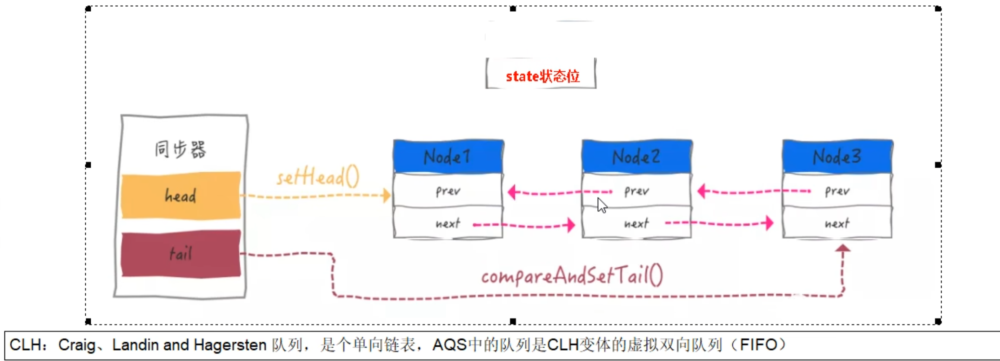

## AQS源码分析

### AQS内部体系架构----AQS自身

- AQS的int类型变量state

- AQS的同步状态State成员变量

- 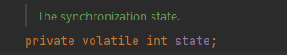

- 银行办理业务的受理窗口状态

- 零就是没人，自由状态可以去办理
- 大于等于1，有人占用窗口，等着去

- AQS的CLH队列

- CLH（三个大牛的名字组成）队列为一个双向队列

- 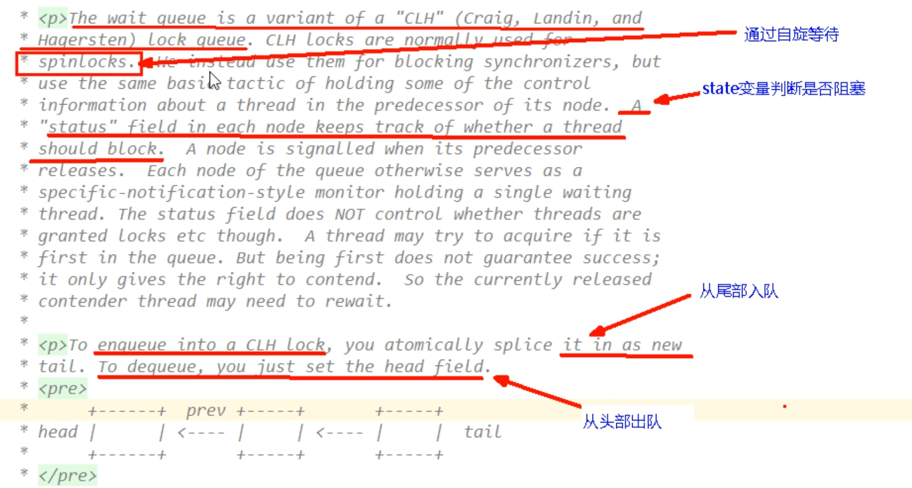

- 银行候客区的等待顾客

- 小总结

- 有阻塞就需要排队，实现排队必然需要队列
- State变量+CLH双端队列

### AQS内部体系架构----内部类Node

- Node的int变量

- Node的等待状态waitState成员变量

- 

- 说人话

- 等候区其他顾客（其他线程）的等待状态
- 队列中每个排队的个体就是一个Node

- Node此类的讲解

- 内部结构

- 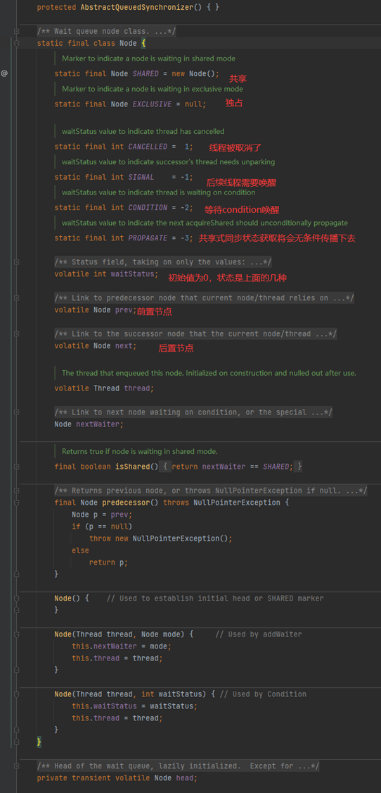

- 属性说明

- 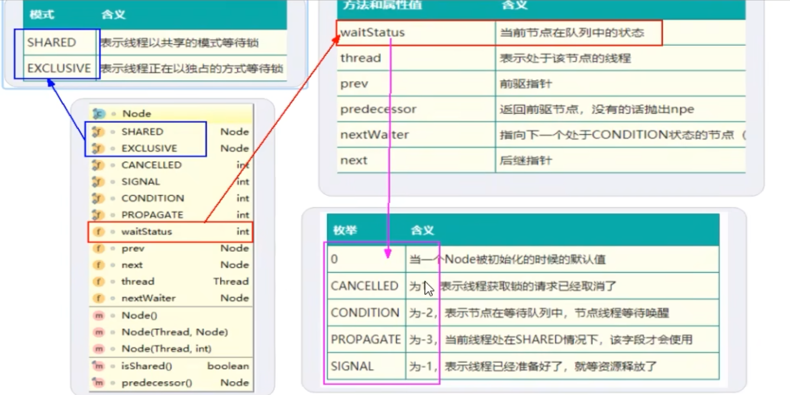

## AQS源码深度讲解和分析

### ReentrantLock的原理

Lock接口的实现类，基本都是通过聚合了一个队列同步器的子类完成线程访问控制的

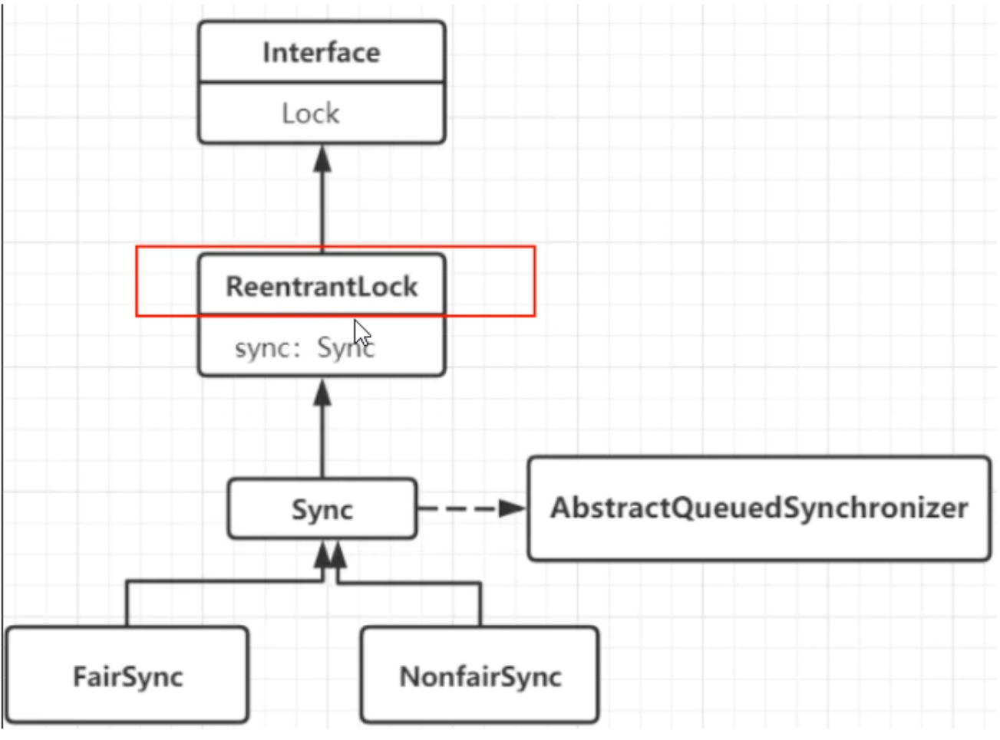

### 从最简单的lock方法开始看看公平和非公平

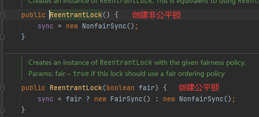

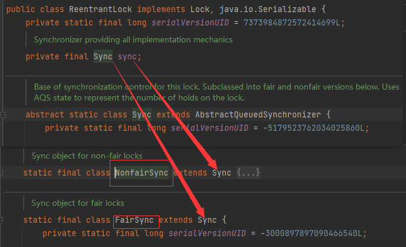

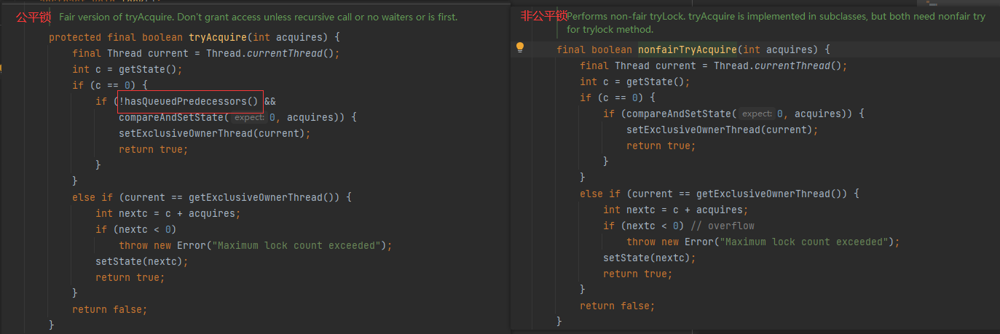

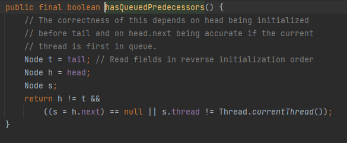

公平锁和非公平锁的lock()方法唯一的区别就在于公平锁在获取同步状态时多了一个限制条件：hasQueuedPredecessors()-----公平锁加锁时判断等待队列中是否存在有效节点的方法

### 以非公平锁ReentrantLock()为例作为突破走起---方法lock()

对比公平锁和非公平锁的tryAcquire()方法的实现代码，其实差异就在于非公平锁获取锁时比公平锁中少了一个判断!hasQueuedPredecessors()，hasQueuedPredecessors()中判断了是否需要排队，导致公平锁和非公平锁的差异如下：

- 公平锁：公平锁讲究先来后到，线程在获取锁时，如果这个锁的等待队列中已经有线程在等待，那么当前线程就会进入到等待队列中；
- 非公平锁：不管是否有等待队列，如果可以获取到锁，则立刻占有锁对象。也就是说队列的第一个排队线程苏醒后，不一定就是排头的这个线程获得锁，它还需要参加竞争锁（存在线程竞争的情况下），后来的线程可能不讲武德插队夺锁了。

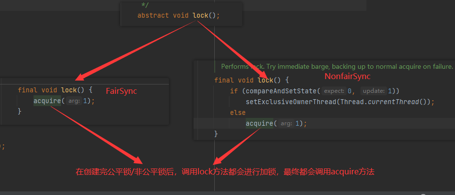

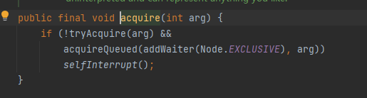

**正式开始源码解读：**

- lock()

- 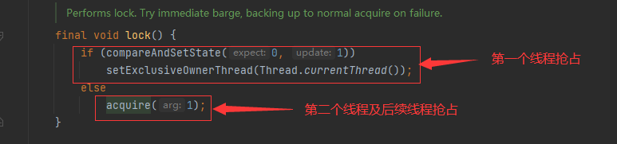
- 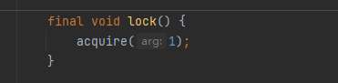

- acquire()

- 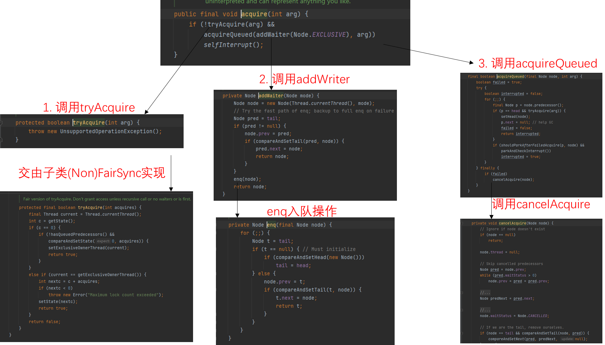

- tryAcquire(arg)

- 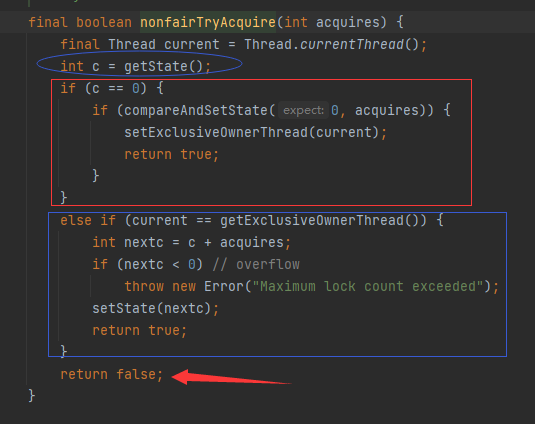
- return false：继续推进条件，走下一个方法
- return true：结束

- addwaiter(Node.EXCLUSIVE)

- 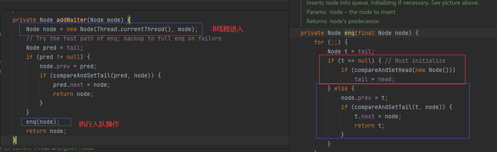
- 注意：在双向链表中，第一个节点为虚节点（也叫做哨兵节点），其实不存储任何信息，只是占位。真正的第一个有数据的节点，是从第二个节点开始的
- 假如此时有线程C进入：
- 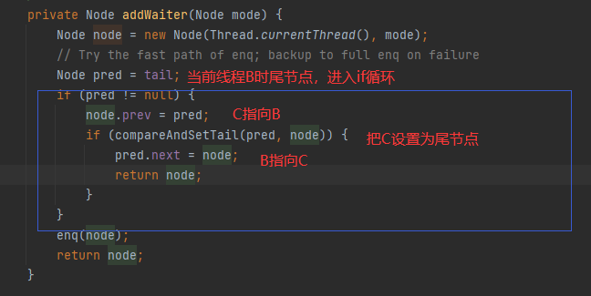

- acquireQueued(addWeiter(Node.EXCLUSIVE), arg)-----坐稳队列

- 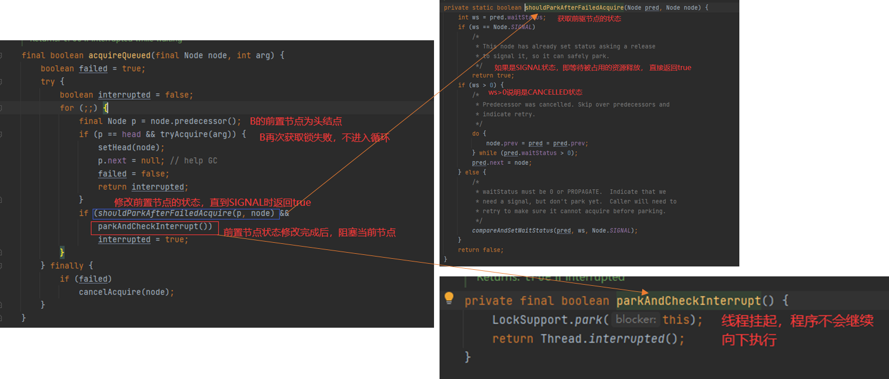

### unlock()

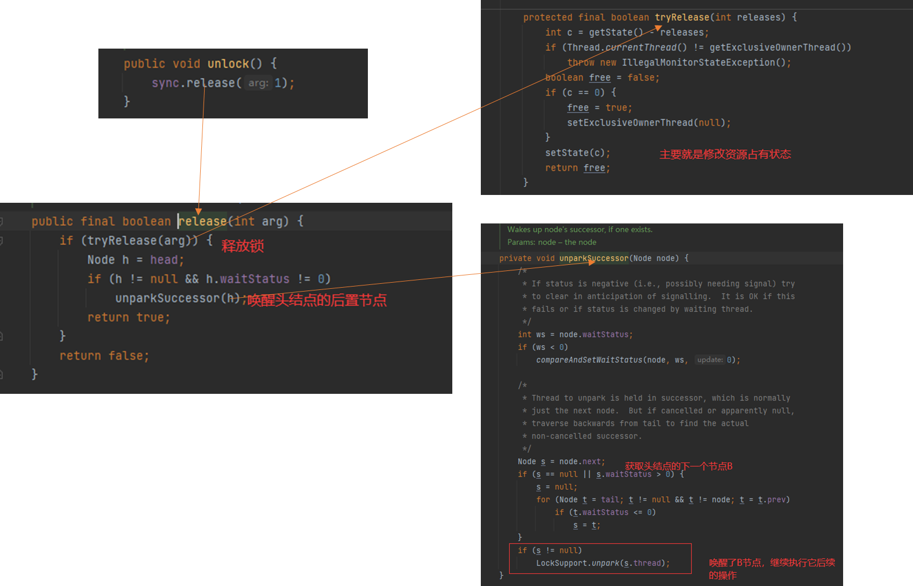