## 概述

### 简介：

`volatile`是Java中的一个关键字，用于声明变量是"易变"的。当一个变量被声明为`volatile`时，表示这个变量可能被多个线程同时访问并修改，而且这些线程之间不会进行同步操作（比如加锁），因此`volatile`变量在多线程环境下能够保证可见性和有序性。

### 特性：

**可见性（Visibility）：**

 当一个线程修改了`volatile`变量的值，这个新值会立即被其他线程所看到，即保证了变量的可见性。

**有序性（禁重排）（Ordering）：**

 `volatile`变量的写操作会在其他线程的读操作之前发生，即保证了变量的有序性。

重排序是指编译器和处理器为了优化程序性能而对指令序列进行重新排序的一种手段，有时候会改变程序语句的先后顺序，若不存在数据依赖关系，可以重排序；存在数据依赖关系，禁止重排序；但重排后的指令绝对不能改变原有的串行语义！这点在并发设计中必须要重点考虑！

### 内存语义：

- 当写一个volatile变量时，JMM会把该线程对应的本地内存中的共享变量值立即刷新回主内存中

- 当读一个volatile变量时，JMM会把该线程对应的本地内存设置为无效，重新回到主内存中读取最新共享变量的值

- 所以volatile的写内存语义是直接刷新到主内存中，读的内存语义是直接从主内存中读取


### 场景：

- 在多线程环境下，一个变量被多个线程共享，并且这些线程可能会修改这个变量的值。
- 当变量的修改对其他线程的行为产生影响时，需要确保修改的可见性。

### 注意：

`volatile`并不能保证原子性。如果多个线程同时对一个`volatile`变量进行写操作，虽然每次写操作都能立即被其他线程看到，但是可能会出现覆盖的情况，从而导致数据的不一致性。如果需要保证原子性操作，需要使用`synchronized`关键字或者`java.util.concurrent.atomic`包中提供的原子类。volatile`关键字在多线程编程中用于保证变量的可见性和有序性，但并不能保证原子性。


## 内存屏障

### 内存屏障是什么(保证可见性和有序性)

内存屏障（也称内存栅栏，屏障指令等）是一类同步屏障指令，是CPU或编译器在对内存随机访问的操作中的一个同步点，使得此点之前的所有读写操作都执行后才可以开始执行此点之后的操作，避免代码重排序。

内存屏障其实就是一种JVM指令，Java内存模型的重排规则会要求Java编译器在生成JVM指令时插入特定的内存屏障指令，通过这些内存屏障指令，volatile实现了Java内存模型中的可见性和有序性（禁重排），但volatile无法保证原子性

- 内存屏障之前的所有写操作都要回写到主内存
- 内存屏障之后的所有读操作都能获得内存屏障之前的所有写操作的最新结果（实现了可见性）

写屏障(Store Memory Barrier)：告诉处理器在写屏障之前将所有存储在缓存(store buffers)中的数据同步到主内存，也就是说当看到Store屏障指令，就必须把该指令之前的所有写入指令执行完毕才能继续往下执行

读屏障(Load Memory Barrier)：处理器在读屏障之后的读操作，都在读屏障之后执行。也就是说在Load屏障指令之后就能够保证后面的读取数据指令一定能够读取到最新的数据。

因此重排序时，不允许把内存屏障之后的指令重排序到内存屏障之前。一句话：对一个volatile变量的写，先行发生于任意后续对这个volatile变量的读，也叫写后读。

### 内存屏障分类

粗分两种：

- 读屏障（Load Barrier）：在读指令之前插入读屏障，让工作内存或CPU高速缓存 当中的缓存数据失效，重新回到主内存中获取最新数据。
- 写屏障（Store Barrier）：在写指令之后插入写屏障，强制把缓冲区的数据刷回到主内存中。

细分四种：

| **屏障类型** | **指令示例**             | **说明**                                                     |
| ------------ | ------------------------ | ------------------------------------------------------------ |
| LoadLoad     | Load1;LoadLoad;Load2     | 保证Load1的读取操作在Load2及后续读取操作之前执行             |
| StoreStore   | Store1;StoreStore;Store2 | 在store2及其后的写操作执行前，保证Store1的写操作已经刷新到主内存 |
| LoadStore    | Load1;LoadStore;Store2   | 在Store2及其后的写操作执行前，保证Load1的读操作已经结束      |
| StoreLoad    | Store1;StoreLoad;Load2   | 保证Store1的写操作已经刷新到主内存后，Load2及其后的读操作才能执行 |

### 困难内容

- 什么叫保证有序性？----->通过内存屏障禁重排

- 重排序有可能影响程序的执行和实现，因此，我们有时候希望告诉JVM别自动重排序，我这里不需要重排序，一切听我的。
- 对于编译器的重排序，JMM会根据重排序的规则，禁止特定类型的编译器重排序
- 对于处理器的重排序，Java编译器在生成指令序列的适当位置，插入内存屏障指令，来禁止特定类型的处理器排序。

- happens-before之volatile变量规则

| 第一个操作 | 第二个操作：普通读写 | 第二个操作：volatile读 | 第二个操作：volatile写 |
| ---------- | -------------------- | ---------------------- | ---------------------- |
| 普通读写   | 可以重排             | 可以重排               | 不可以重排             |
| volatile读 | 不可以重排           | 不可以重排             | 不可以重排             |
| volatile写 | 可以重排             | 不可以重排             | 不可以重排             |

| 当第一个操作为volatile读时，不论第二个操作是什么，都不能重排序，这个操作保证了volatile读之后的操作不会被重排到volatile读之前。 |
| ------------------------------------------------------------ |
| 当第一个操作为volatile写时，第二个操作为volatile读时，不能重排 |
| 当第二个操作为volatile写时，不论第一个操作是什么，都不能重排序，这个操作保证了volatile写之前的操作不会被重排到volatile写之后 |

- JMM就将内存屏障插入策略分为4种规则

- 读屏障：在每个volatile读操作的**后面**插入一个LoadLoad屏障或者LoadStore屏障

- 

- 写屏障：在每个volatile写操作的**前面**插入StoreStore屏障；在每个volatile写操作的**后面**插入StoreLoad屏障；

- 


## volatile特性

###  保证可见性

保证不同线程对某个变量完成操作后结果及时可见，即该共享变量一旦改变所有线程立即可见

- Code

- 不加volatile，没有可见性，程序无法停止
- 加了volatile，保证可见性，程序可以停止

```
/**
 */
public class VolatileSeeDemo {

    /**
     * t1	-------come in
     * main	 修改完成
     * t1	-------flag被设置为false，程序停止
     */
    static volatile boolean flag = true;

    public static void main(String[] args) {
        new Thread(() -> {
            System.out.println(Thread.currentThread().getName() + "\t-------come in");
            while (flag) {

            }
            System.out.println(Thread.currentThread().getName() + "\t-------flag被设置为false，程序停止");
        }, "t1").start();

        try {
            TimeUnit.SECONDS.sleep(2);
        } catch (InterruptedException e) {
            e.printStackTrace();
        }

        //更新flag值
        flag = false;

        System.out.println(Thread.currentThread().getName() + "\t 修改完成");
    }
}
```

- volatile变量的读写过程（了解即可）

  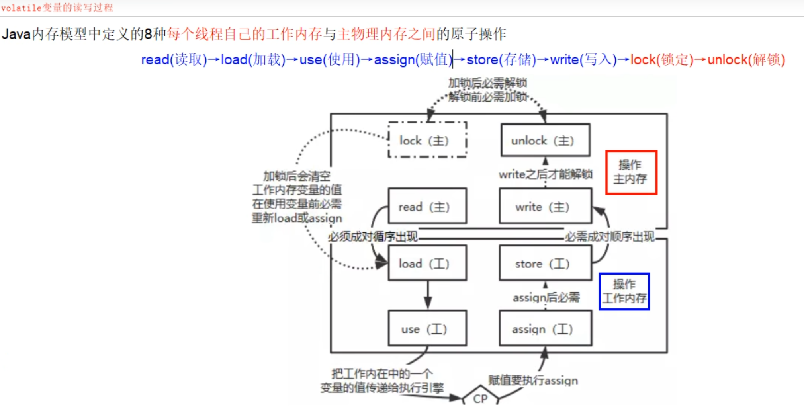

### 没有原子性

volatile变量的符合操作不具有原子性

- 对于voaltile变量具备可见性，JVM只是保证从主内存加载到线程工作内存的值是最新的，也仅仅是数据加载时是最新的。但是多线程环境下，“数据计算”和“数据赋值”操作可能多次出现，若数据在加载之后，若主内存volatile修饰变量发生修改之后，线程工作内存的操作将会作废去读主内存最新值，操作出现写丢失问题。即各线程私有内存和主内存公共内存中变量不同步，进而导致数据不一致。由此可见volatile解决的是变量读时的可见性问题，但无法保证原子性，对于多线程修改主内存共享变量的场景必须加锁同步。
- 至于怎么去理解这个写丢失的问题，就是再将数据读取到本地内存到写回主内存中有三个步骤：数据加载---->数据计算---->数据赋值，如果第二个线程在第一个线程读取旧值与写回新值期间读取共享变量的值，那么第二个线程将会与第一个线程一起看到同一个值，并执行自己的操作，一旦其中一个线程对volatile修饰的变量先行完成操作刷回主内存后，另一个线程会作废自己的操作，然后重新去读取最新的值再进行操作，这样的话，它自身的那一次操作就丢失了，这就造成了 线程安全失败，因此，这个问题需要使用synchronized修饰以保证线程安全性。
- 结论：volatile变量不适合参与到依赖当前值的运算，如i++，i=i+1之类的，通常用来保存某个状态的boolean值或者int值，也正是由于volatile变量只能保证可见性，在不符合以下规则的运算场景中，我们仍然要通过加锁来保证原子性：

- 运算结果并不依赖变量的当前值，或者能够确保只有单一的线程修改变量的值
- 变量不需要与其他的状态变量共同参与不变约束

- 面试回答为什么不具备原子性：举例i++的例子，在字节码文件中，i++分为三部，间隙期间不同步非原子操作

- 对于volatile变量，JVM只是保证从主内存加载到线程工作内存的值是最新的，也就是数据加载时是最新的，如果第二个线程在第一个线程读取旧值和写回新值期间读取i的域值，也就造成了线程安全问题。
- 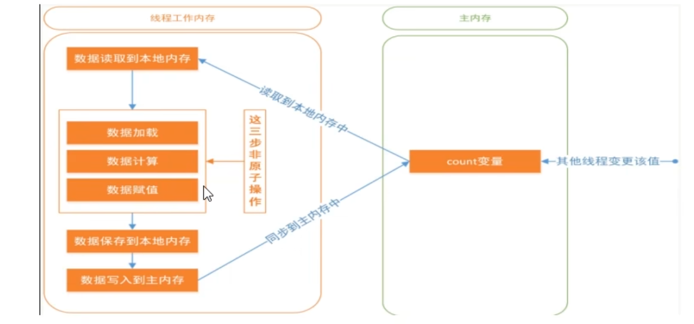

### 指令禁重排

- 在每一个volatile写操作前面插入一个StoreStore屏障--->StoreStore屏障可以保证在volatile写之前，其前面所有的普通写操作都已经刷新到主内存中。
- 在每一个volatile写操作后面插入一个StoreLoad屏障--->StoreLoad屏障的作用是避免volatile写与后面可能有的volatile读/写操作重排序
- 在每一个volatile读操作后面插入一个LoadLoad屏障--->LoadLoad屏障用来禁止处理器把上面的volatile读与下面的普通读重排序
- 在每一个volatile读操作后面插入一个LoadStore屏障--->LoadTore屏障用来禁止处理器把上面的volatile读与下面的普通写重排序
- 案例说明（volatile读写前或后加了屏障保证有序性）：


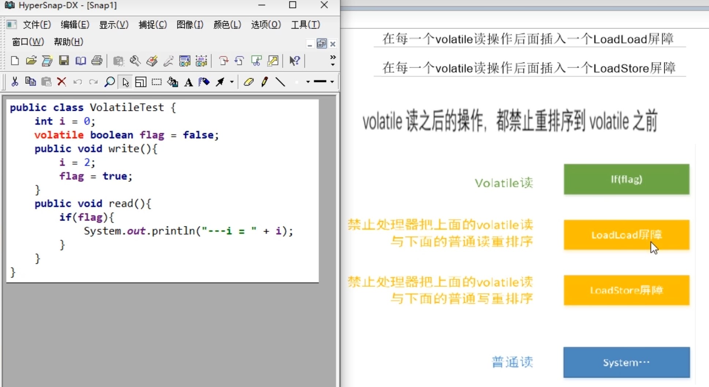

## 如何正确使用volatile

- 单一赋值可以，但是含复合运算赋值不可以（i++之类的）

- volatile int a = 10;
- volatile boolean flag = true;

- 状态标志，判断业务是否结束

- 作为一个布尔状态标志，用于指示发生了一个重要的一次性事件，例如完成初始化或任务结束
- 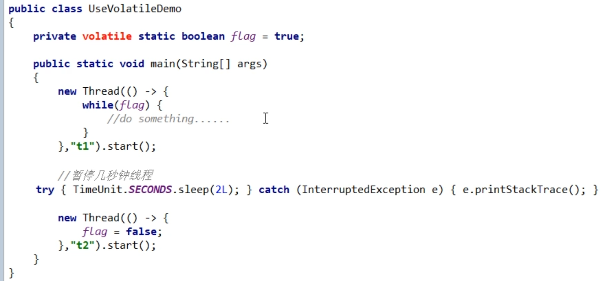

- 开销较低的读，写锁策略

- 当读远多于写，结合使用内部锁和volatile变量来减少同步的开销
- 原理是：利用volatile保证读操作的可见性，利用synchronized保证符合操作的原子性
- 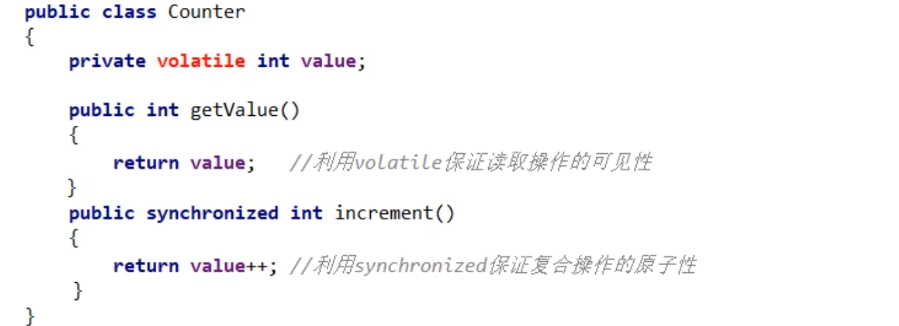

- DCL双端锁的发布

- 问题描述：首先设定一个加锁的单例模式场景

- 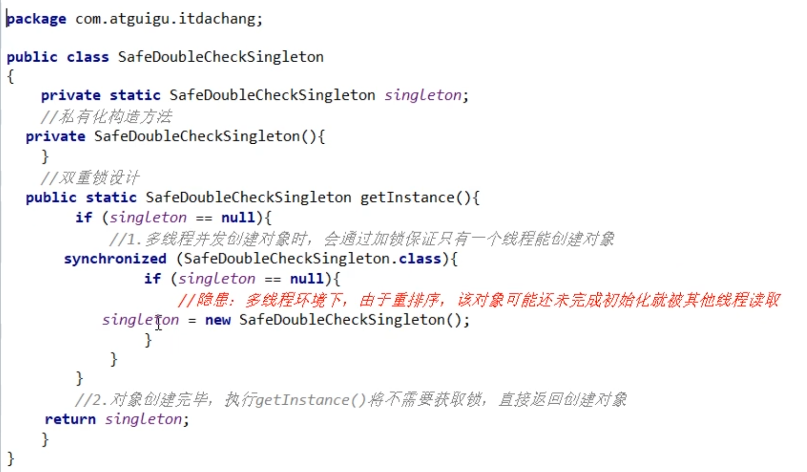
- 在单线程环境下（或者说正常情况下），在“问题代码处”，会执行以下操作，保证能获取到已完成初始化的实例：
- 
- 隐患：在多线程环境下，在“问题代码处”，会执行以下操作，由于重排序导致2，3乱序，后果就是其他线程得到的是null而不是完成初始化的对象，其中第3步中实例化分多步执行（分配内存空间、初始化对象、将对象指向分配的内存空间），某些编译器为了性能原因，会将第二步和第三步重排序，这样某个线程肯能会获得一个未完全初始化的实例：
- 

- 多线程下的解决方案：加volatile修饰

- 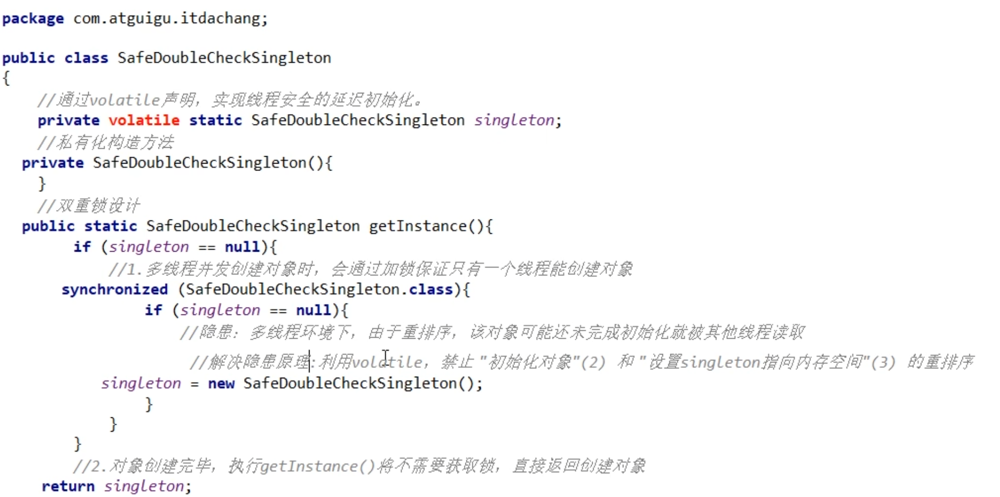

## 本章最后的小总结

### volatile可见性

| volatile关键字保证可见性： | 对一个被volatile关键字修饰的变量                             |
| -------------------------- | ------------------------------------------------------------ |
| 1                          | 写操作的话，这个变量的最新值会立即刷新回到主内存中           |
| 2                          | 读操作的话，总是能够读取到这个变量的最新值，也就是这个变量最后被修改的值 |
| 3                          | 当某个线程收到通知，去读取volatile修饰的变量的值的时候，线程私有工作内存的数据失效，需要重新回到主内存中去读取最新的数据。 |

### volatile没有原子性

### volatile禁重排

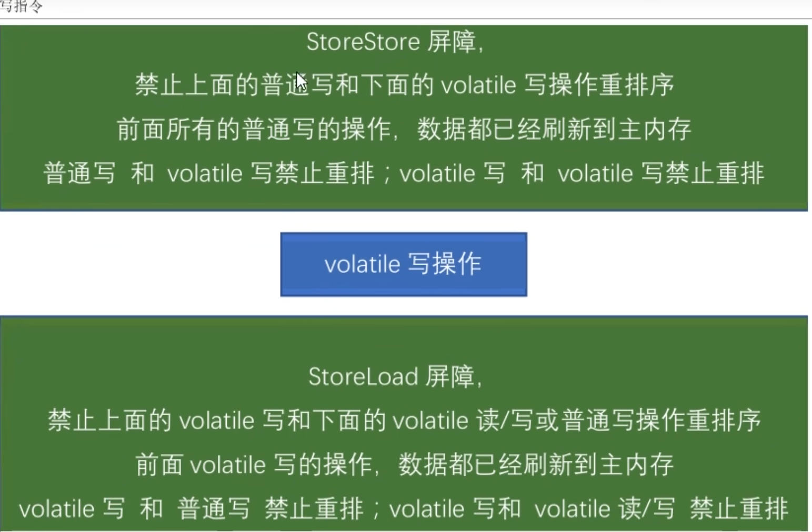

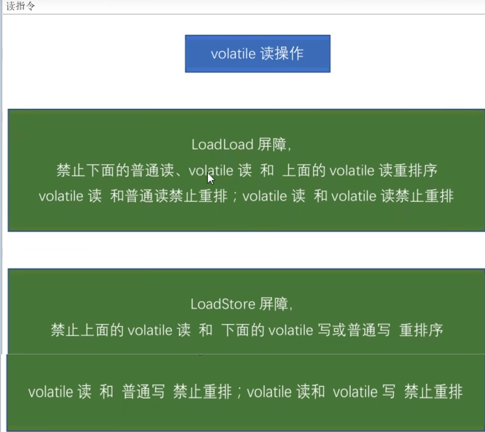

### 凭什么我们Java写了一个volatile关键字，系统底层加入内存屏障？两者的关系如何勾搭？

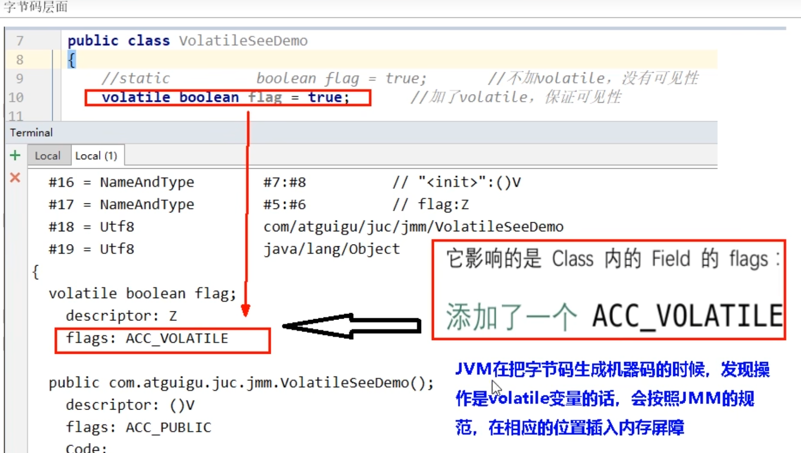

### 内存屏障是什么？

是一种屏障指令，它使得CPU或编译器对屏障指令的前和后所发出的内存操作执行一个排序的约束。也称为内存栅栏或栅栏指令。

### 内存屏障能干吗？

- 阻止屏障两边的指令重排序
- 写操作时加入屏障，强制将线程私有工作内存的数据刷回主物理内存
- 读操作时加入屏障，线程私有工作内存的数据失效，重新回到主物理内存中获取最新值

### 内存屏障四大指令

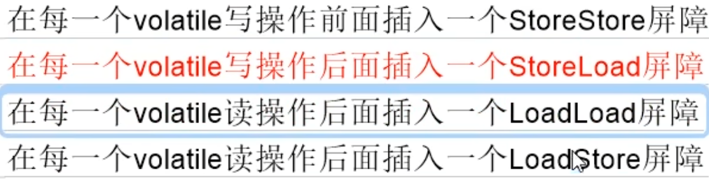

### 句话总结

- volatile写之前的操作，都禁止重排序到volatile之后
- volatile读之后的操作，都禁止重排序到volatile之前
- volatile写之后volatile读，禁止重排序