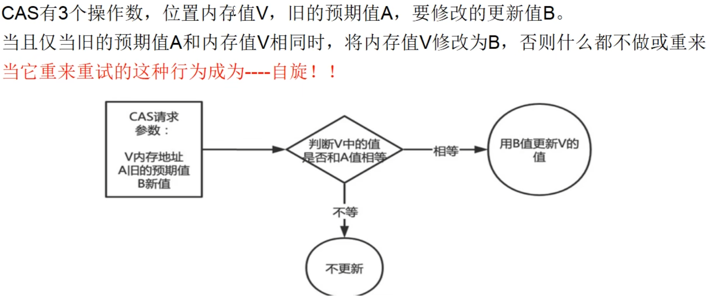
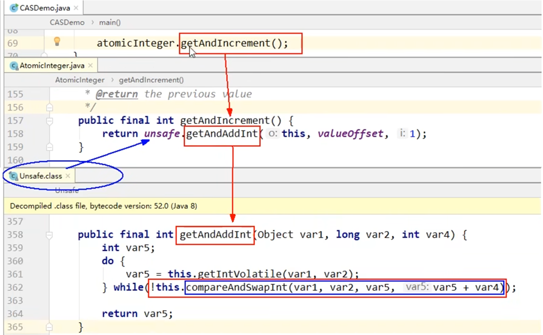
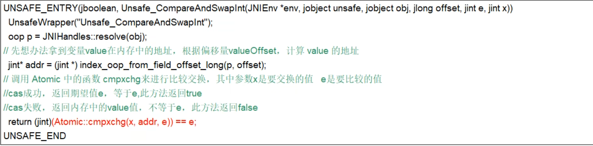
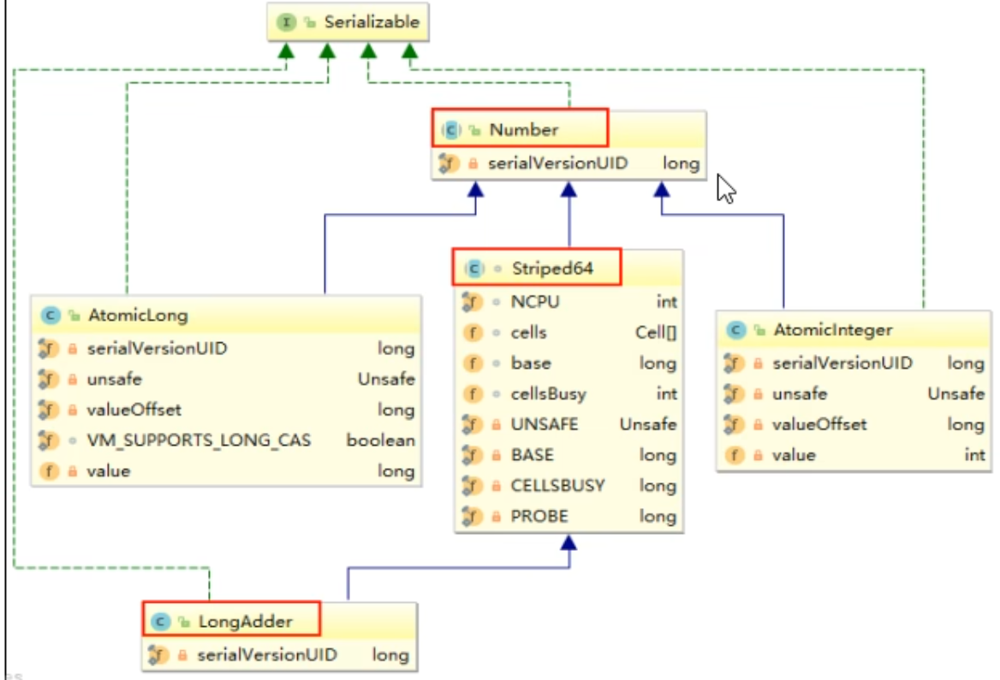
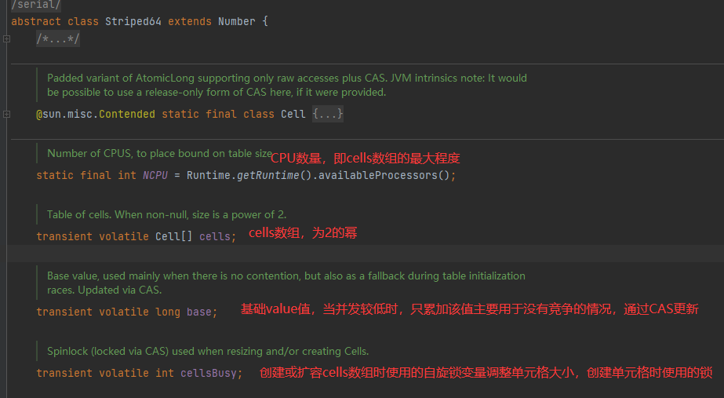
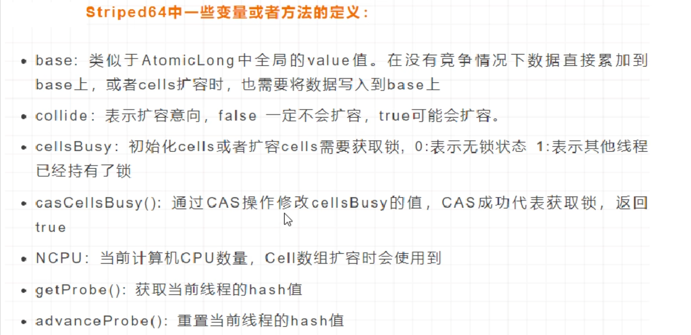
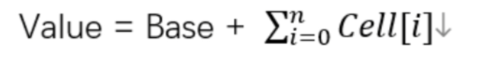
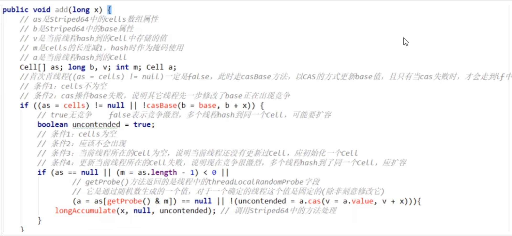
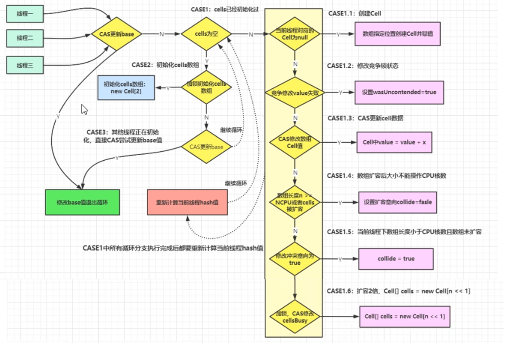
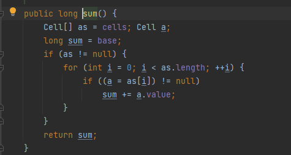

# CAS(compare and swap)

## CAS作用

多线程环境中不使用原子类保证线程安全i++（基本数据类型）

```
class Test {
        private volatile int count = 0;
        //若要线程安全执行执行count++，需要加锁
        public synchronized void increment() {
                  count++;
        }

        public int getCount() {
                  return count;
        }
}
```

多线程环境中使用原子类保证线程安全i++（基本数据类型）---------->类似于乐观锁

```
class Test2 {
        private AtomicInteger count = new AtomicInteger();

        public void increment() {
                  count.incrementAndGet();
        }
      //使用AtomicInteger之后，不需要加锁，也可以实现线程安全。
       public int getCount() {
                return count.get();
        }
}
```

## CAS是什么

CAS(compare and swap)，中文翻译为比较并交换，实现并发算法时常用到的一种技术，用于保证共享变量的原子性更新，它包含三个操作数---内存位置、预期原值与更新值。

执行CAS操作的时候，将内存位置的值与预期原值进行比较：

- 如果相匹配，那么处理器会自动将该位置更新为新值
- 如果不匹配，处理器不做任何操作，多个线程同时执行CAS操作只有一个会成功。




CAS（Compare-and-Swap）是一种用于实现无锁数据结构（也称为非阻塞数据结构）的原子操作。CAS 操作包含三个操作数 —— 内存位置（V）、预期的原值（A）和新值（B）。如果内存位置 V 的值等于预期原值 A，那么处理器会自动将该位置值更新为新值 B。否则，处理器不做任何操作。无论哪种情况，它都会在更新前的值上返回一个值。

CAS 是许多原子类（如 `java.util.concurrent.atomic` 包中的类）实现其原子操作的基础。CAS 操作在处理器级别上提供了支持，并由 Java 的 `Unsafe` 类（一个内部类，通常不建议直接使用）来访问。

CAS 的主要优点是它可以在不阻塞其他线程的情况下实现线程安全的更新。然而，CAS 也存在一些限制和潜在问题：

1. **ABA 问题**：如果一个变量从 A 变为 B，然后又变回到 A，CAS 检查时会认为它的值没有变化过，但实际上它已经被其他线程改变过了。这个问题可以通过引入版本号（时间戳）来解决，例如 `AtomicStampedReference`。
2. **循环开销**：如果 CAS 失败，它通常会在一个循环中重试，这可能会导致高开销，特别是在高争用的情况下。
3. **只能保证单个共享变量的原子操作**：CAS 机制只能保证对单个共享变量的操作具有原子性，当操作涉及多个共享变量时，CAS 无法保证整个操作的原子性。这种情况下，就需要使用锁来保证原子性。

CAS操作的基本思想是：当多个线程尝试去更新同一个变量时，CAS操作会将当前内存位置的值与预期原值进行比较，如果相等，则说明该位置没有被其他线程修改过，那么就将该位置的值更新为新值；如果不相等，则说明该位置已经被其他线程修改过了，那么当前线程就选择放弃或者重试。


## CAS底层原理

### Unsafe

Unsafe类是CAS的核心类，由于Java方法无法直接访问底层系统，需要通过本地（native）方法来访问，Unsafe相当于一个后门，基于该类可以直接操作特定内存的数据。Unsafe类存在于sun.misc包中，其内部方法操作可以像C的指针一样直接操作内存，因此Java中CAS操作的执行依赖于Unsafe类的方法。

注意：Unsafe类中的所有方法都是native修饰的，也就是说Unsafe类中的所有方法都直接调用操作系统底层资源执行相应任务。

问题：我们知道i++是线程不安全的，那AtomicInteger.getAndIncrement()如何保证原子性？

AtomicInteger类主要利用CAS+volatile和native方法来保证原子操作，从而避免synchronized的高开销，执行效率大为提升：



CAS并发原语体现在Java语言中就是sun.misc.Unsafe类中的各个方法。调用Unsafe类中的CAS方法，JVM会帮我们实现出CAS汇编指令。这是一种完全依赖于硬件的功能，通过它实现了原子操作。再次强调，由于CAS是一种系统原语，原语属于操作系统用语范畴，是由若干条指令组成的，用于完成某个功能的一个过程，并且原语的执行必须是连续的，在执行过程中不允许被中断，也就是说CAS是一条CPU的原子指令，不会造成所谓的数据不一致问题。


### 底层汇编



JDK提供的CAS机制，在汇编层级会禁止变量两侧的指令优化，然后使用compxchg指令比较并更新变量值（原子性）

总结：

- CAS是靠硬件实现的从而在硬件层面提升效率，最底层还是交给硬件来保证原子性和可见性
- 实现方式是基于硬件平台的汇编指令，在inter的CPU中，使用的是汇编指令compxchg指令
- 核心思想就是比较要更新变量V的值和预期值E，相等才会将V的值设为新值N，如果不相等自旋再来


## CAS与自旋锁

### 自旋锁是什么

CAS是实现自旋锁的基础，CAS利用CPU指令保证了操作的原子性，以达到锁的效果，至于自旋锁---字面意思自己旋转。是指尝试获取锁的线程不会立即阻塞，而是采用循环的方式去尝试获取锁，当线程发现锁被占用时，会不断循环判断锁的状态，直到获取。这样的好处是减少线程上下文切换的消耗，缺点是循环会消耗CPU。

### 自己实现一个自旋锁

题目：实现一个自旋锁，借鉴CAS思想

通过CAS完成自旋锁，A线程先进来调用myLock方法自己持有锁5秒钟，B随后进来后发现当前有线程持有锁，所以只能通过自旋等待，直到A释放锁后B随后抢到。

```
public class SpinLockDemo {

    AtomicReference<Thread> atomicReference = new AtomicReference<>();

    public void lock() {
        Thread thread = Thread.currentThread();
        System.out.println(Thread.currentThread().getName() + "\t --------come in");
        while (!atomicReference.compareAndSet(null, thread)) {

        }
    }

    public void unLock() {
        Thread thread = Thread.currentThread();
        atomicReference.compareAndSet(thread, null);
        System.out.println(Thread.currentThread().getName() + "\t --------task over,unLock.........");
    }

    public static void main(String[] args) {
        SpinLockDemo spinLockDemo = new SpinLockDemo();
        new Thread(() -> {
            spinLockDemo.lock();
            try {
                TimeUnit.SECONDS.sleep(5);
            } catch (InterruptedException e) {
                e.printStackTrace();
            }
            spinLockDemo.unLock();
        }, "A").start();


        try {
            TimeUnit.MILLISECONDS.sleep(500);
        } catch (InterruptedException e) {
            e.printStackTrace();
        }

        new Thread(() -> {
            spinLockDemo.lock();
            spinLockDemo.unLock();
        }, "B").start();
    }
}
/**
 * A	 --------come in
 * B	 --------come in
 * A	 --------task over,unLock.........
 * B	 --------task over,unLock.........
 */

```

## CAS缺点

### 循环时间长开销很大

```
public final int getAndAddInt(Object var1, long var2, int var4) {
        int var5;
        do {
            var5 = this.getIntVolatile(var1, var2);
        } while (!this.compareAndSwapInt(var1, var2, var5, var5 + var4));

        return var5;
    }
```

- getAndAddInt方法有一个do while
- 如果CAS失败，会一直进行尝试，如果CAS长时间一直不成功，可能会给CPU带来很大开销

### 引出来ABA问题

ABA问题怎么产生的？

- CAS算法实现一个重要前提需要提取出内存中某时刻的数据并在当下时刻比较并替换，那么在这个时间差类会导致数据的变化。
- 比如说一个线程1从内存位置V中取出A，这时候另一个线程2也从内存中取出A，并且线程2进行了一些操作将值变成了B，然后线程2又将V位置的数据变成A，这时候线程1进行CAS操作发现内存中仍然是A，预期ok，然后线程1操作成功--------尽管线程1的CAS操作成功，但是不代表这个过程就是没有问题的。

版本号时间戳原子引用

```
@Data
@AllArgsConstructor
@NoArgsConstructor
class Book {
    private int id;
    private String bookName;
}

public class AtomicStampedReferenceDemo {
    public static void main(String[] args) {
        Book javaBook = new Book(1, "javaBook");
        AtomicStampedReference<Book> atomicStampedReference = new AtomicStampedReference<>(javaBook, 1);
        System.out.println(atomicStampedReference.getReference() + "\t" + atomicStampedReference.getStamp());

        Book mysqlBook = new Book(2, "mysqlBook");
        boolean b;
        b = atomicStampedReference.compareAndSet(javaBook, mysqlBook, atomicStampedReference.getStamp(), atomicStampedReference.getStamp() + 1);
        System.out.println(b + "\t" + atomicStampedReference.getReference() + "\t" + atomicStampedReference.getStamp());

        b = atomicStampedReference.compareAndSet(mysqlBook, javaBook, atomicStampedReference.getStamp(), atomicStampedReference.getStamp() + 1);
        System.out.println(b + "\t" + atomicStampedReference.getReference() + "\t" + atomicStampedReference.getStamp());
    }
}
/**
 * Book(id=1, bookName=javaBook)	1
 * true	Book(id=2, bookName=mysqlBook)	2
 * true	Book(id=1, bookName=javaBook)	3
 */
```

多线程情况下演示AtomicStampedReference解决ABA问题

```
public class ABADemo {
    static AtomicInteger atomicInteger = new AtomicInteger(100);
    static AtomicStampedReference<Integer> atomicStampedReference = new AtomicStampedReference<>(100, 1);

    public static void main(String[] args) {
//        abaHappen();//true	2023
        /**
         * t3	首次版本号: 1
         * t4	首次版本号: 1
         * t3	2次版本号: 2
         * t3	3次版本号: 3
         * false	100	3
         */
        abaNoHappen();

    }

    private static void abaNoHappen() {
        new Thread(() -> {
            int stamp = atomicStampedReference.getStamp();
            System.out.println(Thread.currentThread().getName() + "\t" + "首次版本号: " + stamp);
            try {
                TimeUnit.MILLISECONDS.sleep(500);
            } catch (InterruptedException e) {
                e.printStackTrace();
            }
            atomicStampedReference.compareAndSet(100, 101, atomicStampedReference.getStamp(), atomicStampedReference.getStamp() + 1);
            System.out.println(Thread.currentThread().getName() + "\t" + "2次版本号: " + atomicStampedReference.getStamp());
            atomicStampedReference.compareAndSet(101, 100, atomicStampedReference.getStamp(), atomicStampedReference.getStamp() + 1);
            System.out.println(Thread.currentThread().getName() + "\t" + "3次版本号: " + atomicStampedReference.getStamp());
        }, "t3").start();


        new Thread(() -> {
            int stamp = atomicStampedReference.getStamp();
            System.out.println(Thread.currentThread().getName() + "\t" + "首次版本号: " + stamp);
            try {
                TimeUnit.SECONDS.sleep(1);
            } catch (InterruptedException e) {
                e.printStackTrace();
            }
            boolean b = atomicStampedReference.compareAndSet(100, 200, stamp, stamp + 1);
            System.out.println(b + "\t" + atomicStampedReference.getReference() + "\t" + atomicStampedReference.getStamp());
        }, "t4").start();
    }

    private static void abaHappen() {
        new Thread(() -> {
            atomicInteger.compareAndSet(100, 101);
            try {
                TimeUnit.MILLISECONDS.sleep(10);
            } catch (InterruptedException e) {
                e.printStackTrace();
            }
            atomicInteger.compareAndSet(101, 100);
        }, "t1").start();


        new Thread(() -> {
            try {
                TimeUnit.MILLISECONDS.sleep(200);
            } catch (InterruptedException e) {
                e.printStackTrace();
            }
            System.out.println(atomicInteger.compareAndSet(100, 2023) + "\t" + atomicInteger.get());//true	2023
        }, "t2").start();
    }
}
```


# 原子类

即使是在多个线程一起执行的时候，一个操作一旦开始，就不会被其他线程干扰。


1. **AtomicInteger**：原子性地更新一个 `int` 类型的值。
2. **AtomicLong**：原子性地更新一个 `long` 类型的值。
3. **AtomicBoolean**：原子性地更新一个 `boolean` 类型的值。
4. **AtomicReference<V>**：原子性地更新一个对象的引用。
5. **AtomicReferenceArray<E>**：一个支持对数组元素进行原子更新的数组。
6. **AtomicIntegerFieldUpdater<T>**：基于反射的实用工具，用于对指定类的 `volatile int` 字段进行原子更新。
7. **AtomicLongFieldUpdater<T>**：基于反射的实用工具，用于对指定类的 `volatile long` 字段进行原子更新。
8. **AtomicMarkableReference<V>**：维护具有标记位的对象引用，允许原子地更新引用和标记。
9. **AtomicStampedReference<V>**：维护带有整数“时间戳”的对象引用，允许对引用和时间戳进行原子更新。
10. **AtomicIntegerArray**：一个支持对 `int` 数组元素进行原子更新的类。
11. **AtomicLongArray**：一个支持对 `long` 数组元素进行原子更新的类。
12. **DoubleAccumulator****，DoubleAdder**，**LongAccumulator****，LongAdder**：这些类在 Java 8 中被引入，用于在大量并发更新时提供更好的性能。它们通过分段或分解操作来减少争用，适用于高并发的场景。


## 基本类型原子类

#### 类

- `AtomicInteger`：整型原子类
- `AtomicBoolean`：布尔型原子类
- `AtomicLong`：长整型原子类

#### API

```
public final int get() //获取当前的值
public final int getAndSet(int newValue)//获取当前的值，并设置新的值
public final int getAndIncrement()//获取当前的值，并自增
public final int getAndDecrement() //获取当前的值，并自减
public final int getAndAdd(int delta) //获取当前的值，并加上预期的值
boolean compareAndSet(int expect, int update) //如果输入的数值等于预期值，则以原子方式将该值设置为输入值（update）
public final void lazySet(int newValue)//最终设置为newValue,使用 lazySet 设置之后可能导致其他线程在之后的一小段时间内还是可以读到旧的值。
```


#### 案例

```
class MyNumber {
    AtomicInteger atomicInteger = new AtomicInteger();

    public void addPlusPlus() {
        atomicInteger.getAndIncrement();
    }

}

public class AtomicIntegerDemo {

    public static final int SIZE = 50;

    public static void main(String[] args) throws InterruptedException {
        MyNumber myNumber = new MyNumber();
        CountDownLatch countDownLatch = new CountDownLatch(SIZE);
        for (int i = 1; i <= SIZE; i++) {
            new Thread(() -> {
                try {
                    for (int j = 1; j <= 10; j++) {
                        myNumber.addPlusPlus();
                    }
                } finally {
                    countDownLatch.countDown();
                }
            }, String.valueOf(i)).start();

        }
        countDownLatch.await();

        System.out.println(Thread.currentThread().getName() + "\t" + "result: " + myNumber.atomicInteger.get());//main	result: 500
    }
}

```


## 数组类型原子类

#### 类

- `AtomicIntegerArray`：整型数组原子类
- `AtomicLongrArray`：长整型数组原子类
- `AtomicReferenceArray`：用类型数组原子类

#### API

```
public final int get(int i) //获取 index=i 位置元素的值
public final int getAndSet(int i, int newValue)//返回 index=i 位置的当前的值，并将其设置为新值：newValue
public final int getAndIncrement(int i)//获取 index=i 位置元素的值，并让该位置的元素自增
public final int getAndDecrement(int i) //获取 index=i 位置元素的值，并让该位置的元素自减
public final int getAndAdd(int i, int delta) //获取 index=i 位置元素的值，并加上预期的值
boolean compareAndSet(int i, int expect, int update) //如果输入的数值等于预期值，则以原子方式将 index=i 位置的元素值设置为输入值（update）
public final void lazySet(int i, int newValue)//最终 将index=i 位置的元素设置为newValue,使用 lazySet 设置之后可能导致其他线程在之后的一小段时间内还是可以读到旧的值。
```


#### 案例

```
public class AtomicIntegerArrayDemo {
    public static void main(String[] args) {
//        AtomicIntegerArray atomicIntegerArray = new AtomicIntegerArray(new int[]{1, 2, 3, 4, 5});
        AtomicIntegerArray atomicIntegerArray = new AtomicIntegerArray(new int[5]);
        for (int i = 0; i < atomicIntegerArray.length(); i++) {
            System.out.println(atomicIntegerArray.get(i));
        }
        System.out.println();
        int tempInt = 0;
        tempInt = atomicIntegerArray.getAndSet(0, 1122);
        System.out.println(tempInt + "\t" + atomicIntegerArray.get(0));
        tempInt = atomicIntegerArray.getAndIncrement(0);
        System.out.println(tempInt + "\t" + atomicIntegerArray.get(0));
    }
}
```


## 引用类型原子类

#### 类

`AtomicReference` :引用类型原子类

`AtomicStampedReference`：原子更新带有版本号的引用类型。该类将整数值与引用关联起来，可用于解决原子的更新数据和数据的版本号，可以解决使用 CAS 进行原子更新时可能出现的 ABA 问题。

- 解决修改过几次

`AtomicMarkableReference`：原子更新带有标记的引用类型。该类将 boolean 标记与引用关联起来

- 解决是否修改过，它的定义就是将标记戳简化为true/false，类似于一次性筷子

#### API


#### 案例

```
public class AtomicMarkableReferenceDemo {
    static AtomicMarkableReference markableReference = new AtomicMarkableReference(100, false);

    public static void main(String[] args) {
        new Thread(() -> {
            boolean marked = markableReference.isMarked();
            System.out.println(Thread.currentThread().getName() + "\t" + "默认标识: " + marked);//t1	默认标识: false
            try {
                TimeUnit.SECONDS.sleep(1);
            } catch (InterruptedException e) {
                e.printStackTrace();
            }
            markableReference.compareAndSet(100, 1000, marked, !marked);//t2	默认标识: false

        }, "t1").start();

        new Thread(() -> {
            boolean marked = markableReference.isMarked();
            System.out.println(Thread.currentThread().getName() + "\t" + "默认标识: " + marked);//t2	t2线程CASResult：false
            try {
                TimeUnit.SECONDS.sleep(2);
            } catch (InterruptedException e) {
                e.printStackTrace();
            }
            boolean b = markableReference.compareAndSet(100, 2000, marked, !marked);
            System.out.println(Thread.currentThread().getName() + "\t" + "t2线程CASResult：" + b);
            System.out.println(Thread.currentThread().getName() + "\t" + markableReference.isMarked());//t2	true
            System.out.println(Thread.currentThread().getName() + "\t" + markableReference.getReference());//t2	1000

        }, "t2").start();
    }
}
```


## 对象的属性修改原子类

以一种线程安全的方式操作非线程安全对象内的某些字段

更新的对象属性必须使用public volatile修饰符

因为对象的属性修改类型原子类都是抽象类，所以每次使用都必须使用静态方法newUpdater()创建一个更新器，并且需要设置想要更新的类和属性

#### 类

- `AtomicIntegerFieldUpdater`：原子更新对象中int类型字段的值
- `AtomicLongFieldUpdater`：原子更新对象中Long类型字段的值
- `AtomicReferenceFieldUpdater`：原子更新对象中引用类型字段的值

#### API


#### 案例

```
//需求：10个线程各自转账1000
class BankAccount {
    public volatile int money = 0;


    AtomicIntegerFieldUpdater<BankAccount> atomicIntegerFieldUpdater = AtomicIntegerFieldUpdater.newUpdater(BankAccount.class, "money");

    public void transferMoney(BankAccount bankAccount) {
        atomicIntegerFieldUpdater.getAndIncrement(bankAccount);

    }
}

public class AtomicIntegerFieldUpdaterDemo {
    public static void main(String[] args) throws InterruptedException {
        BankAccount bankAccount = new BankAccount();
        CountDownLatch countDownLatch = new CountDownLatch(10);
        for (int i = 1; i <= 10; i++) {
            new Thread(() -> {
                try {
                    for (int j = 1; j <= 1000; j++) {
                        bankAccount.transferMoney(bankAccount);
                    }
                } finally {
                    countDownLatch.countDown();
                }
            }, String.valueOf(i)).start();

        }
        countDownLatch.await();
        System.out.println(Thread.currentThread().getName() + '\t' + "result: " + bankAccount.money); //main	result: 10000
    }
}
```

```
/**
 * 需求：多线程并发调用一个类的初始化方法，如果未被初始化过，将执行初始化工作
 * 要求只能被初始化一次，只有一个线程操作成功
 */
class MyVar {
    public volatile Boolean isInit = Boolean.FALSE;
    AtomicReferenceFieldUpdater<MyVar, Boolean> referenceFieldUpdater = AtomicReferenceFieldUpdater.newUpdater(MyVar.class, Boolean.class, "isInit");

    public void init(MyVar myVar) {
        if (referenceFieldUpdater.compareAndSet(myVar, Boolean.FALSE, Boolean.TRUE)) {
            System.out.println(Thread.currentThread().getName() + "\t" + "--------------start init ,need 2 secondes");
            try {
                TimeUnit.SECONDS.sleep(2);
            } catch (InterruptedException e) {
                e.printStackTrace();
            }
            System.out.println(Thread.currentThread().getName() + "\t" + "--------------over init");
        } else {
            System.out.println(Thread.currentThread().getName() + "\t" + "--------------已经有线程进行初始化工作了。。。。。");
        }
    }
}

public class AtomicReferenceFieldUpdaterDemo {

    public static void main(String[] args) {
        MyVar myVar = new MyVar();
        for (int i = 1; i <= 5; i++) {
            new Thread(() -> {
                myVar.init(myVar);
            }, String.valueOf(i)).start();
        }
    }
}
/**
 * 1	--------------start init ,need 2 secondes
 * 5	--------------已经有线程进行初始化工作了。。。。。
 * 2	--------------已经有线程进行初始化工作了。。。。。
 * 4	--------------已经有线程进行初始化工作了。。。。。
 * 3	--------------已经有线程进行初始化工作了。。。。。
 * 1	--------------over init
 */
```

## 原子操作增强类

`DoubleAccumulator`、`DoubleAdder`、`LongAccumulator` 和 `LongAdder` 这些类提供了线程安全的、基于原子操作的累加器（accumulator）和加法器（adder）功能。这些类通常用于高性能的并发编程场景，其中需要在线程之间共享和累加数值。

#### 类

- `DoubleAccumulator`：一个或多个变量，它们一起保持运行double使用所提供的功能更新值
- `DoubleAdder`：一个或多个变量一起保持初始为零double总和
- `LongAccumulator`：一个或多个变量，一起保持使用提供的功能更新运行的值long ，提供了自定义的函数操作
- `LongAdder`：一个或多个变量一起维持初始为零long总和（重点），只能用来计算加法，且从0开始计算

#### API

##### DoubleAccumulator

- `DoubleAccumulator(double identity, DoubleBinaryOperator accumulatorFunction)`: 创建一个新的累加器，使用给定的标识值和累加函数。
- `accumulate(double x)`: 使用累加函数将给定的值累加到当前值。
- `doubleValue()`: 返回当前值。
- `reset()`: 重置为标识值。
- ... (其他方法，如 `getAndAccumulate`、`addAndGet` 等)

##### DoubleAdder

- `DoubleAdder()`: 创建一个新的加法器。
- `add(double x)`: 将给定的值添加到加法器中。
- `doubleValue()`: 返回当前累加的和。
- `reset()`: 重置为0。
- ... (没有像`accumulate`这样的方法，因为`DoubleAdder`只支持加法)

##### LongAccumulator

- `LongAccumulator(long identity, LongBinaryOperator accumulatorFunction)`: 创建一个新的累加器，使用给定的标识值和累加函数。
- `accumulate(long x)`: 使用累加函数将给定的值累加到当前值。
- `longValue()`: 返回当前值。
- `reset()`: 重置为标识值。
- ... (其他方法，如 `getAndAccumulate`、`addAndGet` 等)

##### LongAdder

- `LongAdder()`: 创建一个新的加法器。
- `add(long x)`: 将给定的值添加到加法器中。
- `sum()`: 返回当前累加的和。
- `sumThenReset()`: 返回当前累加的和，并将加法器重置为0。
- `increment()`: 相当于`add(1)`。
- `decrement()`: 相当于`add(-1)`。
- `longValue()`: 返回当前累加的和（与`sum()`方法相同，但`longValue`不建议在`LongAdder`中使用）。
- ... (没有像`accumulate`这样的方法，因为`LongAdder`主要支持加法操作)

注意：

- `DoubleAdder` 和 `LongAdder` 提供了比传统 `AtomicLong` 和 `AtomicDouble` 更高的吞吐量，尤其是在高并发场景中，因为它们使用了一种称为分段累加的技术来减少争用。
- `DoubleAccumulator` 和 `LongAccumulator` 允许你定义自己的累加函数，而不仅仅是加法。这使得它们能够支持更复杂的累积操作。
- 在使用这些类时，请确保你了解它们的内部工作原理和适用场景，以便选择最适合你需求的类和方法。

#### 案例

##### 点赞计数器

```
/**
 * 需求：50个线程，每个线程100w此，总点赞数出来
 */
class ClickNumber {
    int number = 0;

    public synchronized void clickBySynchronized() {
        number++;
    }

    AtomicLong atomicLong = new AtomicLong(0);

    public void clickByAtomicLong() {
        atomicLong.getAndIncrement();
    }

    LongAdder longAdder = new LongAdder();

    public void clickByLongAdder() {
        longAdder.increment();
    }

    LongAccumulator longAccumulator = new LongAccumulator((x, y) -> x + y, 0);

    public void clickByLongAccumulator() {
        longAccumulator.accumulate(1);
    }
}

public class AccumulatorCompareDemo {
    public static final int _1W = 10000;
    public static final int THREAD_NUMBER = 50;

    public static void main(String[] args) throws InterruptedException {
        ClickNumber clickNumber = new ClickNumber();
        long StartTime;
        long endTime;
        CountDownLatch countDownLatch1 = new CountDownLatch(THREAD_NUMBER);
        CountDownLatch countDownLatch2 = new CountDownLatch(THREAD_NUMBER);
        CountDownLatch countDownLatch3 = new CountDownLatch(THREAD_NUMBER);
        CountDownLatch countDownLatch4 = new CountDownLatch(THREAD_NUMBER);

        StartTime = System.currentTimeMillis();
        for (int i = 1; i <= 50; i++) {
            new Thread(() -> {
                try {
                    for (int j = 1; j <= 100 * _1W; j++) {
                        clickNumber.clickBySynchronized();
                    }
                } finally {
                    countDownLatch1.countDown();
                }
            }, String.valueOf(i)).start();
        }
        countDownLatch1.await();
        endTime = System.currentTimeMillis();
        System.out.println("------costTime: " + (endTime - StartTime) + " 毫秒" + "\t clickBySynchronized: " + clickNumber.number);

        StartTime = System.currentTimeMillis();
        for (int i = 1; i <= 50; i++) {
            new Thread(() -> {
                try {
                    for (int j = 1; j <= 100 * _1W; j++) {
                        clickNumber.clickByAtomicLong();
                    }
                } finally {
                    countDownLatch2.countDown();
                }
            }, String.valueOf(i)).start();
        }
        countDownLatch2.await();
        endTime = System.currentTimeMillis();
        System.out.println("------costTime: " + (endTime - StartTime) + " 毫秒" + "\t clickByAtomicLong: " + clickNumber.atomicLong.get());

        StartTime = System.currentTimeMillis();
        for (int i = 1; i <= 50; i++) {
            new Thread(() -> {
                try {
                    for (int j = 1; j <= 100 * _1W; j++) {
                        clickNumber.clickByLongAdder();
                    }
                } finally {
                    countDownLatch3.countDown();
                }
            }, String.valueOf(i)).start();
        }
        countDownLatch3.await();
        endTime = System.currentTimeMillis();
        System.out.println("------costTime: " + (endTime - StartTime) + " 毫秒" + "\t clickByLongAdder: " + clickNumber.longAdder.sum());

        StartTime = System.currentTimeMillis();
        for (int i = 1; i <= 50; i++) {
            new Thread(() -> {
                try {
                    for (int j = 1; j <= 100 * _1W; j++) {
                        clickNumber.clickByLongAccumulator();
                    }
                } finally {
                    countDownLatch4.countDown();
                }
            }, String.valueOf(i)).start();
        }
        countDownLatch4.await();
        endTime = System.currentTimeMillis();
        System.out.println("------costTime: " + (endTime - StartTime) + " 毫秒" + "\t clickByLongAccumulator: " + clickNumber.longAccumulator.get());

    }
}
/**
 * ------costTime: 1313 毫秒	 clickBySynchronized: 50000000
 * ------costTime: 825 毫秒	 clickByAtomicLong: 50000000
 * ------costTime: 92 毫秒	 clickByLongAdder: 50000000
 * ------costTime: 61 毫秒	 clickByLongAccumulator: 50000000
 */
```

##### 源码、原理分析

架构



原理（LongAdder为什么这么快）

- 如果是JDK8，推荐使用LongAdder对象，比AtomicLong性能更好（减少乐观锁的重试次数）
- LongAdder是Striped64的子类
- Striped64的基本结构





- cell：是java.util.concurrent.atomic下Striped64的一个内部类
- LongAdder为什么这么快

- LongAdder的基本思路就是分散热点，将value值分散到一个Cell数组中，不同线程会命中到数组的不同槽中，各个线程只对自己槽中的那个值进行CAS操作，这样热点就被分散了，冲突的概率就小很多，如果要获取真正的long值，只要将各个槽中的变量值累加返回
- sum()会将所有的Cell数组中的value和base累加作为返回值，核心的思想就是将之前AtomicLong一个value的更新压力分散到多个value中去，从而降级更新热点。
- 内部有一个base变量，一个Cell[]数组

- base变量：低并发，直接累加到该变量上

- Cell[]数组：高并发，累加进各个线程自己的槽Cell[i]中

  

源码解读深度分析

- LongAdder在无竞争的情况下，跟AtomicLong一样，对同一个base进行操作，当出现竞争关系时则是采用化整为零分散热点的做法，用空间换时间，用一个数组cells，将一个value值拆分进这个数组cells。多个线程需要同时对value进行操作的时候，可以对线程id进行hash得到hash值，再根据hash值映射到这个数组cells的某个下标，再对该下标所对应的值进行自增操作。当所有线程操作完毕，将数组cells的所有值和base都加起来作为最终结果
- add(1L)

- 
- 1 如果Cells表为空，尝试用CAS更新base字段，成功则退出
- 2 如果Cells表为空，CAS更新base字段失败，出现竞争，uncontended为true，调用longAccumulate（新建数组）
- 3 如果Cells表非空，但当前线程映射的槽为空，uncontended为true，调用longAccumulate（初始化）
- 4 如果Cells表非空，且当前线程映射的槽非空，CAS更新Cell的值，成功则返回，否则，uncontended设为false，调用longAccumulate（扩容）

- longAccumulate

- 

- sum

- 
- sum()会将所有Cell数组中的value和base累加作为返回值。核心思想就是将之前AtomicLong一个value的更新压力分散到多个value中去，从而降级更新热点。
- sum执行时，并没有限制对base和cells的更新，所以LongAdder不是强一致性的，它是最终一致性的，对cell的读取无法保证是最后一次写入的值，所以在没有并发的场景下，可以获得正确的结果。

使用总结

- AtomicLong线程安全，可允许一些性能损耗，要求高精度时可使用，保证精度，多个线程对单个热点值value进行了原子操作-----保证精度，性能代码
- LongAdder当需要在高并发场景下有较好的性能表现，且对值得精确度要求不高时，可以使用，LongAdder时每个线程拥有自己得槽，各个线程一般只对自己槽中得那个值进行CAS操作---保证性能，精度代价

#### 总结

##### AtomicLong

- 原理：CAS+自旋
- 场景：低并发下的全局计算，AtomicLong能保证并发情况下计数的准确性，其内部通过CAS来解决并发安全性问题
- 缺陷：高并发后性能急剧下降----AtomicLong的自旋会成为瓶颈（N个线程CAS操作修改线程的值，每次只有一个成功过，其他N-1失败，失败的不停自旋直至成功，这样大量失败自旋的情况，一下子cpu就打高了）

##### LongAdder

- 原理：CAS+Base+Cell数组分散-----空间换时间并分散了热点数据
- 场景：高并发下的全局计算
- 缺陷：sum求和后还有计算线程修改结果的话，最后结果不够准确
