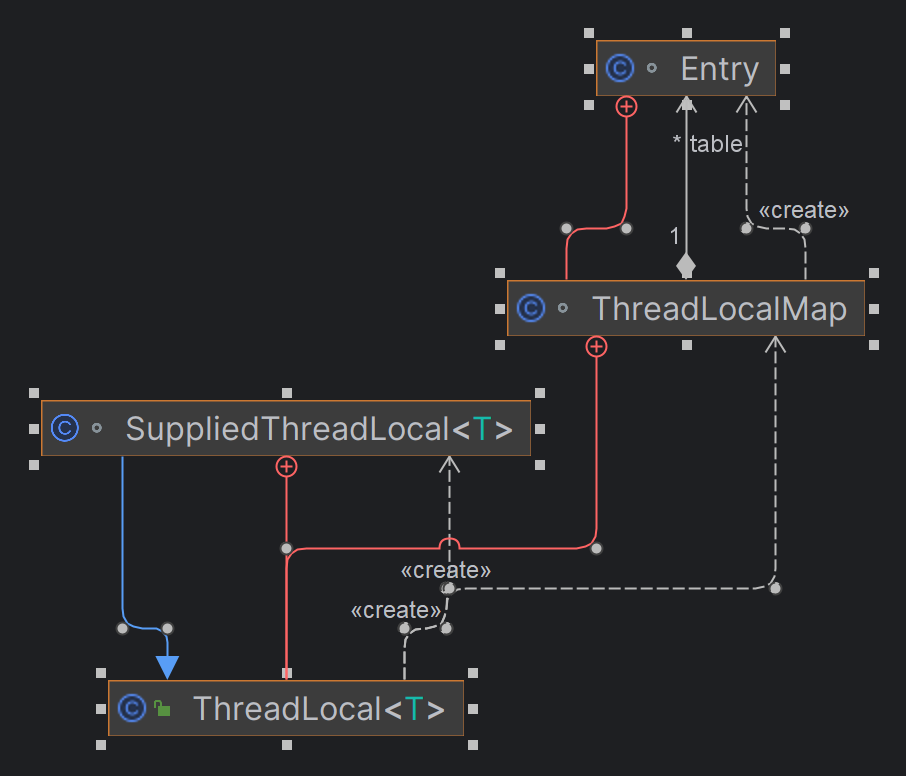
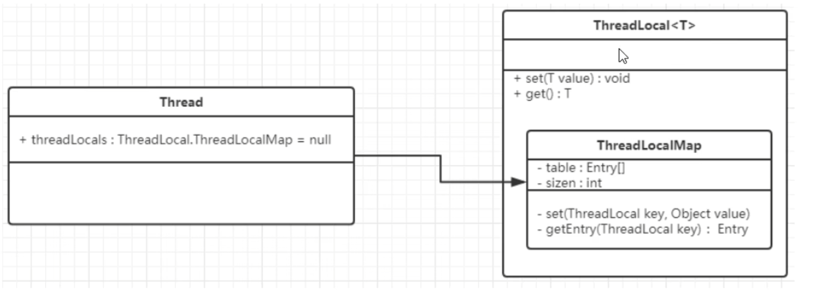
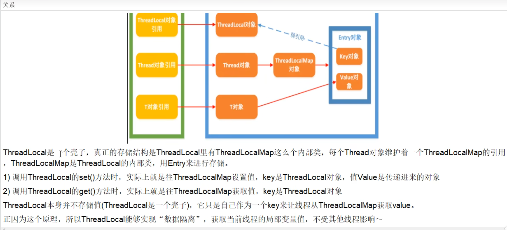
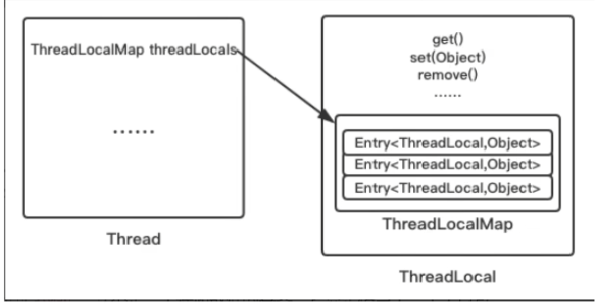
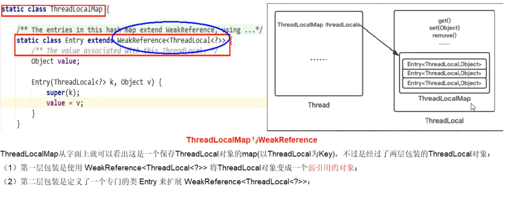
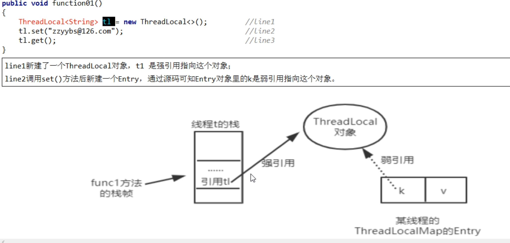
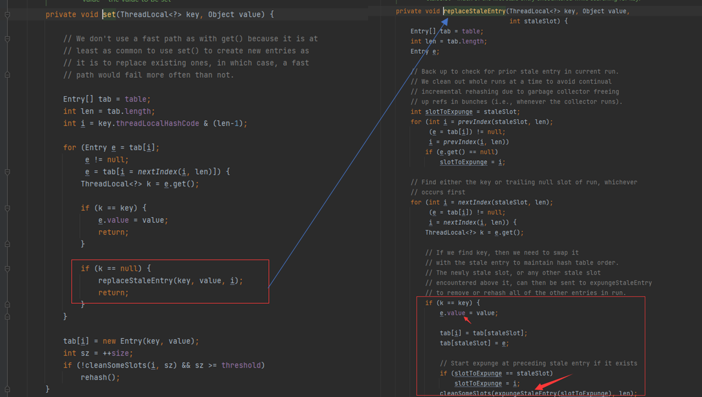
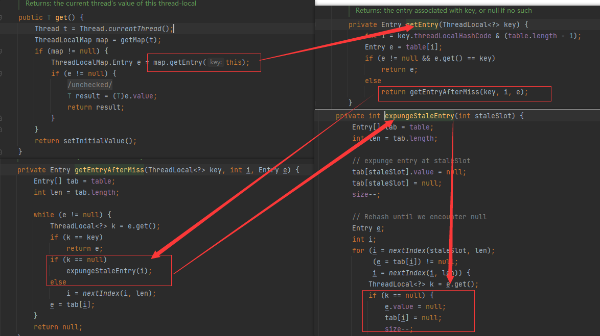
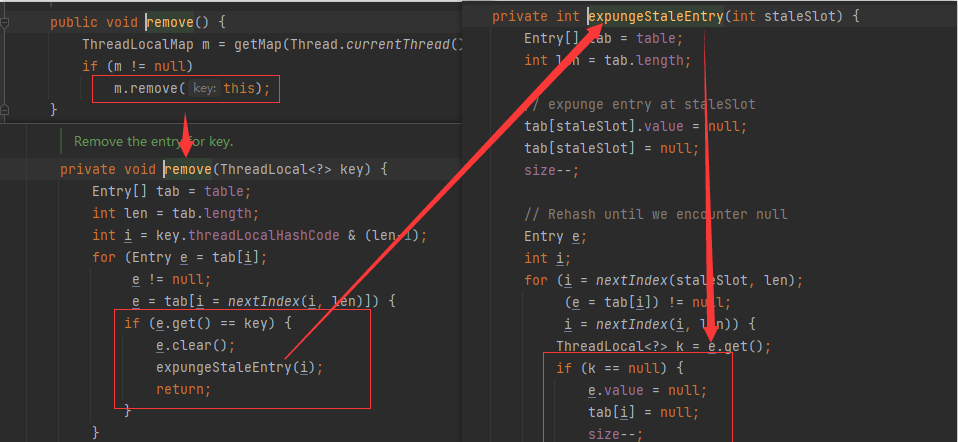

# ThreadLocal


## ThreadLocal介绍

### ThreadLocal是什么

ThreadLocal提供线程局部变量。这些变量与正常的变量不同，因为每一个线程在访问ThreadLocal实例的时候（通过其get或set方法）都有自己的、独立初始化的变量副本。ThreadLocal实例通常是类中的私有静态字段，使用它的目的是希望将状态（例如，用户ID或事物ID）与线程关联起来。

### ThreadLocal作用

实现每一个线程都有自己专属的本地变量副本（自己用自己的变量不用麻烦别人，不和其他人共享，人人有份，人各一份）。主要解决了让每个线程绑定自己的值，通过使用get()和set()方法，获取默认值或将其改为当前线程所存的副本的值从而避免了线程安全问题。


## ThreadLocal常用方法

##### 构造函数：

- `ThreadLocal()`: 创建一个新的线程局部变量。

##### 设置值：

- `public void set(T value)`: 将此线程局部变量的当前线程的值设置为指定值。如果此线程先前尚未调用过此方法，则在此线程第一次调用此方法时将触发 `initialValue()` 方法的调用。

##### 获取值：

- `public T get()`: 返回此线程局部变量的当前线程的值。如果此线程尚未调用过 `set(T)` 方法，并且 `initialValue()` 方法尚未被此线程的先前调用触发，则返回此线程局部变量的初始值。

##### 删除值：

- `public void remove()`: 移除此线程局部变量的值。如果此线程随后调用 `get()` 方法，并且 `initialValue()` 方法尚未被此线程的先前调用触发，则将重新触发 `initialValue()` 方法的调用。

##### 初始值：

- `protected T initialValue()`: 返回此线程局部变量的初始值。此方法会被 `get()` 方法调用，在首次获取线程局部变量的值时（线程尚未调用 `set(T)` 方法），并且值尚未被设置时。默认情况下，此方法返回 `null`；但是，子类可以重写此方法以返回非空值。

- `public static <S> ThreadLocal<S> withInitial(Supplier<? extends S> supplier)`: 此方法返回一个新的线程局部变量，它使用给定的 `Supplier` 函数来生成其初始值。这提供了一种更简洁的方式来设置初始值，而无需每次都重写 `initialValue()` 方法。（JDK 1.8 后的新特性）

## ThreadLocal应用

#### 应用场景

1. **线程安全的数据传递：** 在多线程环境中，如果某个对象需要在多个方法之间传递，并且每个方法都是在不同的线程中执行的，可以使用 `ThreadLocal` 存储这个对象，确保每个线程都可以独立访问自己的对象副本，而不会影响其他线程。
2. **线程上下文信息：** 在某些情况下，需要在整个线程执行过程中共享一些上下文信息，但又不希望通过方法参数来传递。可以使用 `ThreadLocal` 存储这些上下文信息，每个线程都可以通过 `ThreadLocal` 获取自己的上下文信息。
3. **线程相关的数据库连接、会话信息等：** 在 Web 应用程序中，每个请求通常都会有一个对应的线程，可以使用 `ThreadLocal` 存储数据库连接、会话信息等，确保每个请求都可以独立访问自己的资源，而不会影响其他请求。
4. **简化线程安全问题：** 在某些情况下，可能会需要共享一些对象，但这些对象本身不是线程安全的。可以使用 `ThreadLocal` 在每个线程中保存一份对象的副本，从而避免线程安全问题。
5. **实现线程范围的单例模式：** 可以使用 `ThreadLocal` 实现线程范围的单例模式，确保每个线程都只能获取到自己的单例对象，而不会影响其他线程。

#### 注意事项

- 确保及时清理：在使用完 `ThreadLocal` 后，需要及时调用 `remove()` 方法清理线程局部变量，防止内存泄漏。
- 避免滥用：过度使用 `ThreadLocal` 可能会导致代码难以理解和维护，应该根据实际需求慎重使用。
- 考虑并发性：虽然 `ThreadLocal` 可以解决线程安全问题，但在某些情况下可能会引入新的并发性问题，例如内存泄漏、数据一致性等，需要仔细考虑并发性。

## ThreadLocal案例

### 问题描述：

5个销售买房子，集团只关心销售总量的准确统计数，按照总销售额统计，方便集团公司给部分发送奖金--------群雄逐鹿起纷争------为了数据安全只能加锁

```
/**
 * 需求：5个销售卖房子，集团只关心销售总量的精确统计数
 */
class House {
    int saleCount = 0;

    public synchronized void saleHouse() {
        saleCount++;
    }

}

public class ThreadLocalDemo {
    public static void main(String[] args) {
        House house = new House();
        for (int i = 1; i <= 5; i++) {
            new Thread(() -> {
                int size = new Random().nextInt(5) + 1;
                System.out.println(size);
                for (int j = 1; j <= size; j++) {
                    house.saleHouse();
                }
            }, String.valueOf(i)).start();

        }
        try {
            TimeUnit.MILLISECONDS.sleep(300);
        } catch (InterruptedException e) {
            e.printStackTrace();
        }
        System.out.println(Thread.currentThread().getName() + "\t" + "共计卖出多少套： " + house.saleCount);
    }
}
/**
 * 3
 * 4
 * 2
 * 4
 * 2
 * main	共计卖出多少套： 15
 */

```

### 需求变更：

希望各自分灶吃饭，各凭销售本事提成，按照出单数各自统计-------比如房产中介销售都有自己的销售额指标，自己专属自己的，不和别人参和。----人手一份天下安

```
/**
 * 需求：需求变更：希望各自分灶吃饭，各凭销售本事提成，按照出单数各自统计-------比如房产中介销售都有自己的销售额指标，自己专属自己的，不和别人参和。
 */
class House {
    int saleCount = 0;

    public synchronized void saleHouse() {
        saleCount++;
    }

    ThreadLocal<Integer> saleVolume = ThreadLocal.withInitial(() -> 0);

    public void saleVolumeByThreadLocal() {
        saleVolume.set(1 + saleVolume.get());
    }


}

public class ThreadLocalDemo {
    public static void main(String[] args) {
        House house = new House();
        for (int i = 1; i <= 5; i++) {
            new Thread(() -> {
                int size = new Random().nextInt(5) + 1;
                try {
                    for (int j = 1; j <= size; j++) {
                        house.saleHouse();
                        house.saleVolumeByThreadLocal();
                    }
                    System.out.println(Thread.currentThread().getName() + "\t" + "号销售卖出：" + house.saleVolume.get());
                } finally {
                    house.saleVolume.remove();
                }
            }, String.valueOf(i)).start();

        }
        try {
            TimeUnit.MILLISECONDS.sleep(300);
        } catch (InterruptedException e) {
            e.printStackTrace();
        }
        System.out.println(Thread.currentThread().getName() + "\t" + "共计卖出多少套： " + house.saleCount);
    }
}
/**
 * 3	号销售卖出：1
 * 4	号销售卖出：3
 * 5	号销售卖出：4
 * 2	号销售卖出：3
 * 1	号销售卖出：5
 * main	共计卖出多少套： 16
 */
```

###  总结

- 因为每个Thread内有自己的实例副本且该副本只有当前线程自己使用
- 既然其他ThreadLocal不可访问，那就不存在多线程间共享问题
- 统一设置初始值，但是每个线程对这个值得修改都是各自线程互相独立得
- 如何才能不争抢

- 加入synchronized或者Lock控制资源的访问顺序
- 人手一份，大家各自安好，没有必要争抢


## ThreadLocal源码分析

### 源码解读

#### Thread、ThreadLocal、ThreadLocalMap关系



#### 三者总概括



ThreadLocalMap实际上就是一个以ThreadLocal实例为Key，任意对象为value的Entry对象

当我们为ThreadLocal变量赋值，实际上就是以当前ThreadLocal实例为Key，值为value的Entry往这个ThreadLocalMap中存放



#### 总结

ThreadLocalMap从字面上就可以看出这是一个保存ThreadLocal对象的map（其实是以ThreadLocal为Key），不过是经过了两层包装的ThreadLocal对象：



JVM内部维护了一个线程版的Map<ThreadLocal, Value>（通过ThreadLocal对象的set方法，结果把ThreadLocal对象自己当作Key，放进了ThreadLocalMap中），每个线程要用到这个T的时候，用当前的线程去Map里面获取，通过这样让每个线程都拥有了自己独立的变量，人手一份，竞争条件被彻底消除，在并发模式下是绝对安全的变量。


## ThreadLocal内存泄漏问题

#### 什么是内存泄漏

不再会被使用的对象或者变量占用的内存不能被回收，就是内存泄漏

#### 谁惹的祸

再回首ThreadLocalMap



#### 为什么要用弱引用，不用会发生什么



为什么要用弱引用：

- 当方法执行完毕后，栈帧销毁，强引用t1也就没有了，但此时线程的ThreadLocalMap里某个entry的Key引用还指向这个对象，若这个Key是强引用，就会导致Key指向的ThreadLocal对象即V指向的对象不能被gc回收，造成内存泄露
- 若这个引用时弱引用就大概率会减少内存泄漏的问题（当然，还得考虑key为null这个坑），使用弱引用就可以使ThreadLocal对象在方法执行完毕后顺利被回收且entry的key引用指向为null


这里有个需要注意的问题：

- ThreadLocalMap使用ThreadLocal的弱引用作为Key，如果一个ThreadLocal没有外部强引用引用他，那么系统gc时，这个ThreadLocal势必会被回收，这样一来，ThreadLocalMap中就会出现Key为null的Entry，就没有办法访问这些Key为null的Entry的value，如果当前线程迟迟不结束的话（好比正在使用线程池），这些key为null的Entry的value就会一直存在一条强引用链
- 虽然弱引用，保证了Key指向的ThreadLocal对象能够被及时回收，但是v指向的value对象是需要ThreadLocalMap调用get、set时发现key为null时才会去回收整个entry、value，因此弱引用不能100%保证内存不泄露，我们要在不使用某个ThreadLocal对象后，手动调用remove方法来删除它，尤其是在线程池中，不仅仅是内存泄漏的问题，因为线程池中的线程是重复使用的，意味着这个线程的ThreadLocalMap对象也是重复使用的，如果我们不手动调用remove方法，那么后面的线程就有可能获取到上个线程遗留下来的value值，造成bug。
- 清除脏Entry----key为null的entry

- set()方法

- 

- get()方法

- 

- remove()

- 

#### 最佳实践

- ThreadLocal一定要初始化，避免空指针异常。
- 建议把ThreadLocal修饰为static
- 用完记得手动remove


## ThreadLocal归纳

- ThreadLocal并不解决线程间共享数据的问题
- ThreadLocal适用于变量在线程间隔离且在方法间共享的场景
- ThreadLocal通过隐式的在不同线程内创建独立实例副本避免了实例线程安全的问题
- 每个线程持有一个只属于它自己的专属map并维护了ThreadLocal对象与具体实例的映射，该Map由于只被持有他的线程访问，故不存在线程安全以及锁的问题
- ThreadLocalMap的Entry对ThreadLocal的引用为弱引用。避免了ThreadLocal对象无法被回收的问题
- 都会通过expungeStaleEntry，cleanSomeSlots，replaceStaleEntry这三个方法回收键为null的Entry对象的值（即为具体实例）以及entry对象本身从而防止内存泄漏，属于安全加固的方法
- 群雄逐鹿起纷争，人各一份天下安